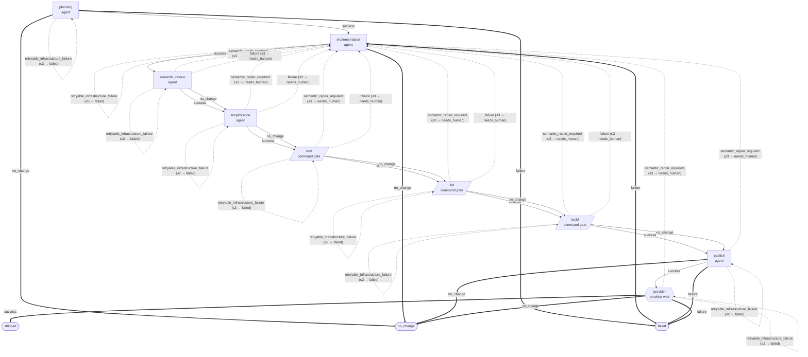

# Pipeline ce/implement@2

<!-- Generated by `npm run docs:pipelines --prefix supervisor` from supervisor/pipelines/.
     Do not edit by hand; edit the manifest and regenerate. -->

- **Pipeline:** `ce/implement@2`
- **Entry stage:** `planning`
- **Max attempts:** 20

Staged CE implementation with sealed repository gates, exact-tree publication, and bounded provider repair.

## Flow

### Legend

- Rectangle = agent stage, parallelogram = command gate, hexagon = provider wait.
- Solid arrow = forward transition; dashed arrow = re-entry (the target is the
  stage itself or sits at/before it in the declared stage order, matching
  `supervisor/src/pipeline/coordinator.ts`); thick arrow = terminal outcome.
- `(≤N → outcome)` on an edge is `max_reentries` and its `on_exhausted` terminal.
- Outcomes identical across every stage are suppressed and listed in the
  trailing `%%` comment inside the diagram.
