# Pipeline core/automatic@1

<!-- Generated by `npm run docs:pipelines --prefix supervisor` from supervisor/pipelines/.
     Do not edit by hand; edit the manifest and regenerate. CI fails the
     "Verify pipeline docs are regenerated" step when this page drifts. -->

- **Pipeline:** `core/automatic@1`
- **Entry stage:** `admission_planner`
- **Max attempts:** 200
- **Max repair rounds:** 5

Immutable automatic admission template with fresh typed planning and review, deterministic supervisor gates, and distinct simple and structured execution and publication tails.

## Flow

```mermaid
flowchart TD
    %% core/automatic@1
    admission_planner["admission_planner<br/>agent"]
    admission_decision_gate{"admission_decision_gate<br/>supervisor gate"}
    admission_reviewer["admission_reviewer<br/>agent"]
    admission_review_gate{"admission_review_gate<br/>supervisor gate"}
    simple_implementation["simple_implementation<br/>agent"]
    simple_repair_implementation["simple_repair_implementation<br/>agent"]
    simple_repair_semantic_review["simple_repair_semantic_review<br/>agent"]
    simple_semantic_review["simple_semantic_review<br/>agent"]
    simple_simplification["simple_simplification<br/>agent"]
    simple_post_simplify_review["simple_post_simplify_review<br/>agent"]
    simple_test[/"simple_test<br/>command gate"/]
    simple_lint[/"simple_lint<br/>command gate"/]
    simple_build[/"simple_build<br/>command gate"/]
    simple_publish["simple_publish<br/>agent"]
    simple_provider{{"simple_provider<br/>provider wait"}}
    structured_edit[("structured_edit<br/>loop action")]
    structured_publish["structured_publish<br/>agent"]
    structured_provider{{"structured_provider<br/>provider wait"}}
    terminal_shipped(["shipped"])
    terminal_no_change(["no_change"])
    terminal_needs_human(["needs_human"])
    terminal_failed(["failed"])
    admission_planner -->|"success"| admission_decision_gate
    admission_planner -->|"no_change"| admission_decision_gate
    admission_planner -.->|"semantic_repair_required (≤1 → failed)"| admission_planner
    admission_planner -.->|"retryable_infrastructure_failure (≤2 → failed)"| admission_planner
    admission_planner -.->|"failure (≤1 → failed)"| admission_planner
    admission_decision_gate -->|"success"| admission_reviewer
    admission_decision_gate -->|"no_change"| simple_implementation
    admission_decision_gate -.->|"semantic_repair_required (≤1 → failed)"| admission_planner
    admission_decision_gate -.->|"retryable_infrastructure_failure (≤2 → failed)"| admission_decision_gate
    admission_decision_gate ==>|"failure"| terminal_failed
    admission_reviewer -->|"success"| admission_review_gate
    admission_reviewer -->|"no_change"| admission_review_gate
    admission_reviewer -.->|"semantic_repair_required (≤1 → failed)"| admission_reviewer
    admission_reviewer -.->|"retryable_infrastructure_failure (≤2 → failed)"| admission_reviewer
    admission_reviewer -.->|"failure (≤1 → failed)"| admission_reviewer
    admission_review_gate -->|"success"| structured_edit
    admission_review_gate -->|"no_change"| structured_edit
    admission_review_gate -.->|"semantic_repair_required (≤1 → failed)"| admission_reviewer
    admission_review_gate -.->|"retryable_infrastructure_failure (≤2 → failed)"| admission_review_gate
    admission_review_gate -.->|"failure (≤1 → failed)"| admission_planner
    simple_implementation -->|"success"| simple_semantic_review
    simple_implementation ==>|"no_change"| terminal_no_change
    simple_implementation -.->|"semantic_repair_required (≤8 → needs_human)"| simple_implementation
    simple_implementation -.->|"retryable_infrastructure_failure (≤3 → failed)"| simple_implementation
    simple_implementation ==>|"failure"| terminal_failed
    simple_repair_implementation -->|"success"| simple_repair_semantic_review
    simple_repair_implementation -->|"no_change"| simple_repair_semantic_review
    simple_repair_implementation -.->|"semantic_repair_required (≤8 → needs_human)"| simple_repair_implementation
    simple_repair_implementation -.->|"retryable_infrastructure_failure (≤3 → failed)"| simple_repair_implementation
    simple_repair_implementation ==>|"failure"| terminal_failed
    simple_repair_semantic_review -->|"success"| simple_test
    simple_repair_semantic_review -->|"no_change"| simple_test
    simple_repair_semantic_review -.->|"semantic_repair_required (≤5 → needs_human)"| simple_repair_implementation
    simple_repair_semantic_review -.->|"retryable_infrastructure_failure (≤2 → failed)"| simple_repair_semantic_review
    simple_repair_semantic_review -.->|"failure (≤5 → needs_human)"| simple_repair_implementation
    simple_semantic_review -->|"success"| simple_simplification
    simple_semantic_review -->|"no_change"| simple_simplification
    simple_semantic_review -.->|"semantic_repair_required (≤5 → needs_human)"| simple_repair_implementation
    simple_semantic_review -.->|"retryable_infrastructure_failure (≤2 → failed)"| simple_semantic_review
    simple_semantic_review -.->|"failure (≤5 → needs_human)"| simple_repair_implementation
    simple_simplification -->|"success"| simple_post_simplify_review
    simple_simplification -->|"no_change"| simple_test
    simple_simplification -.->|"semantic_repair_required (≤5 → needs_human)"| simple_repair_implementation
    simple_simplification -.->|"retryable_infrastructure_failure (≤2 → failed)"| simple_simplification
    simple_simplification -.->|"failure (≤5 → needs_human)"| simple_repair_implementation
    simple_post_simplify_review -->|"success"| simple_test
    simple_post_simplify_review -->|"no_change"| simple_test
    simple_post_simplify_review -.->|"semantic_repair_required (≤5 → needs_human)"| simple_repair_implementation
    simple_post_simplify_review -.->|"retryable_infrastructure_failure (≤2 → failed)"| simple_post_simplify_review
    simple_post_simplify_review -.->|"failure (≤5 → needs_human)"| simple_repair_implementation
    simple_test -->|"success"| simple_lint
    simple_test -->|"no_change"| simple_lint
    simple_test -.->|"semantic_repair_required (≤5 → needs_human)"| simple_repair_implementation
    simple_test -.->|"retryable_infrastructure_failure (≤2 → failed)"| simple_test
    simple_test -.->|"failure (≤5 → needs_human)"| simple_repair_implementation
    simple_lint -->|"success"| simple_build
    simple_lint -->|"no_change"| simple_build
    simple_lint -.->|"semantic_repair_required (≤5 → needs_human)"| simple_repair_implementation
    simple_lint -.->|"retryable_infrastructure_failure (≤2 → failed)"| simple_lint
    simple_lint -.->|"failure (≤5 → needs_human)"| simple_repair_implementation
    simple_build -->|"success"| simple_publish
    simple_build -->|"no_change"| simple_publish
    simple_build -.->|"semantic_repair_required (≤5 → needs_human)"| simple_repair_implementation
    simple_build -.->|"retryable_infrastructure_failure (≤2 → failed)"| simple_build
    simple_build -.->|"failure (≤5 → needs_human)"| simple_repair_implementation
    simple_publish -->|"success"| simple_provider
    simple_publish ==>|"no_change"| terminal_no_change
    simple_publish -.->|"semantic_repair_required (≤5 → needs_human)"| simple_repair_implementation
    simple_publish -.->|"retryable_infrastructure_failure (≤2 → failed)"| simple_publish
    simple_publish ==>|"failure"| terminal_failed
    simple_provider ==>|"success"| terminal_shipped
    simple_provider ==>|"no_change"| terminal_no_change
    simple_provider -.->|"semantic_repair_required (≤5 → needs_human)"| simple_repair_implementation
    simple_provider -.->|"retryable_infrastructure_failure (≤2 → failed)"| simple_provider
    simple_provider ==>|"failure"| terminal_failed
    structured_edit -->|"success"| structured_publish
    structured_edit ==>|"no_change"| terminal_no_change
    structured_edit ==>|"semantic_repair_required"| terminal_needs_human
    structured_edit -.->|"retryable_infrastructure_failure (≤2 → failed)"| structured_edit
    structured_edit ==>|"failure"| terminal_failed
    structured_publish -->|"success"| structured_provider
    structured_publish ==>|"no_change"| terminal_no_change
    structured_publish ==>|"semantic_repair_required"| terminal_needs_human
    structured_publish -.->|"retryable_infrastructure_failure (≤2 → failed)"| structured_publish
    structured_publish ==>|"failure"| terminal_failed
    structured_provider ==>|"success"| terminal_shipped
    structured_provider ==>|"no_change"| terminal_no_change
    structured_provider ==>|"semantic_repair_required"| terminal_needs_human
    structured_provider -.->|"retryable_infrastructure_failure (≤2 → failed)"| structured_provider
    structured_provider ==>|"failure"| terminal_failed
    %% every stage also: needs_human (18), canceled (18), superseded (18)
    %%   needs_human -> terminal needs_human
    %%   canceled -> terminal canceled
    %%   superseded -> terminal superseded
```

### Legend

- Rectangle = agent stage, parallelogram = command gate, rounded node = loop action, diamond = supervisor gate, hexagon = provider wait.
- Solid arrow = forward transition; dashed arrow = re-entry (the target is the
  stage itself or sits at/before it in the declared stage order, matching the
  shared `isPipelineReentry` manifest helper); thick arrow = terminal outcome.
- `(≤N → outcome)` on an edge is `max_reentries` and its `on_exhausted` terminal.
- Outcomes identical across every stage are suppressed and listed in the
  trailing `%%` comment inside the diagram.
