# Pipeline core/implement@4

<!-- Generated by `npm run docs:pipelines --prefix supervisor` from supervisor/pipelines/.
     Do not edit by hand; edit the manifest and regenerate. CI fails the
     "Verify pipeline docs are regenerated" step when this page drifts. -->

- **Pipeline:** `core/implement@4`
- **Entry stage:** `implementation`
- **Max attempts:** 200
- **Max repair rounds:** 5

Staged CE implementation from a pre-approved plan with round-based repair budgeting, scoped repair re-entry, sealed repository gates, exact-tree publication, and bounded provider repair. The initial forward pass may simplify; repair passes re-run semantic review and command gates without re-running simplification.

## Flow

```mermaid
flowchart TD
    %% core/implement@4
    implementation["implementation<br/>agent"]
    repair_implementation["repair_implementation<br/>agent"]
    repair_semantic_review["repair_semantic_review<br/>agent"]
    semantic_review["semantic_review<br/>agent"]
    simplification["simplification<br/>agent"]
    post_simplify_review["post_simplify_review<br/>agent"]
    test[/"test<br/>command gate"/]
    lint[/"lint<br/>command gate"/]
    build[/"build<br/>command gate"/]
    publish["publish<br/>agent"]
    provider{{"provider<br/>provider wait"}}
    terminal_shipped(["shipped"])
    terminal_no_change(["no_change"])
    terminal_failed(["failed"])
    implementation -->|"success"| semantic_review
    implementation ==>|"no_change"| terminal_no_change
    implementation -.->|"semantic_repair_required (≤8 → needs_human)"| implementation
    implementation -.->|"retryable_infrastructure_failure (≤3 → failed)"| implementation
    implementation ==>|"failure"| terminal_failed
    repair_implementation -->|"success"| repair_semantic_review
    repair_implementation -->|"no_change"| repair_semantic_review
    repair_implementation -.->|"semantic_repair_required (≤8 → needs_human)"| repair_implementation
    repair_implementation -.->|"retryable_infrastructure_failure (≤3 → failed)"| repair_implementation
    repair_implementation ==>|"failure"| terminal_failed
    repair_semantic_review -->|"success"| test
    repair_semantic_review -->|"no_change"| test
    repair_semantic_review -.->|"semantic_repair_required (≤5 → needs_human)"| repair_implementation
    repair_semantic_review -.->|"retryable_infrastructure_failure (≤2 → failed)"| repair_semantic_review
    repair_semantic_review -.->|"failure (≤5 → needs_human)"| repair_implementation
    semantic_review -->|"success"| simplification
    semantic_review -->|"no_change"| simplification
    semantic_review -.->|"semantic_repair_required (≤5 → needs_human)"| repair_implementation
    semantic_review -.->|"retryable_infrastructure_failure (≤2 → failed)"| semantic_review
    semantic_review -.->|"failure (≤5 → needs_human)"| repair_implementation
    simplification -->|"success"| post_simplify_review
    simplification -->|"no_change"| test
    simplification -.->|"semantic_repair_required (≤5 → needs_human)"| repair_implementation
    simplification -.->|"retryable_infrastructure_failure (≤2 → failed)"| simplification
    simplification -.->|"failure (≤5 → needs_human)"| repair_implementation
    post_simplify_review -->|"success"| test
    post_simplify_review -->|"no_change"| test
    post_simplify_review -.->|"semantic_repair_required (≤5 → needs_human)"| repair_implementation
    post_simplify_review -.->|"retryable_infrastructure_failure (≤2 → failed)"| post_simplify_review
    post_simplify_review -.->|"failure (≤5 → needs_human)"| repair_implementation
    test -->|"success"| lint
    test -->|"no_change"| lint
    test -.->|"semantic_repair_required (≤5 → needs_human)"| repair_implementation
    test -.->|"retryable_infrastructure_failure (≤2 → failed)"| test
    test -.->|"failure (≤5 → needs_human)"| repair_implementation
    lint -->|"success"| build
    lint -->|"no_change"| build
    lint -.->|"semantic_repair_required (≤5 → needs_human)"| repair_implementation
    lint -.->|"retryable_infrastructure_failure (≤2 → failed)"| lint
    lint -.->|"failure (≤5 → needs_human)"| repair_implementation
    build -->|"success"| publish
    build -->|"no_change"| publish
    build -.->|"semantic_repair_required (≤5 → needs_human)"| repair_implementation
    build -.->|"retryable_infrastructure_failure (≤2 → failed)"| build
    build -.->|"failure (≤5 → needs_human)"| repair_implementation
    publish -->|"success"| provider
    publish ==>|"no_change"| terminal_no_change
    publish -.->|"semantic_repair_required (≤5 → needs_human)"| repair_implementation
    publish -.->|"retryable_infrastructure_failure (≤2 → failed)"| publish
    publish ==>|"failure"| terminal_failed
    provider ==>|"success"| terminal_shipped
    provider ==>|"no_change"| terminal_no_change
    provider -.->|"semantic_repair_required (≤5 → needs_human)"| repair_implementation
    provider -.->|"retryable_infrastructure_failure (≤2 → failed)"| provider
    provider ==>|"failure"| terminal_failed
    %% every stage also: needs_human (11), canceled (11), superseded (11)
    %%   needs_human -> terminal needs_human
    %%   canceled -> terminal canceled
    %%   superseded -> terminal superseded
```

### Legend

- Rectangle = agent stage, parallelogram = command gate, rounded node = loop action, diamond = supervisor gate, hexagon = provider wait.
- Solid arrow = forward transition; dashed arrow = re-entry (the target is the
  stage itself or sits at/before it in the declared stage order, matching the
  shared `isPipelineReentry` manifest helper); thick arrow = terminal outcome.
- `(≤N → outcome)` on an edge is `max_reentries` and its `on_exhausted` terminal.
- Outcomes identical across every stage are suppressed and listed in the
  trailing `%%` comment inside the diagram.
