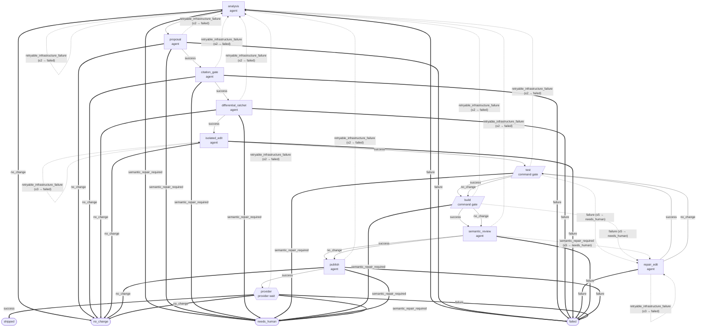

# Pipeline core/tune@1

<!-- Generated by `npm run docs:pipelines --prefix supervisor` from supervisor/pipelines/.
     Do not edit by hand; edit the manifest and regenerate. CI fails the
     "Verify pipeline docs are regenerated" step when this page drifts. -->

- **Pipeline:** `core/tune@1`
- **Entry stage:** `analysis`
- **Max attempts:** 200
- **Max repair rounds:** 5

Immutable self-tuning pipeline with read-only corpus analysis and proposal generation, supervisor citation and differential-ratchet gates, fresh isolated mutation, command gates, semantic review and repair, exact-subject publication, provider verification, and mandatory human merge.

## Flow

### Legend

- Rectangle = agent stage, parallelogram = command gate, hexagon = provider wait.
- Solid arrow = forward transition; dashed arrow = re-entry (the target is the
  stage itself or sits at/before it in the declared stage order, matching the
  shared `isPipelineReentry` manifest helper); thick arrow = terminal outcome.
- `(≤N → outcome)` on an edge is `max_reentries` and its `on_exhausted` terminal.
- Outcomes identical across every stage are suppressed and listed in the
  trailing `%%` comment inside the diagram.
