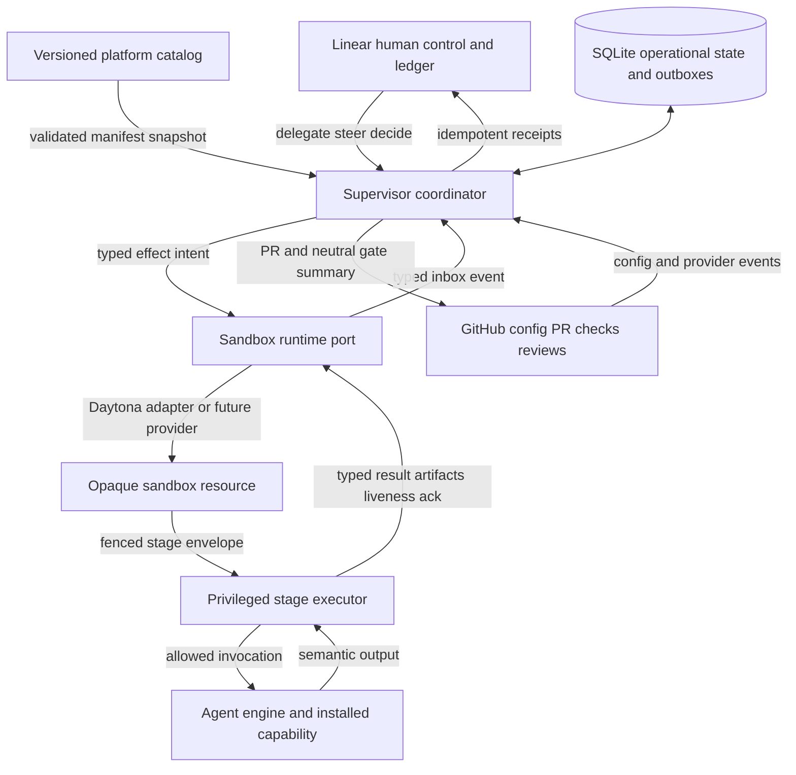
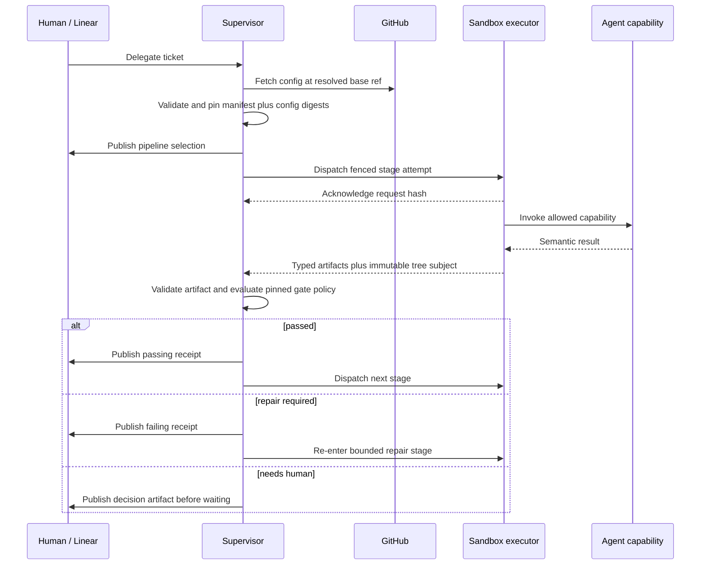
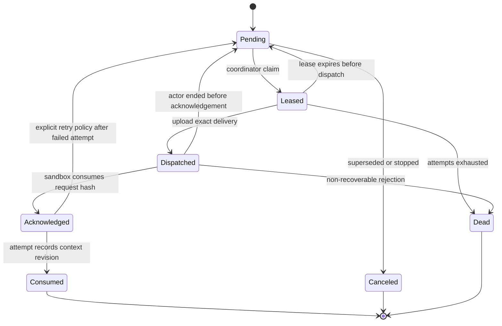
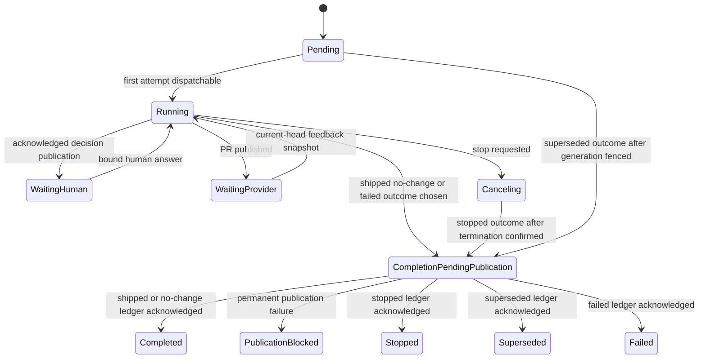
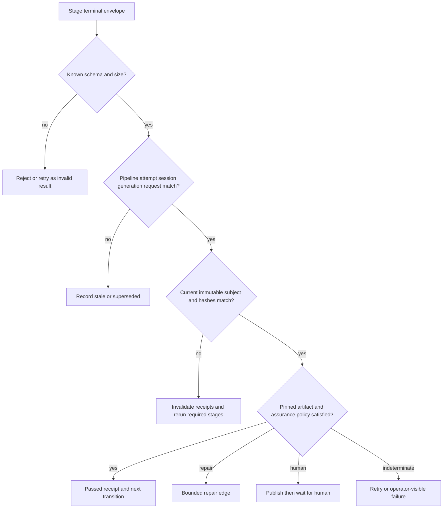
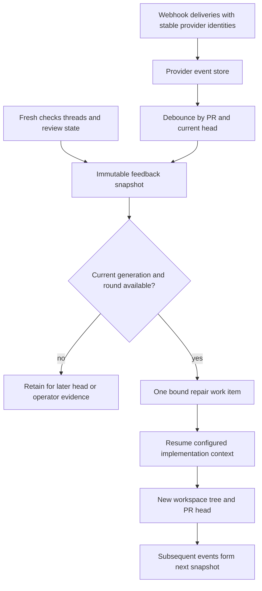
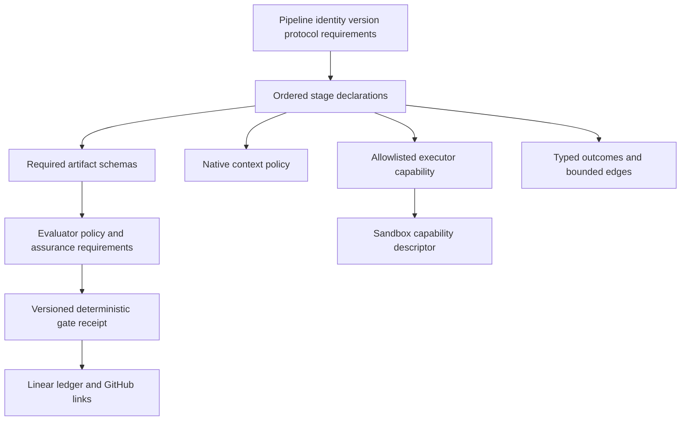
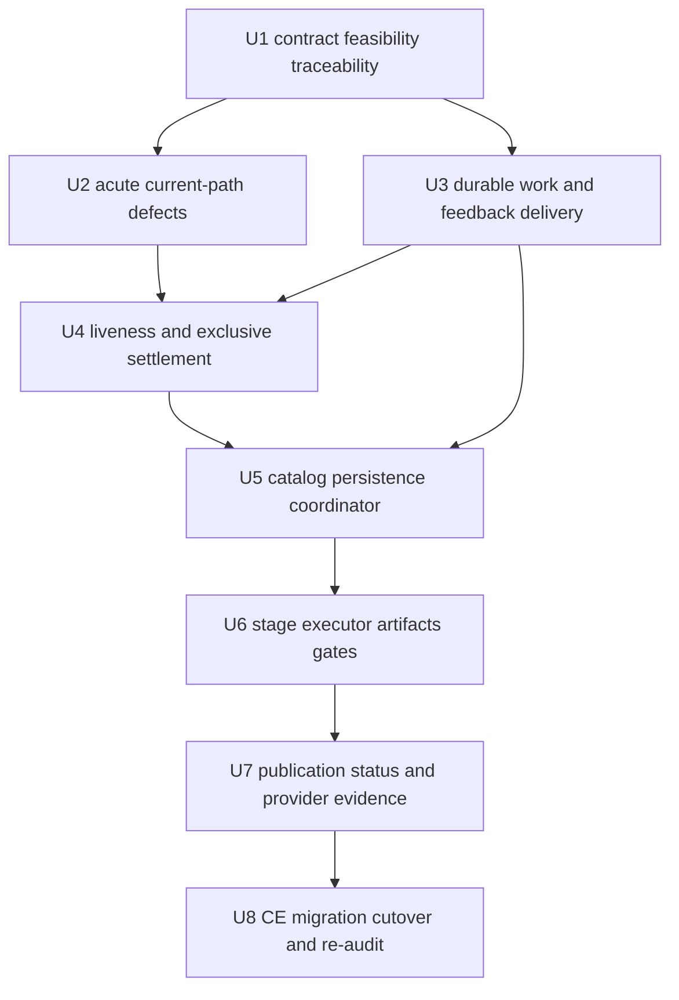

# Configurable Agentic Pipeline Coordinator

> **POC implementation decision (2026-07-22):** OpenThrottle has no installed
> consumers or production traffic. The implementation therefore selects the
> coordinator for every new generation and omits the plan's repository canary,
> legacy-drain, and production soak machinery. The credentialed live acceptance
> is explicitly deferred; all local gates and the stubbed Docker lifecycle remain
> required. Historical migration columns may remain until a separate schema
> contraction change.

## Goal Capsule

| Field | Contract |
|---|---|
| Objective | Replace the duplicated, agent-owned CE sequence with a versioned config-as-code pipeline catalog, a deterministic supervisor coordinator, a provider-neutral sandbox stage executor, typed gate evidence, and durable human-visible receipts. |
| Product authority | The decisions confirmed in the planning dialogue, then this plan's Product Contract, then `docs/SPEC.md` after U1 reconciles it. Existing implementation details do not override those contracts. |
| Execution profile | Deep, migration-oriented software change delivered in dependency order. Characterize the current path before changing durable state or cutover behavior. |
| Safety boundary | Agent reasoning remains inside explicit sandbox stages. The supervisor validates data and advances state; it never performs semantic reasoning. Runtime safety invariants remain non-configurable. |
| Migration rule | Existing active tickets remain on the legacy execution path. Only newly delegated or explicitly re-delegated tickets may receive a new pinned pipeline instance. |
| Stop conditions | Do not enable the new default until engine capability tests, crash/recovery matrices, publication acknowledgement tests, full contract CI, and a live delegation-to-feedback acceptance run pass. |
| Tail ownership | The final unit removes legacy declarations only after zero legacy instances remain, reruns the original audit line by line, and leaves unresolved credential findings visibly open. |

---

## Product Contract

### Summary

OpenThrottle's autonomous loop will become a durable ticket-to-terminal lifecycle driven by a pinned, versioned pipeline instance. A pipeline is configured as an ordered set of stages and typed transitions. The supervisor coordinates stage attempts and evaluates gate policy deterministically; a sandbox executor runs commands or invokes agent capabilities; agents produce semantic attestations but cannot declare their own gates passed.

The first catalog ships CE-backed implement and investigate pipelines as defaults, plus non-CE command and semantic-agent fixtures that prove the core is not CE-specific. Repositories select named platform-owned pipelines in `.openthrottle.yml`; they do not upload arbitrary supervisor-executable pipeline logic in V1.

### Problem Frame

The current runtime has several competing descriptions of the autonomous sequence. `skills/tasks/implement-plan/SKILL.md` contains the actual CE sequence, `sandbox/lib/runtime.sh` and `sandbox/entrypoint.sh` independently map task types to skills and prose, while `supervisor/src/scheduler.ts` exposes an unused `LOOP_REGISTRY`. That makes configuration non-authoritative and lets behavioral drift survive tests. The existing work-delivery and liveness protocols also lack acknowledgement, leasing, generation fencing, and exclusive settlement guarantees, so moving to more stage boundaries without first hardening those foundations would multiply races rather than improve autonomy.

The new design must preserve OpenThrottle's hard role split: Linear is the human control surface and durable human-facing ledger; GitHub is canonical for PR, check, and review evidence; SQLite is the operational transaction/outbox store; the sandbox is the only place agent reasoning and repository commands run.

### Actors

- A1. A platform author adds immutable pipeline manifests and supported executor/evaluator definitions.
- A2. A repository maintainer selects allowed pipelines and supplies trusted repository commands in `.openthrottle.yml`.
- A3. A human delegates and steers work through Linear and reviews PR-native evidence in GitHub.
- A4. The supervisor resolves and pins configuration, coordinates state, validates artifacts, evaluates gates, and publishes receipts.
- A5. The sandbox stage executor invokes agent or command capabilities against an isolated checkout and emits fenced results.
- A6. An agent engine and CE or another installed capability perform semantic work inside an explicitly requested stage.
- A7. GitHub and Linear provide external events and durable human-visible evidence.

### Requirements

#### Vocabulary and configuration

- R1. `docs/SPEC.md` must define one canonical vocabulary: an autonomous loop is the durable ticket/event lifecycle; a pipeline is the configured execution graph used by that loop; a stage is one execution unit; a gate is a transition condition evaluated over evidence; an attempt is one immutable execution of a stage; and resume is a native-session continuation policy, not a pipeline.
- R2. OpenThrottle must support multiple immutable, named, versioned pipeline manifests in one platform-owned catalog, not only a switch between two hard-coded defaults.
- R3. Each pipeline instance must pin the pipeline ID and version, normalized manifest and digest, exact base commit, repository config blob SHA and digest, sandbox runtime release and independently produced capability-descriptor digest, executor protocol version, and authorized capability set. Later default, deployment, or repository config changes must not reinterpret an active instance.
- R4. `.openthrottle.yml` must select pipeline IDs by intent and retain bounded repository commands and settings. The supervisor resolves the base branch to an exact commit, fetches config from that commit before provisioning, and seals the normalized snapshot for the instance. Missing legacy selection uses the platform default; malformed configuration, unknown pipelines, or incompatible capabilities fail before sandbox provisioning and produce a human-visible error.
- R5. V1 manifests must be schema-validated data with allowlisted executor, evaluator, artifact, transition, and context-policy kinds. They may express finite ordered stages, typed conditional transitions, and explicitly bounded repair re-entry, but not executable supervisor expressions, unbounded cycles, arbitrary DAG fan-out, or dynamic stage generation.
- R6. The supervisor core must contain no CE skill names or CE-specific transition branches. CE implement and investigate are swappable default manifests; non-CE command-only and semantic-agent pipelines must exercise command, context, normalized semantic artifact, and gate behavior without coordinator changes. Adding a pipeline from installed capabilities is config-only; adding an executable capability requires a sandbox runtime release, never a coordinator branch.

#### Execution and autonomy

- R7. The deterministic pipeline coordinator must run in the supervisor. The sandbox must expose a provider-neutral, one-stage-at-a-time execution protocol. Neither coordinator nor executor is an agent or subagent.
- R8. Every stage request must carry a fenced immutable envelope containing pipeline instance, manifest digest, runtime/capability digests, stage and attempt IDs, request hash, run ID, ticket/session/generation, repository/base commit, context revision, expected content-addressed publish subject, native-session policy, allowed capability, required artifacts, authorized credential scopes, and idempotency key.
- R9. Agent stages must declare a native context policy such as fresh, resume-required, prefer-resume with recorded reconstruction, or fresh-review. A missing required session must take an explicit configured recovery transition and must never silently start fresh.
- R10. Stage results and pipeline terminal results must be typed. Stage outcomes must distinguish success, no change, semantic repair required, retryable infrastructure failure, needs human, canceled, superseded, and non-recoverable failure. Pipeline outcomes must distinguish shipped, no change, needs human, canceled/stopped, superseded, and failed.
- R11. Human steering may be consumed only by agent stages that declare live-steering capability. Command and provider-wait stages cannot consume it. GitHub feedback must re-enter the configured repair stage as a bounded snapshot, normally resuming the original implementation session.
- R12. Authentication, branch/push safety, one active actor per ticket, fail-closed repository routing, minimal credential capabilities, session/run/generation binding, sanitization, stop/reap exclusivity, and artifact schema validation are runtime invariants, not configurable product gates.

#### Durable work and liveness

- R13. Human steering, follow-up work, and fallback continuation must use one durable work-item model with explicit delivery attempts and the lifecycle `pending -> leased -> dispatched -> acknowledged -> consumed`, plus canceled/dead terminal states. Upload to a sandbox inbox is not acknowledgement.
- R14. Every work delivery must bind the intended ticket, Linear session, run, native session, generation, context revision, and request hash; new-mode deliveries must also bind the pipeline instance, while explicitly legacy deliveries omit only that field. Stale or cross-generation work must fail closed.
- R15. GitHub review, comment, and CI events must be retained by stable provider identity and coalesced into one immutable current-state snapshot per bounded repair round. Events arriving during repair belong to the next snapshot; an old-head snapshot cannot reopen the current revision.
- R16. Liveness must be explicit and independent of semantic activity. Quiet bootstrap uses `started_at`, long commands renew a lease, waiting-human/provider instances are not considered active attempts, and stale attempts enter a non-dispatchable reaping state before process termination and lock release.
- R17. Completion, stop, and reaper transitions must be compare-and-set exclusive. The loser performs no publication, settlement, scheduling, or cleanup side effects. A ticket cannot be released until the old actor is confirmed stopped or an operator-visible quarantine policy takes over.

#### Artifacts and gates

- R18. Stage evidence must use versioned OpenThrottle schemas such as review, command-result, provider-check, and human-approval artifacts. Required provenance includes producer/version, pipeline/stage/attempt, run/session/generation, manifest and request digests, repository subject, assurance class, bounded evidence/findings, timestamps, result, and artifact hash.
- R19. The sandbox executor must compute a canonical content-addressed publish subject as a Git tree OID without trusting agent prose. The contract must define included paths, ignored/generated-file treatment, file modes, exclusive-actor requirements, and pre/post-stage recomputation. Review stages must preserve the subject; command receipts bind pre/post subject, command digest, runtime release, and capability descriptor. Before PR publication, the pushed commit tree must equal the gated subject; any relevant workspace or PR-head mutation invalidates older receipts.
- R20. Semantic judgment is an attestation, not deterministic proof. The agent may emit `semantic_attested` or independently `semantic_corroborated` evidence, while sealed commands are `executor_verified`, GitHub state is `provider_verified`, and only a human can emit `human_approved`.
- R21. A gate decision must be a pure deterministic evaluation of the pinned policy and validated current artifacts. Unknown schemas, stale subjects, wrong attempts/sessions/generations, missing evidence, tampered hashes/counts, unsupported assurance, or an agent-authored pass flag must fail closed or become explicitly indeterminate.
- R22. Conditional stages and missing optional repository commands must create visible run/skipped/not-configured receipts. Exit zero without the required typed result is failure; resource termination such as exit 137 is never a semantic pass.

#### Human-facing truth and operations

- R23. Linear must be the canonical human-facing pipeline ledger. Each meaningful gate and terminal transition must publish pipeline, stage, attempt, subject, assurance, policy, result, evidence summary, residual uncertainty, sanitized artifact link or attachment, and relevant PR/provider links.
- R24. GitHub remains canonical for PR-native checks, reviews, thread state, and head SHA. The supervisor may maintain one neutral PR gate summary, but an internal CE review must not be presented as a formal GitHub approval.
- R25. SQLite must durably retain operational state, artifact and payload hashes, leases, retries, idempotency keys, publication intent, external receipt IDs, and acknowledgement state. It must not be the only place a human must inspect to understand how a gate passed.
- R26. Ordinary technical progression may continue while a non-interactive Linear receipt is durably queued, but `needs_human` cannot wait for an answer until its artifact is acknowledged, and terminal completion remains `completion_pending_publication` until the terminal ledger entry is acknowledged. Permanent publication failure becomes operator-visible `publication_blocked`.
- R27. Status and logs must expose pipeline ID/version, active stage and attempt, retry/re-entry count, wait reason, immutable subject, current gate result, native-context policy, and publication state consistently across supervisor endpoints and the CLI.

#### Migration and portability

- R28. Existing active and PR-waiting tickets must remain explicitly marked legacy until they drain or a human re-delegates them. New pipeline instances launch behind a cutover flag; silent mid-loop conversion is prohibited.
- R29. Pipeline manifests may narrow logical credential capabilities but cannot grant authority. The executable capability declares minimum needs, installation/operator policy defines the maximum grant, repository config cannot expand it, and the authorized envelope carries only their permitted intersection as logical scope IDs. Manifests must never contain Daytona secret identifiers or values; credential materialization stays behind the sandbox-runtime provider boundary.
- R30. The final cutover must rerun every finding in `docs/AGENTIC-LOOP-REVIEW.md`, mark each prerequisite/resolved/deferred/obsolete disposition with evidence, and keep unresolved credential trust work visible rather than treating replacement of a code path as resolution.

### Key Flows

- F1. Pipeline authoring and deployment
  - **Trigger:** A platform author adds or changes a manifest.
  - **Actors:** A1, A4, A5.
  - **Steps:** Catalog validation checks identity, schema, graph bounds, and referenced executors/evaluators/artifacts; a separately built sandbox runtime advertises its actual protocol, engine/context, artifact, side-effect, adapter, and capability inventory; activation verifies the manifest requires only that inventory; aliases may move only for future instances.
  - **Outcome:** The catalog is accepted, rejected with actionable validation output, or deployment is blocked by capability drift.
  - **Covered by:** R2, R3, R5, R6.
- F2. Delegation and pinning
  - **Trigger:** A3 delegates an approved Linear ticket.
  - **Actors:** A2, A3, A4, A7.
  - **Steps:** The supervisor resolves routing and the base branch to an exact commit, fetches `.openthrottle.yml` by that commit before provisioning, validates selection, seals and pins config/catalog/runtime evidence, creates the pipeline instance, and publishes the selection.
  - **Outcome:** The first stage becomes dispatchable, or a fail-closed error is visible in Linear without creating a sandbox.
  - **Covered by:** R3, R4, R23, R25.
- F3. Stage and gate progression
  - **Trigger:** A pipeline instance has a dispatchable stage.
  - **Actors:** A4, A5, A6.
  - **Steps:** The coordinator leases an attempt; the sandbox acknowledges the exact request; the executor runs the allowed capability and emits liveness plus typed artifacts; the supervisor validates provenance and applies gate policy; the instance advances, repairs, retries, waits, or terminates.
  - **Outcome:** Each transition has one reproducible receipt and one bounded successor.
  - **Covered by:** R7-R10, R16-R22.
- F4. Human steering and semantic repair
  - **Trigger:** A human steers an active attempt, answers a decision, or a semantic gate requests repair.
  - **Actors:** A3, A4, A5, A6.
  - **Steps:** One durable work item is bound to the current generation; a capable agent stage acknowledges live consumption or the item remains queued; repair re-enters the declared implementation context; exhausted bounds publish `needs_human` before waiting.
  - **Outcome:** Steering is neither lost nor duplicated, and repair cannot loop without a configured bound.
  - **Covered by:** R9, R11, R13, R14, R26.
- F5. PR/provider feedback loop
  - **Trigger:** A publish stage creates or updates a PR, or GitHub emits review/check events.
  - **Actors:** A3, A4, A6, A7.
  - **Steps:** The pushed tree is reconciled with gated evidence; the instance waits for provider state; stable events are coalesced into a current-head snapshot; one snapshot consumes one review round and resumes the configured repair context; new-head receipts replace stale receipts.
  - **Outcome:** Green/approved state advances, actionable feedback repairs once per snapshot, and merge/close/no-change remain distinct terminal outcomes.
  - **Covered by:** R15, R19, R24, R28.
- F6. Failure, recovery, and cutover
  - **Trigger:** The supervisor or sandbox crashes, an attempt stalls, a native session is missing, the user stops/re-delegates, or the feature flag changes.
  - **Actors:** A3, A4, A5.
  - **Steps:** Expired leases are reclaimed; acknowledged actors are reaped exclusively; context recovery follows the manifest; old generations are fenced; active legacy instances stay legacy while new instances use the coordinator.
  - **Outcome:** At-least-once delivery produces idempotent effects without overlapping actors or silent context reset.
  - **Covered by:** R13-R17, R28.

### Acceptance Examples

- AE1. **Given** a repository selects an unknown pipeline, **when** its ticket is delegated, **then** the supervisor rejects the selection and publishes an actionable Linear error before provisioning a sandbox.
- AE2. **Given** an active instance pinned to `ce/implement@1` and manifest digest A, **when** the default alias or `.openthrottle.yml` changes, **then** the active instance retains digest A while a new instance uses the new selection.
- AE3. **Given** a schema-valid CE review artifact with a current tree OID but a policy-blocking P1 finding, **when** the gate evaluator runs, **then** the receipt records semantic attestation and deterministically fails into the configured repair edge; the agent cannot mark it passed.
- AE4. **Given** review and command gates passed for workspace tree A, **when** any tracked or included untracked file changes to tree B, **then** every receipt for A is stale and publication cannot proceed until gates rerun for B.
- AE5. **Given** a steer is uploaded and the supervisor crashes before sandbox acknowledgement, **when** the lease expires, **then** the same work item is redelivered without launching both live steering and fallback continuation.
- AE6. **Given** completion and the reaper race for the same attempt, **when** one wins the terminal compare-and-set, **then** the loser performs no publication, scheduling, settlement, or resource-release side effects.
- AE7. **Given** multiple review comments and distinct CI failures arrive on one head during repair, **when** the next feedback round is claimed, **then** one immutable current-state snapshot includes every stable provider identity and consumes exactly one configured round.
- AE8. **Given** Linear is temporarily unavailable after an ordinary gate passes, **when** its receipt is durably queued, **then** technical work may advance and publication retries idempotently; terminal completion remains pending until the terminal receipt is acknowledged.
- AE9. **Given** a resume-required native session is unavailable, **when** the stage starts, **then** the instance follows its recorded missing-session recovery policy and never silently creates a fresh session under the same attempt.
- AE10. **Given** active legacy tickets and the new-coordinator flag enabled, **when** a new ticket is delegated, **then** only the new ticket receives a pipeline instance; legacy tickets drain unchanged.
- AE11. **Given** a platform author adds command-only or semantic-agent pipelines with no CE references, **when** either is selected and run using installed capabilities, **then** the generic coordinator executes it, applies context/artifact/gate policy as applicable, and publishes a receipt without core code changes.

### Success Criteria

- Every new delegation can be traced from Linear ticket to pinned pipeline manifest/config digests, stage attempts, gate receipts, PR/provider evidence, and terminal publication.
- No supported pipeline/task/engine mapping is declared independently in the scheduler, runtime shell, entrypoint, skills documentation, and tests.
- Restart and concurrency tests show at-least-once dispatch with idempotent effect and one active actor per ticket.
- A reviewer in Linear can see what evidence was considered, its assurance level, subject SHA/tree, policy result, and external links without inspecting supervisor SQLite.
- Non-CE command and semantic-agent fixtures plus the current CE implement/investigate flows run through the same coordinator contract.
- The original audit is reissued with evidence for every disposition and no unresolved finding silently disappears.

### Scope Boundaries

#### In scope now

- Platform-owned pipeline catalog and strict schema validation.
- Repository pipeline selection fetched and pinned before provisioning.
- Sequential stages, typed conditional transitions, and bounded repair re-entry.
- Supervisor coordinator, stage-attempt persistence, and provider-neutral sandbox stage protocol.
- CE implement/investigate defaults plus non-CE command and semantic-agent fixtures.
- Durable work acknowledgement, feedback snapshots, liveness leases, exclusive reaping, and generation fencing.
- Normalized artifacts, deterministic gate evaluation, immutable subject reconciliation, Linear ledger publication, GitHub evidence mirroring, status parity, legacy cutover, and re-audit.

#### Deferred to Follow-Up Work

- Full repository-authored pipeline manifests; V1 repositories select platform-owned definitions only.
- Arbitrary DAGs, parallel fan-out or swarms, dynamic stages, custom evaluator plugins, visual pipeline builders, and cross-ticket workflows.
- A generalized artifact warehouse or public artifact hosting beyond Linear private uploads/links and retained operational metadata.
- Full decomposition of `supervisor/src/db.ts` and its large test files; this plan adds domain stores where useful and defers broad cleanup until contracts stabilize.
- A user-facing operator command for ad hoc steering beyond the Linear-native control path.
- Automatic migration of arbitrary in-flight legacy sessions.
- Audit finding #21's product/security decision for centrally validated account-pinned rotating model credentials versus per-run isolation.
- Moving eligible static header credentials into Daytona Secrets. The provider supports host-allowlisted header substitution but not the JSON-body refresh flow used by Codex; migration requires a separate credential capability plan.

#### Human-only or invariant

- OAuth or credential consent, secret entry, CAPTCHA/platform permission flows, and formal human-approval attestations cannot be synthesized by an agent.
- GitHub approval and merge remain human/provider actions under the current product policy.
- Pipeline config can never weaken sealed push protection, authorization, routing, sanitization, generation fencing, or one-active-actor guarantees.

### Assumptions

- A deterministic workspace tree OID computed by the privileged executor is the canonical local gate subject. The publish stage may create or reuse a commit only if its tree matches that OID.
- Platform manifests ship with the supervisor deployment, while each sandbox runtime release independently advertises what it actually implements. The instance pins both digests and the sandbox does not receive or evaluate transition policy.
- The sealed repository-config snapshot is derived once from the exact base commit and delivered root-owned. Later agent edits to `.openthrottle.yml` neither reinterpret nor invalidate the active instance; they affect only future delegation.
- Sandbox-provider swappability applies to new instances. Moving a live workspace or opaque native agent session between providers is not promised.
- Existing active tickets drain on the legacy path. A human re-delegation may intentionally create a fresh pipeline instance, but no automated conversion occurs.
- CE stages that cannot be safely split for a pinned engine remain one atomic agent stage that emits normalized artifacts; stage granularity is a catalog/capability concern, not a CE branch in the coordinator.
- Permanent Linear activities provide the summary ledger. Oversized normalized artifacts use Linear's private file-upload flow and are linked from the permanent entry; replaceable Linear plans remain progress UI, not the audit record.

---

## Planning Contract

### Key Technical Decisions

- KTD1. **session-settled: Supervisor coordinator, sandbox executor.** The deterministic coordinator belongs in the supervisor and the sandbox accepts one fenced stage request at a time. This preserves reasoning inside the sandbox while making transition ownership durable and testable.
- KTD2. **session-settled: Multiple named and versioned pipelines.** The catalog is additive and supports many pipelines; it is not a single default switch or a renamed `LOOP_REGISTRY`.
- KTD3. **Platform-owned V1 catalog with repository selection.** `.openthrottle.yml` selects platform-owned manifests and supplies sandbox command settings. Arbitrary repository-authored transition logic is deferred because it would expand supervisor capability authorization and trust.
- KTD4. **session-settled: CE is the swappable default.** `ce/implement@1` and `ce/investigate@1` are data packages over native CE capabilities. Core schemas, state, and evaluators use OpenThrottle vocabulary only.
- KTD5. **session-settled: Configurable product gates inside fixed safety invariants.** There is no hidden mandatory product gate. Manifests choose semantic, command, provider, or human transition requirements, but cannot override authorization and runtime safety invariants.
- KTD6. **session-settled: Deterministic structure and policy, semantic attestation.** Artifact provenance, integrity, freshness, and gate evaluation are deterministic. CE code review is semantic judgment whose assurance is explicitly `semantic_attested`, not proof that the code is correct.
- KTD7. **The local gate subject is a content-addressed Git tree.** The privileged executor owns canonical inclusion and file-mode rules, computes pre/post-stage tree OIDs under exclusive actor ownership without trusting the agent's index, and invalidates receipts on relevant mutation. Read-only review must preserve the subject; command evidence also binds its command/runtime/capability context; publication constructs or proves a commit with the identical tree.
- KTD8. **At-least-once transport with idempotent effects.** Sandbox, Linear, and GitHub delivery cannot honestly be called exactly once. Stable IDs, leases, fencing, compare-and-set transitions, and provider reconciliation make repeated delivery safe.
- KTD9. **session-settled: Linear ledger, GitHub provider truth, SQLite operational truth.** Gate summaries and decisions are permanently visible in Linear; PR-native evidence remains in GitHub and is mirrored; SQLite owns durable mechanics and receipts but is not the sole human audit surface.
- KTD10. **Publication is a separate acknowledged state.** Gate truth and publication truth are not conflated. Ordinary progression can survive a Linear outage, while human-wait and terminal states require their ledger entry to be acknowledged.
- KTD11. **Legacy instances drain rather than migrate.** New and old state machines coexist behind an explicit execution mode until the legacy population reaches zero and live acceptance passes.
- KTD12. **Provider-neutral least-privilege credentials.** An executor capability declares minimum credential needs, operator/installation policy sets the maximum, and a manifest may only narrow their intersection; repository config cannot expand it. The authorized envelope carries logical scopes while the runtime provider materializes them. Daytona Secrets is suitable only for eligible host-allowlisted header credentials; it does not solve the rotating Codex refresh trust issue because that refresh token is sent in a request body.
- KTD13. **Runtime capability evidence is independent of the catalog.** A sandbox runtime release advertises what it actually implements—protocol, engine/context policies, artifact schemas, side-effect classes, adapter versions, and capability IDs. A pipeline declares requirements against that independently built inventory; it cannot vouch for its own executability.
- KTD14. **One lifecycle owner and atomic transition/effect intent.** Pipeline, stage, process run, work delivery, gate, and publication records each own one semantic concern. The coordinator atomically persists a versioned state transition plus deterministic effect intents; separate dispatchers perform external I/O and return typed inbox events. Adapters never call back into the reducer inline.
- KTD15. **Explicit sandbox-runtime port.** Provision/bootstrap, dispatch, acknowledgement/result collection, liveness, stop/quarantine, cleanup, and credential materialization form one control-plane port. Daytona is one adapter; coordinator/domain modules do not import Daytona SDK types or interpret Daytona-specific errors.

### High-Level Technical Design

These diagrams communicate architectural direction and state contracts. They are not implementation specifications; exact type and helper names may change during implementation.

#### Component topology

#### Delegation, stage, and gate sequence

#### Work-delivery state machine

#### Pipeline and attempt lifecycle

#### Deterministic gate branching

#### Feedback snapshot data flow

#### Catalog and artifact contract shape

### State and Storage Direction

- Retain `runs` as the sole authority for a concrete sandbox process actor, its liveness lease, reaping, and settlement. Each sandbox-backed `stage_attempt` references zero or one unique run; provider-wait stages have no run, and coordinator advancement requires the linked run's terminal settlement.
- Introduce `pipeline_instances`, `stage_attempts`, `gate_receipts`, `pipeline_artifacts`, and `publication_receipts` as explicit domains rather than overloading `runs` or `sandbox_events`.
- Replace the overlapping semantics of `session_work` and `session_inbox` with authoritative `work_items` and `work_deliveries` through a versioned expand/bridge/contract migration; legacy projections exist only for backward-compatible rollback and are written in the same transaction.
- Persist normalized manifest and repository config snapshots alongside their hashes so recovery does not depend on mutable catalog files or branch content.
- Persist a catalog-release registry so a previously accepted `(pipeline_id, version)` can never be activated with a different normalized digest across deployments.
- Keep raw/large artifact payload retention bounded, but never prune canonical bytes while a nonterminal instance, current gate, unacknowledged publication, or recovery path references them. Dependency-aware garbage collection runs only after external receipt reconciliation and then retains hashes, subject, schema, external link/ID, and required audit metadata.

#### Lifecycle ownership and transaction boundary

| Record | Sole authority | Cardinality and transition rule |
|---|---|---|
| Pipeline instance | Logical stage position, retry/re-entry counters, wait reason, execution mode, and terminal state | One per new delegated session generation; versioned compare-and-set transition. |
| Stage attempt | One immutable logical stage execution and typed result | Unique instance/stage/attempt ordinal; retry creates a new attempt. |
| Run | One concrete sandbox process actor, liveness lease, reaping, and settlement | Zero or one unique run for a sandbox-backed attempt; no duplicated lease fields on the attempt. |
| Workspace generation | Opaque sandbox resource, checkout lineage, and native-context lineage | Provider-owned identifiers stored opaquely; not portable between live providers. |
| Work item and delivery | Semantic human/provider request, then transport lease/acknowledgement | One logical item; one or more delivery attempts; consumed-by-attempt is single assignment. |
| Artifact and gate receipt | Immutable evidence, then pure policy decision over that evidence | Restricted deletion; receipts bind exact attempt, hashes, and content-addressed subject. |
| Publication receipt | Provider delivery, acknowledgement, and external identity | Created as effect intent in the transition transaction; provider I/O occurs after commit. |

The coordinator transaction compares the current instance version, persists the typed result/artifacts/gate decision, advances state, creates any next attempt, and inserts all sandbox/Linear/GitHub effect intents with deterministic unique keys. Dispatchers execute only committed intents and return typed inbox events; crash recovery scans pending intents rather than reconstructing effects from mutable files.

### Sequencing and Rollout

The first four units harden the existing path and define contracts before any production cutover. U5-U7 add dormant infrastructure behind a flag. U8 expresses CE as manifests, proves engine parity, drains legacy instances, enables new delegation, removes false authorities, and re-audits.

### Operational Rollout Contract

| Ring | Entry condition | Required observation | Exit or rollback boundary |
|---|---|---|---|
| 1. Dormant schema | Additive migrations and compatibility bridge pass file-backed tests. | Record release SHA, accepted catalog digests, restorable database backup, and baseline counts for runs/work/events/publications; prove the previous compatible supervisor can read the expanded database. | Admission remains off; schema checksum or reconciliation mismatch stops deployment. |
| 2. Runtime capability | A sandbox runtime independently advertises every capability required by candidate manifests. | Retain exact runtime/snapshot and capability digests and verify launch compatibility without creating pipeline instances. | Publish runtime capability before activating manifests that require it. |
| 3. Flag-off production | Dormant supervisor and runtime releases are live. | Confirm zero pipeline-instance admissions and legacy completion/resume/publication/reaping signals at baseline. | Any new-mode admission or legacy regression rolls back the dormant release. |
| 4. Single-cohort canary | Named primary/backup owners approve one registered test team/repository. | Exercise implement, investigate, both non-CE fixtures, advertised engines, one failed-feedback repair, and publication outage/recovery. | Admission kill switch affects future generations only; active pinned instances continue or pause at a fenced needs-human boundary. |
| 5. Canary soak | Full live acceptance passes with zero stop conditions. | Observe at +5 minutes, +1 hour, +4 hours, and +24 hours; keep at least a 24-hour canary window. | Unexplained health regression stops expansion and disables new admission. |
| 6. Broader admission | Canary evidence and operator sign-off are recorded. | Expand new-ticket cohorts gradually while execution mode remains immutable for every existing generation. | Disable new admission without remapping active instances. |
| 7. Legacy drain | No new legacy generations are admitted. | Require zero obligations across legacy runs, pending/leased/dispatched work, inbox deliveries, feedback/provider events, effect/publication intents, waits, reaping/quarantine, and sandbox resources across consecutive sweeps. | Any rediscovered obligation restores the legacy drain state and blocks removal. |
| 8. Cleanup release | Cross-domain drain stays zero for at least 72 hours and longer than the maximum lease/retry horizon. | Re-prove backup restore and previous-release compatibility; approve legacy-code removal separately. | Destructive schema contraction waits for a later independently approved release. |

#### Stop/go criteria

Expansion stops on any cross-generation delivery/transition, subject-artifact mismatch, unexpected read-only-stage mutation, unacknowledged needs-human/terminal state, conflicting duplicate receipt, CAS loser side effect, release-before-stop, runtime/manifest capability mismatch, unclassified coordinator failure, out-of-cohort admission, or rediscovered legacy obligation. During activation, publication-blocked, quarantine, and failed-stop counts remain zero; oldest work delivery, active attempt, and publication ages stay below two configured lease/retry windows; retry and re-entry rates remain within the saved baseline unless explicitly explained and approved.

#### Rollback and ownership

The feature flag controls admission only. Before legacy removal, rollback disables new admission, retains every manifest/runtime release referenced by a nonterminal instance, and uses only a previous supervisor release proven compatible with the expanded schema. Existing new-mode instances either continue under pinned evidence or pause at a fenced human decision; they never become legacy. Legacy-code removal and later destructive schema contraction are separate rollback-boundary crossings with distinct approval and restore evidence.

Before canary, name primary and backup owners for release/flag control, database backup and migration verification, runtime capability compatibility, Linear/GitHub publication evidence, soak incident response, and final audit/deferred findings. Dashboards and alerts segment execution mode, pipeline/version, engine, cohort, stage, and wait reason, covering instance age, lease/redelivery/acknowledgement, retries/re-entry, gate subject mismatch/assurance, publication age/blocking, feedback backlog, reaper/CAS/stop/quarantine, and the full legacy drain predicate.

### Alternative Approaches Considered

- **Keep the monolithic skill as the authoritative loop.** Rejected because it cannot durably expose stage attempts, deterministic gate receipts, publication acknowledgement, or restart-safe transitions, and it keeps lifecycle policy inside agent prose.
- **Run the coordinator inside each sandbox.** Rejected because active pipeline state, Linear/GitHub events, leases, and terminal publication must survive sandbox loss and be coordinated across provider resources.
- **Let repositories author arbitrary pipeline manifests immediately.** Deferred because fetching untrusted transition definitions into the supervisor introduces capability authorization, schema evolution, and supply-chain concerns. Platform-owned manifests plus repository selection provide extensibility without this trust expansion.
- **Treat a valid semantic artifact as a deterministic pass.** Rejected because schema validation proves provenance and shape, not correctness. Policy may accept an attestation, but the receipt must preserve the assurance class.
- **Store complete artifacts only in SQLite.** Rejected because humans supervise from Linear and GitHub. SQLite remains necessary for transactions and retries but cannot be the sole audit interface.
- **Use Daytona Secrets for all sandbox credentials.** Rejected as a universal solution. Its proxy substitutes secrets in allowlisted outbound request headers, while Codex token refresh sends the refresh token in a JSON body. Provider-native secrets remain an optional materialization strategy behind a provider-neutral capability boundary.

### System-Wide Impact

- **Control-plane state:** The supervisor gains a generic orchestration responsibility that existing docs currently deny. U1 must deliberately amend that contract without allowing semantic reasoning into the supervisor.
- **Sandbox lifecycle:** The current eight-phase `entrypoint.sh` lifecycle must separate one-time bootstrap from repeatable stage execution so each stage does not repeat checkout/bootstrap/dev-server work.
- **Agent sessions:** More stage boundaries can lose context or amplify cost. Explicit context policy, context revisions, and atomic adapter fallback are required for Claude, Codex, and OpenCode parity.
- **Repository configuration:** Pipeline selection moves earlier than current sandbox parsing. The supervisor must fetch config at the resolved base ref and the sandbox must verify its checked-out copy against the pinned digest.
- **Security:** Repository code remains trusted to execute inside a sandbox, but emitted artifacts remain untrusted control input. Schema, provenance, size, capability, sanitization, and immutable-subject checks precede transition or publication.
- **Operations:** Status, reaping, logs, outbox delivery, snapshot rebuilds, and deployment workflows all gain pipeline/stage awareness. Ordinary and terminal publication states must be distinguishable to operators.
- **Provider portability:** The stage envelope and logical credential capabilities stay above Daytona. Provider-specific create/stop/upload/secret mechanics remain behind `sandbox-lifecycle.ts` and `daytona.ts` or a later provider implementation.

### Risks and Mitigations

| Risk | Mitigation |
|---|---|
| Pinned agent CLIs cannot invoke the intended CE stage boundary or resume consistently. | U1 runs real pinned engine feasibility tests. Unsupported fine-grained boundaries compile to an atomic agent stage with the same normalized result contract; no silent fresh session fallback. |
| CE skills commit, push, or mutate outside the stage's intended side-effect envelope. | Inventory referenced skill side effects in U1/U6, keep publishing supervisor-owned, assert read-only review stages do not mutate the tree, and refuse artifacts when the tree changes unexpectedly. |
| A schema-valid semantic review overstates certainty. | Preserve assurance classes in policy and UI; publish evidence and uncertainty; require provider/human assurance when configured. |
| Config and snapshot capabilities drift. | Manifests declare requirements, sandbox runtimes independently advertise actual capability metadata, deployment and launch validate compatibility, and instances pin both digests. |
| Pipeline stages multiply existing delivery and reaper races. | Land U3/U4 before coordinator activation and test every crash boundary plus completion/reaper ordering. |
| Artifact size or malicious content leaks secrets or injects external payload fields. | Normalize against closed schemas, cap fields/counts, sanitize before storage/publication, use supervisor-authored templates, and upload only bounded private artifacts. |
| Linear outage hides completion or blocks all useful work. | Separate gate and publication state; permit ordinary progression from durable intent; require acknowledgement before waiting-human or terminal visibility; expose publication-blocked state. |
| Big-bang cutover strands active sessions or resets review rounds. | Add execution mode, preserve legacy rows/history, cut over only new instances, and delete legacy code only at zero legacy population. |
| Rotating Codex credentials remain shared and agent-writable. | Keep audit #21 open, bound refresh I/O immediately, avoid claiming Daytona Secrets solves body-token refresh, and constrain concurrent subscription runs until a separate trust decision lands. |
| Disabling admission strands or silently remaps active coordinator instances. | Make the flag admission-only; retain pinned evidence and define continue-versus-needs-human rollback behavior. |
| A simple active-run count overlooks queued legacy obligations. | Use the cross-domain drain predicate over work, events, effects, publications, waits, quarantine, and resources across consecutive sweeps and the post-drain soak. |
| Coordinator and sandbox runtime become incompatible during staggered deployment. | Independently advertise and pin runtime capability digests, publish runtime support before manifest activation, and retain referenced runtime releases until all dependent instances are terminal. |
| Cleanup removes the safe rollback path too early. | Separate activation, legacy-code removal, and destructive schema contraction into independently approved releases with backup/restore and compatibility evidence. |
| Waiting states and genuine stalls look identical operationally. | Persist wait reason and owner, exempt declared waits from actor liveness, and alert on age against configured lease/retry windows. |

### Sources and Research

- `docs/AGENTIC-LOOP-REVIEW.md` — original structural, reliability, and security audit that this plan must disposition and rerun.
- `docs/SPEC.md` — current normative endpoint, persistence, sandbox, publication, and security contracts.
- `docs/SIMPLIFICATION-PLAN.md` — role boundaries, CE adapter intent, consolidation history, and queue rationale.
- `docs/PLAN.md` — current delivery/acceptance posture and agent-engine constraints.
- `skills/README.md`, `skills/tasks/implement-plan/SKILL.md`, `sandbox/lib/runtime.sh`, `sandbox/entrypoint.sh`, and `supervisor/src/scheduler.ts` — current competing pipeline declarations.
- [Linear agent interaction](https://linear.app/developers/agent-interaction) — validated activity types, Markdown activity bodies, and replaceable plan behavior.
- [Linear attachments](https://linear.app/developers/attachments) and [Linear file uploads](https://linear.app/developers/how-to-upload-a-file-to-linear) — idempotent issue attachments, rich metadata limits, presigned private uploads, and linking uploaded artifacts from issue content.
- [Daytona Secrets](https://www.daytona.io/docs/en/secrets/) and [Daytona TypeScript SDK](https://www.daytona.io/docs/en/typescript-sdk/daytona/) — host-allowlisted header substitution and snapshot secret capability constraints that shape KTD12.

---

## Implementation Units

### U1. Reconcile the contract, audit traceability, and engine capabilities

- **Goal:** Make the new orchestration boundary normative, preserve every original audit finding, and prove the real pinned Claude, Codex, and OpenCode runtimes can satisfy the proposed stage/session/artifact protocol before durable implementation depends on it.
- **Requirements:** R1-R12, R18-R22, R28-R30; KTD1-KTD7, KTD11-KTD15.
- **Dependencies:** None.
- **Files:**
  - `docs/SPEC.md`
  - `docs/PLAN.md`
  - `docs/SIMPLIFICATION-PLAN.md`
  - `docs/AGENTIC-LOOP-REVIEW.md`
  - `skills/README.md`
  - `skills/tasks/implement-plan/SKILL.md`
  - `sandbox/tests/ce-adapters.test.mjs`
  - `sandbox/tests/smoke.sh`
  - `supervisor/src/scheduler.test.ts`
- **Approach:**
  - Define the canonical vocabulary, role split, pipeline/catalog/stage/gate/artifact contracts, assurance classes, context policies, terminal outcomes, immutable-subject rule, publication acknowledgement semantics, and legacy cutover in `docs/SPEC.md` before code changes.
  - Add an audit-disposition table to `docs/AGENTIC-LOOP-REVIEW.md` with one of `prerequisite`, `resolved by U-ID`, `orthogonal follow-up`, or `verified obsolete`, plus expected verification evidence. Do not mark findings resolved in U1.
  - Probe the exact pinned engine and CE-plugin installation path for named skill invocation, native session capture/resume, fresh review context, live steer hooks, structured result emission, and side effects. Record capability differences as data used by later catalog validation.
  - Correct the current adapter reference from `ce-simplify` to `ce-simplify-code` and make contract tests verify every referenced skill exists in the built snapshot.
  - Resolve documentation conflicts such as the current statement that v2 has no orchestrator: it has no reasoning orchestrator in the supervisor, but it will have a deterministic pipeline coordinator.
  - Define explicit atomic-stage fallback for an engine that cannot safely expose a finer CE boundary. The fallback must still emit the same stage result/artifact protocol and may not weaken gate evaluation.
- **Execution note:** Begin with characterization tests against the pinned snapshot/CLI behavior; do not design engine invocation from documentation alone.
- **Patterns to follow:** Existing contract language and security invariants in `docs/SPEC.md`; snapshot-level adapter tests in `sandbox/tests/ce-adapters.test.mjs`; full lifecycle shape in `sandbox/tests/smoke.sh`.
- **Test scenarios:**
  - Each pinned engine discovers the exact configured skill/capability and produces a schema-shaped fixture result with a captured native session identifier where supported.
  - A resume-required probe reuses the captured native session; a missing session reports an explicit unsupported/recovery outcome rather than silently creating a new one.
  - A fresh-review probe starts without implementation-session history and any workspace mutation fails the probe.
  - A manifest capability requested by no installed snapshot capability is rejected by the contract fixture.
  - Every skill name referenced by the CE default resolves in the built snapshot, including `ce-simplify-code`.
  - Covers AE9. A missing native session follows the declared recovery branch and records that context transition.
- **Verification:** The normative docs agree on vocabulary and authority, the audit has a complete non-resolved disposition matrix, and real pinned-engine evidence establishes supported stage granularity before U5/U6 schemas freeze it.

### U2. Fix acute defects on the current production path

- **Goal:** Remove immediate correctness and security hazards that would otherwise contaminate staged rollout or remain hidden behind the refactor.
- **Requirements:** R10, R12, R22, R28, R30; KTD8, KTD11-KTD12.
- **Dependencies:** U1.
- **Files:**
  - `supervisor/src/codex-auth.ts`
  - `supervisor/src/codex-auth.test.ts`
  - `supervisor/src/run-lifecycle.ts`
  - `supervisor/src/run-lifecycle.test.ts`
  - `supervisor/src/config.ts`
  - `supervisor/src/config.test.ts`
  - `supervisor/scripts/snapshot-resources.mjs`
  - `supervisor/scripts/snapshot-resources.test.mjs`
  - `sandbox/entrypoint.sh`
  - `sandbox/lib/runtime.sh`
  - `sandbox/tests/runtime.bats`
  - `.openthrottle.yml`
  - `.github/workflows/deploy.yml`
  - `docs/SPEC.md`
  - `sandbox/README.md`
- **Approach:**
  - Add bounded connect/response timeout and cancellation behavior to Codex refresh I/O, with sanitized errors.
  - Compare the supervisor preflight seed and existing sandbox Codex auth state, install the newest trusted compatible record in either direction, and fail closed on incompatible account lineage. Do not broaden the unresolved shared-credential trust model.
  - Make wrapper/process failure precedence explicit so a nonzero executor result cannot be converted to success by a later marker or cleanup path.
  - Choose one snapshot disk default and reconcile its resource script, workflow, specification, sandbox documentation, example/repository config, and tests rather than relying on prose.
  - Preserve the legacy execution interface for active tickets while making its results unambiguous enough for cutover comparison.
- **Execution note:** Add regression tests before changing the current path because these fixes must be independently releasable ahead of coordinator activation.
- **Patterns to follow:** Sanitized error handling in `supervisor/src/sanitize.ts`; explicit run transitions in `supervisor/src/run-lifecycle.ts`; shell contract coverage in `sandbox/tests/runtime.bats`.
- **Test scenarios:**
  - A refresh endpoint that accepts a connection but never responds is canceled within the configured bound and produces no token content in logs.
  - Resume selects the newer compatible supervisor seed or sandbox auth record in both orderings; an incompatible account lineage fails without launching the agent.
  - A wrapper exit nonzero plus a stale success marker remains failed; exit zero without the required result remains failed.
  - A resource termination result such as exit 137 is classified infrastructure failure, never a passed/known-gap outcome.
  - The checked-in `.openthrottle.yml` values match config parsing defaults and documentation fixtures.
- **Verification:** The acute regressions pass on the legacy path, no auth secret is logged, and the fixes can deploy without enabling pipeline instances.

### U3. Consolidate durable work delivery and provider feedback snapshots

- **Goal:** Replace the split, ambiguous `session_work`/`session_inbox` semantics with acknowledged deliveries and make one immutable GitHub snapshot consume one bounded repair round.
- **Requirements:** R11, R13-R15, R17, R25, R28, R30; KTD8, KTD11, KTD14.
- **Dependencies:** U1.
- **Files:**
  - `supervisor/src/db.ts`
  - `supervisor/src/db.test.ts`
  - `supervisor/src/db-migrations.ts`
  - `supervisor/src/db-migrations.test.ts`
  - `supervisor/src/work-store.ts`
  - `supervisor/src/work-store.test.ts`
  - `supervisor/src/inbox.ts`
  - `supervisor/src/inbox.test.ts`
  - `supervisor/src/commands.ts`
  - `supervisor/src/commands.test.ts`
  - `supervisor/src/github-events.ts`
  - `supervisor/src/github.test.ts`
  - `supervisor/src/scheduler.ts`
  - `supervisor/src/scheduler.test.ts`
  - `sandbox/hooks/ot-inbox-drain.sh`
  - `sandbox/tests/inbox-drain.bats`
- **Approach:**
  - Add a checksummed schema-migration ledger. Each expand migration must run under one exclusive SQLite migration transaction or as explicitly resumable batches with a persisted cursor; startup fails closed on unknown newer versions or checksum mismatch.
  - Add `work_items` as the authoritative semantic request and `work_deliveries` as leased attempts through an expand/bridge/contract migration. Merge legacy rows sharing a stable logical ID, retain unique source-table/source-ID mappings, reconcile source/merged/delivery/terminal/ambiguous counts, and write any temporary legacy projection in the same transaction as the authoritative row. Never union-read both models without stable-ID deduplication.
  - Define a total legacy-state mapping that never upgrades assurance: legacy inbox `delivered` becomes dispatched-unverified, never acknowledged; unleased `claimed` work and unmatched deliveries remain ambiguous unless current fenced run/session evidence corroborates them. Pre-upgrade live actors with ambiguity stay legacy or enter operator-visible reconciliation.
  - Bind deliveries to ticket, Linear session, pipeline instance when present, supervisor run, native session, generation, context revision, request hash, and idempotency key. Use compare-and-set transitions and lease expiry.
  - Extend the sandbox inbox protocol with an atomic processed journal keyed by delivery ID/request hash. The drain hook acknowledges only after successful injection/journaling; upload alone remains dispatched. `consumed_by_attempt_id` is single-assignment and is set only when a stage result or fallback durably references the work item. Recovery after acknowledgement but before consumption resumes that fenced context or becomes needs-human rather than silently redelivering elsewhere.
  - Cancel a queued fallback when live steering is acknowledged; if the actor ends first, return the item to pending for one continuation. Separate stop/control commands from ordinary agent work so they cannot be stranded behind the queue they control.
  - Replace head-SHA-only CI deduplication with stable provider event identities. In one transaction, freeze snapshot membership at a provider-event watermark, claim the immutable snapshot, increment exactly one repair round, and insert one uniquely keyed repair work item. Events beyond the watermark form the next snapshot.
  - Preserve prior review-round counts during migration and allow error-state tickets with pending valid work to redrain under explicit policy.
- **Execution note:** Implement the state-transition table and crash matrix test-first; the database is the concurrency boundary.
- **Patterns to follow:** Lease/retry/idempotency shape in `supervisor/src/webhook-delivery.ts`; per-session ordered outbox transitions in `supervisor/src/linear-outbox.ts`; current session binding in `supervisor/src/sandbox-events.ts`.
- **Test scenarios:**
  - Covers AE5. Restart before lease, after lease, after upload, after hook acknowledgement, after consumption, and after fallback launch never loses work or applies it twice.
  - Restart after schema creation, midway through a resumable backfill, before reconciliation verification, and after migration commit either resumes safely or fails closed without serving a partial schema.
  - Every cross-product of legacy work status, inbox status, active run, current session, and generation maps to an explicit legacy, dispatched-unverified, pending, terminal, or operator-reconciliation outcome without inventing acknowledgement.
  - A delivery bound to an old run, native session, generation, or context revision is rejected and cannot enter a newer session.
  - Acknowledged live steering cancels its fallback exactly once; actor exit before acknowledgement requeues exactly one continuation.
  - Crash before sandbox journaling, after journaling before acknowledgement delivery, after supervisor acknowledgement, and before consumed-by-attempt assignment preserves one owner and never redelivers into a different context.
  - Stop/control work bypasses ordinary pending work and fences future dispatch before resource termination.
  - Multiple comments, reviews, workflow runs, and checks on one SHA retain distinct provider IDs and become one immutable snapshot.
  - Covers AE7. Events arriving during an active repair form the next snapshot, while claiming one snapshot consumes exactly one review round.
  - Fault injection between snapshot watermark, membership persistence, claim, round increment, and repair-item insertion always recovers to one snapshot, one round, and one work item.
  - An old-head event is retained for audit but cannot reopen the current revision.
  - Legacy review-round history and pending work remain intact after additive migration and restart.
- **Verification:** The delivery and feedback crash matrices pass against a real SQLite file, hook acknowledgement is observable, and no stale generation can steer or launch work in a current session.

### U4. Make liveness and settlement exclusive

- **Goal:** Ensure quiet work remains live, stalled work is reaped without overlap, and exactly one terminal actor owns side effects.
- **Requirements:** R16, R17, R25, R28, R30; KTD8, KTD11, KTD14.
- **Dependencies:** U2, U3.
- **Files:**
  - `supervisor/src/db.ts`
  - `supervisor/src/db.test.ts`
  - `supervisor/src/reaper.ts`
  - `supervisor/src/reaper.test.ts`
  - `supervisor/src/run-lifecycle.ts`
  - `supervisor/src/run-lifecycle.test.ts`
  - `supervisor/src/sandbox-events.ts`
  - `supervisor/src/sandbox-events.test.ts`
  - `supervisor/src/linear-outbox.ts`
  - `supervisor/src/linear.test.ts`
  - `supervisor/src/sandbox-lifecycle.ts`
  - `supervisor/src/sweep.ts`
  - `supervisor/src/sweep.test.ts`
  - `sandbox/entrypoint.sh`
  - `sandbox/runner/normalize.mjs`
  - `sandbox/runner/normalize.test.mjs`
- **Approach:**
  - Add one authoritative run/actor liveness lease renewed by sealed executor heartbeats, independent of agent thought/activity output. Use `started_at` when no event has ever arrived; U5 links semantic stage attempts to this run without adding a second actor lease.
  - Add the run/event indexes required for current-run liveness queries and prune processed heartbeat events plus delivered ephemeral Linear heartbeat activities without deleting pending/failed outbox entries or required recovery evidence.
  - Introduce a non-dispatchable reaping transition. The reaper must first win compare-and-set ownership, issue stop, confirm actor termination or enter visible quarantine, then release ticket exclusivity.
  - Make completion, manual stop, and reaping call a shared settlement primitive where only the transition winner enqueues publication, follow-up scheduling, cleanup, and resource release.
  - Prevent overlapping reaper sweeps with an explicit lease/lock and make waiting-human/provider states exempt from active-attempt expiry.
- **Execution note:** Characterize existing reaper behavior, then implement state-machine and race tests before moving side effects behind the winning transition.
- **Patterns to follow:** Run serialization in `supervisor/src/run-lifecycle.ts`; leased delivery ownership in `supervisor/src/webhook-delivery.ts`; sandbox event normalization in `supervisor/src/sandbox-events.ts`.
- **Test scenarios:**
  - A bootstrap-silent run expires from `started_at`; a healthy quiet long command remains live through executor heartbeats.
  - Processed heartbeat and delivered ephemeral-activity pruning removes only eligible old rows and retains pending/failed sandbox events and Linear outbox entries.
  - Covers AE6. Completion wins before reaper, reaper wins before completion, and manual stop races both; exactly one path produces side effects.
  - A reaping actor cannot receive new work, and a new actor cannot start before termination confirmation.
  - Failed termination enters an operator-visible quarantine without releasing the ticket lock.
  - Two reaper sweeps cannot simultaneously claim or stop the same run.
  - Waiting-human and waiting-provider instances do not expire as active agent attempts.
- **Verification:** Race tests pass repeatedly, database constraints prevent overlapping dispatch, quiet-command smoke coverage stays healthy, and CAS losers have no external-effect calls.

### U5. Add the versioned catalog, pinned state, and deterministic coordinator

- **Goal:** Introduce dormant config-as-code pipeline infrastructure and durable pipeline/stage state without changing the default legacy dispatch path.
- **Requirements:** R1-R12, R15-R18, R21-R22, R25, R27-R29; KTD1-KTD6, KTD8, KTD11-KTD15.
- **Dependencies:** U3, U4.
- **Files:**
  - `supervisor/package.json`
  - `supervisor/package-lock.json`
  - `supervisor/Dockerfile`
  - `supervisor/pipelines/catalog.yaml`
  - `supervisor/pipelines/ce-implement-v1.yaml`
  - `supervisor/pipelines/ce-investigate-v1.yaml`
  - `supervisor/pipelines/command-fixture-v1.yaml`
  - `supervisor/pipelines/agent-fixture-v1.yaml`
  - `supervisor/src/pipeline-manifest.ts`
  - `supervisor/src/pipeline-manifest.test.ts`
  - `supervisor/src/pipeline-store.ts`
  - `supervisor/src/pipeline-store.test.ts`
  - `supervisor/src/pipeline-coordinator.ts`
  - `supervisor/src/pipeline-coordinator.test.ts`
  - `supervisor/src/sandbox-runtime.ts`
  - `supervisor/src/sandbox-runtime.test.ts`
  - `supervisor/src/db.ts`
  - `supervisor/src/db.test.ts`
  - `supervisor/src/github.ts`
  - `supervisor/src/github.test.ts`
  - `supervisor/src/scheduler.ts`
  - `supervisor/src/scheduler.test.ts`
  - `supervisor/src/sandbox-lifecycle.ts`
  - `supervisor/src/config.ts`
  - `.openthrottle.yml`
- **Approach:**
  - Add a strict YAML parser and closed manifest validator with unknown-key rejection, canonical normalization/digesting, bounded/reachable transitions, artifact/evaluator compatibility, and capability/protocol requirements. Persist accepted `(pipeline_id, version) -> digest` identities so a later deployment cannot mutate an existing version; aliases may move only to a new version for future instances.
  - Ship catalog data in the supervisor image. Separately build a runtime capability descriptor from the installed executor/adapters and pin its runtime release/digest when compatibility is evaluated. The desired catalog never generates the evidence that a sandbox actually supports it, and the sandbox never evaluates transition policy.
  - Resolve the repository base branch to an exact commit, fetch `.openthrottle.yml` via GitHub at that commit before provisioning, validate only pipeline selection and bounded repo settings, and persist the blob SHA, normalized sealed config, and digest. Verify the repository copy only during initial checkout; later edits affect future instances and cannot invalidate the sealed active snapshot.
  - Add pipeline instances, stage attempts, gate/artifact/publication receipt records, wait reasons, attempt/re-entry counters, and explicit legacy/new execution mode through additive schema migration. Pin execution mode on the delegated session generation and create a new-mode pipeline instance in the same transaction; backfill every existing generation as legacy.
  - Enforce database identities and references: unique pipeline/version digest, instance/stage/attempt ordinals, request/idempotency keys, and run-per-sandbox-attempt; foreign keys from runs, work consumption, artifacts, gates, and publications; closed status/kind constraints where supported; restricted deletion for audit-bearing rows; and hash revalidation on recovery.
  - Make the coordinator a deterministic reducer over persisted instance state, a pinned manifest, current typed inbox event/result, and current receipts. One database transaction performs compare-and-set, persists results/artifacts/gates, advances state, creates the next attempt, and inserts every deterministic sandbox/Linear/GitHub effect intent. Separate dispatchers perform external I/O only after commit and return typed inbox events.
  - Introduce the sandbox-runtime port for provision/bootstrap, stage dispatch, acknowledgement/result collection, liveness, stop/quarantine, cleanup, and credential materialization. Daytona implements the port with opaque provider resource IDs; coordinator and domain modules never import its SDK types or branch on its error classes.
  - Integrate claimed provider snapshots as typed re-entry events and enforce bounded edges with an explicit `on_exhausted` result.
  - Keep new dispatch behind a disabled-by-default flag while validation and persistence tests run in production-compatible builds.
- **Execution note:** Land catalog validation and persistence before coordinator effects. Use table-driven transition tests over every stage/outcome/state combination.
- **Patterns to follow:** Fail-closed repository registration/routing; config validation in `supervisor/src/config.ts`; store transactions in `supervisor/src/db.ts`; durable inbox/outbox processing patterns.
- **Test scenarios:**
  - Unknown fields, duplicate IDs/versions, unbounded cycles, unreachable stages, unknown executors/evaluators/artifacts, invalid assurance, and capability mismatch fail before provisioning.
  - A deployment that reuses an accepted pipeline ID/version with a different digest is rejected; moving an alias to a new version affects only future instances.
  - Covers AE1. Unknown repository selection publishes a durable actionable failure and creates no sandbox or stage attempt.
  - Covers AE2. An active instance retains normalized manifest/config and digests after catalog aliases or branch config change.
  - Catalog/snapshot protocol or capability mismatch blocks launch and exposes the missing capability.
  - A desired manifest cannot validate itself: altering catalog capability claims without a matching independent runtime descriptor still blocks launch.
  - Every declared stage outcome has exactly one valid transition or explicit terminal policy; exhausted repair becomes needs-human or failed as configured.
  - Fault injection after each transition-transaction write and after commit-before-I/O always yields either no transition/no intent or one transition with complete idempotent intents; restart dispatches pending intents once semantically.
  - A feedback snapshot for an old instance, generation, or PR head cannot create a current stage attempt.
  - Covers AE10. Legacy active rows remain on legacy scheduling while a flagged new delegation creates a pipeline instance.
  - Covers AE11. Command-only and semantic-agent fixtures validate with no CE reference or coordinator branch; the agent fixture exercises fresh/resume/review context and normalized semantic evidence.
  - Restart or flag change never reinterprets an existing delegated generation's execution mode, and explicit re-delegation fences the old generation before creating the new one.
  - Referential-integrity tests reject duplicate ordinals/requests/runs, orphaned receipts, hash mismatch, and cascade deletion of audit-bearing rows.
- **Verification:** Catalog validation is deterministic across builds, pipeline state survives file-backed restart, new dispatch remains dormant by default, and core tests contain no CE-specific branching expectations.

### U6. Build the sandbox stage executor, normalized artifacts, and gate evaluators

- **Goal:** Execute exactly one fenced stage capability, preserve declared context, produce immutable normalized evidence, and let the supervisor determine gate outcomes without agent self-approval.
- **Requirements:** R7-R12, R16, R18-R22, R29; KTD1, KTD4-KTD8, KTD12-KTD15.
- **Dependencies:** U5.
- **Files:**
  - `sandbox/entrypoint.sh`
  - `sandbox/lib/runtime.sh`
  - `sandbox/runner/execute-stage.mjs`
  - `sandbox/runner/execute-stage.test.mjs`
  - `sandbox/runner/artifacts.mjs`
  - `sandbox/runner/artifacts.test.mjs`
  - `sandbox/runner/capabilities.mjs`
  - `sandbox/runner/capabilities.test.mjs`
  - `sandbox/bin/ot-stage-result.mjs`
  - `sandbox/bin/ot-stage-result.test.mjs`
  - `sandbox/bin/ot-activity.mjs`
  - `sandbox/tests/runtime.bats`
  - `sandbox/tests/smoke.sh`
  - `sandbox/Dockerfile`
  - `supervisor/src/sandbox-events.ts`
  - `supervisor/src/sandbox-events.test.ts`
  - `supervisor/src/gate-evaluators.ts`
  - `supervisor/src/gate-evaluators.test.ts`
  - `supervisor/src/sandbox-lifecycle.ts`
  - `supervisor/src/daytona.ts`
  - `supervisor/src/daytona.test.ts`
- **Approach:**
  - Split one-time sandbox bootstrap/session setup from repeatable stage execution. A stage executor accepts only a root-owned, schema-validated envelope and rejects unknown capabilities, stale request hashes, or config digest mismatch.
  - Independently advertise the runtime's protocol, engine/context support, artifact schemas, side-effect classes, adapter versions, and capability IDs from what is actually installed. Invoke allowlisted agent capabilities or repository command sets without embedding transition logic. Enforce fresh/resume/reconstruction/read-only policy and emit acknowledgement before agent/command launch.
  - Keep mechanical command receipts and tree computation in the privileged executor. Define canonical inclusion, ignore/generated, and file-mode rules; compute pre/post deterministic Git tree OIDs under exclusive actor ownership without trusting the agent's index. Command receipts also bind command digest, runtime release, and capability descriptor.
  - Normalize semantic output into bounded OpenThrottle artifacts, remove chain-of-thought, record evidence/findings/actions/uncertainty, sanitize content, and hash canonical payloads. Agent content cannot set provenance, assurance above its capability, attempt IDs, or pass status.
  - Extend sandbox events with a typed stage-result/artifact protocol and keep summaries under event limits; route larger sanitized artifacts to durable upload/publication handling.
  - Implement pure gate evaluators over current artifact metadata and pinned policy. Store passed/failed/indeterminate receipts separately from the artifact and invalidate receipts when tree/head/context changes.
  - Keep logical credential capability requests in the envelope while current Daytona environment/secret injection remains provider-specific behind lifecycle methods. Do not put provider secret names into manifests.
- **Execution note:** Build deterministic fixtures for the executor and evaluators first, then add real engine smoke coverage. Treat every agent-produced field as untrusted input.
- **Patterns to follow:** JSONL normalization in `sandbox/runner/normalize.mjs`; root-sealed safety configuration; callback/event validation in `supervisor/src/sandbox-events.ts`; redaction in `supervisor/src/sanitize.ts`.
- **Test scenarios:**
  - The executor rejects unknown capabilities, stale stage attempts, wrong request/config/manifest digests, and agent attempts to overwrite fenced metadata.
  - Fresh, resume-required, prefer-resume reconstruction, and fresh-review policies invoke the expected engine mode; missing required context reports the configured recovery outcome.
  - A fresh-review stage that changes the workspace is invalid, even if it emits a passing semantic artifact.
  - Identical validated artifact/policy input yields an identical gate receipt; wrong schema/hash/count/attempt/session/generation/assurance fails closed.
  - Covers AE3. A current `semantic_attested` review with a policy-blocking P1 finding deterministically enters repair despite agent prose claiming success.
  - Covers AE4. A workspace mutation changes the tree OID, stales prior receipts, and blocks publish until configured gates rerun.
  - Missing optional commands emit not-configured and follow manifest skip/fail policy; nonzero, timeout, signal, and exit 137 command results cannot pass.
  - Exit zero without a required terminal envelope or artifact fails the attempt.
  - Oversized, secret-shaped, or payload-injection content is rejected/truncated/sanitized according to schema without altering supervisor-authored publication fields.
  - Provider-neutral stage fixtures run without constructing Daytona-specific pipeline data.
  - A non-CE semantic-agent fixture exercises fresh, resume, and fresh-review context plus normalized review evidence; adding it requires a runtime capability release but no coordinator change.
- **Verification:** All schema/evaluator tests are deterministic, real engine smoke tests emit normalized receipts, tree-to-commit reconciliation succeeds, and the supervisor never consumes raw CE output as control data.

### U7. Publish durable evidence to Linear and GitHub and expose pipeline status

- **Goal:** Make every meaningful gate and terminal decision human-auditable in Linear, preserve GitHub-native truth, and expose operational/publication state through supervisor and CLI surfaces.
- **Requirements:** R23-R27; KTD8-KTD10, KTD14.
- **Dependencies:** U6.
- **Files:**
  - `supervisor/src/pipeline-publication.ts`
  - `supervisor/src/pipeline-publication.test.ts`
  - `supervisor/src/linear-outbox.ts`
  - `supervisor/src/linear.ts`
  - `supervisor/src/linear.test.ts`
  - `supervisor/src/github.ts`
  - `supervisor/src/github.test.ts`
  - `supervisor/src/server.ts`
  - `supervisor/src/server.test.ts`
  - `supervisor/src/logs.ts`
  - `supervisor/src/sanitize.ts`
  - `supervisor/src/sanitize.test.ts`
  - `cli/src/status.ts`
  - `cli/src/logs.ts`
  - `cli/src/operator.test.ts`
- **Approach:**
  - Add versioned supervisor-authored publication templates for pipeline selection, gate receipt, repair/re-entry, needs-human, provider wait, and terminal outcome. Include evidence summaries and residual uncertainty without chain-of-thought.
  - Extend the existing ordered Linear outbox with idempotent permanent receipt publication and private artifact upload/attachment linking. Persist intent before delivery, retain payload while pending, and reconcile stable external IDs after restart.
  - Require the needs-human artifact to be acknowledged before accepting an answer, and keep terminal state at completion-pending-publication until terminal acknowledgement. Surface permanent failure as publication-blocked with operator recovery.
  - Maintain a single neutral supervisor-owned PR summary/check comment that links provider evidence and Linear receipts. Do not submit CE's internal semantic review as a GitHub approval.
  - Expand status/log response shapes and CLI rendering with pipeline, stage, attempt, subject, retry/re-entry, wait reason, gate result, context policy, and publication state while retaining legacy-compatible fields.
  - Apply sanitization and size bounds before persistence and again before provider publication; late receipts remain bound to their original Linear session generation.
- **Execution note:** Start from provider outage and duplicate-delivery tests so publication truth cannot accidentally become a best-effort side effect.
- **Patterns to follow:** Ordered idempotency in `supervisor/src/linear-outbox.ts`; activity/plan APIs in `supervisor/src/linear.ts`; current status/log endpoints and CLI formatting.
- **Test scenarios:**
  - Each gate publication includes pipeline/stage/attempt, tree/head subject, assurance, policy, result, evidence, uncertainty, and external links while omitting internal reasoning and secrets.
  - A small artifact publishes inline; a larger permitted artifact uploads privately and its permanent Linear entry links the returned asset without duplication.
  - Covers AE8. Linear outage after gate acceptance queues one idempotent receipt, allows ordinary progression, and keeps terminal completion pending until acknowledgement.
  - Needs-human does not accept an answer before its decision artifact is acknowledged; retry/restart does not duplicate the artifact.
  - Permanent publication failure becomes publication-blocked and appears in status/logs with a recoverable operator action.
  - A late receipt from an old session/generation cannot appear in the current Linear conversation.
  - GitHub summary updates reconcile by stable identity and never create a formal approval or duplicate comment.
  - Status/CLI output renders new and legacy tickets without crashing and exposes the same canonical fields.
- **Verification:** A human can reconstruct why each gate passed/failed from Linear plus linked GitHub evidence, provider outages are restart-safe, and status surfaces both technical and publication truth.

### U8. Migrate CE defaults, cut over safely, remove duplication, and re-audit

- **Goal:** Express the production implement/investigate behaviors as swappable manifests, prove full engine and feedback-loop acceptance, enable the coordinator for new work, drain legacy execution, remove false authorities, and publish a fresh audit disposition.
- **Requirements:** R2-R12, R15, R18-R30; KTD1-KTD15.
- **Dependencies:** U7.
- **Files:**
  - `supervisor/pipelines/catalog.yaml`
  - `supervisor/pipelines/ce-implement-v1.yaml`
  - `supervisor/pipelines/ce-investigate-v1.yaml`
  - `supervisor/pipelines/command-fixture-v1.yaml`
  - `supervisor/pipelines/agent-fixture-v1.yaml`
  - `supervisor/src/scheduler.ts`
  - `supervisor/src/scheduler.test.ts`
  - `supervisor/src/server.ts`
  - `supervisor/src/server.test.ts`
  - `sandbox/entrypoint.sh`
  - `sandbox/lib/runtime.sh`
  - `sandbox/tests/ce-adapters.test.mjs`
  - `sandbox/tests/smoke.sh`
  - `skills/tasks/implement-plan/SKILL.md`
  - `skills/tasks/investigate/SKILL.md`
  - `skills/README.md`
  - `.github/workflows/ci.yml`
  - `.github/workflows/deploy.yml`
  - `docs/SPEC.md`
  - `docs/PLAN.md`
  - `docs/AGENTIC-LOOP-REVIEW.md`
  - `docs/runbooks/pipeline-coordinator-rollout.md`
- **Approach:**
  - Encode the CE implement flow as manifest stages/transitions: planning, implementation, local semantic review, conditional simplification receipt, configured commands, exact-tree publish, provider wait, bounded current-head feedback repair, and terminal publication. Keep a stage atomic where U1 proved an engine cannot safely expose a finer boundary.
  - Encode investigate as its own manifest and prove command-only plus semantic-agent fixtures can be added/selected without coordinator changes.
  - Validate scheduler selection and skills documentation against the catalog while validating independently produced sandbox capability metadata against installed runtime behavior. Remove `LOOP_REGISTRY`, `task_skill_name`, `task_ce_pipeline`, and duplicated mappings only after parity tests pass.
  - Gate activation by repository/registration or deployment flag for new delegations. Report counts of legacy/new/waiting/publication-blocked instances and do not enable broad default until live acceptance succeeds.
  - Produce a deployment runbook with release rings, saved baselines, cross-domain legacy drain predicate, stop/go criteria, admission rollback decision tree, monitoring links, and named primary/backup owners. Exercise the admission kill switch before canary and prove active pinned instances do not change mode.
  - Drain legacy instances, preserve review-round/session history, and remove the legacy path only after no legacy running, dispatchable, leased, dispatched-unacknowledged, waiting, reaping/quarantined, retryable-effect, publication-blocked, provider-event, or sandbox-resource obligation remains across consecutive sweeps and a soak longer than the maximum lease/retry horizon.
  - Make activation, legacy-code removal, and destructive schema contraction separate releases. Preserve legacy tables as read-only history through at least one later release; require a restorable backup and previous-release compatibility before crossing either rollback boundary.
  - Run the full local contract suite, real pinned engine acceptance, and a live Linear-to-Daytona-to-GitHub feedback loop. Re-audit each original finding and record code/test/operational evidence; leave #21 and any other deferred findings open with ownership.
- **Execution note:** Cut over incrementally and observe; removal is the last operation, never part of the initial flag enablement.
- **Patterns to follow:** Current CI contract suite in `AGENTS.md` and `.github/workflows/ci.yml`; deployment separation between supervisor and snapshot rebuilds; live acceptance boundary in `docs/SPEC.md`.
- **Test scenarios:**
  - CE implement reaches a gated tree, publishes a PR, consumes one failed review/CI snapshot in the original implementation context, produces a new tree/head, and advances on green evidence.
  - CE investigate completes through its own manifest and publishes a typed outcome without entering implement-only stages.
  - Covers AE11. Adding/selecting command-only and semantic-agent fixtures requires catalog data plus installed capabilities only, with no CE/core branch.
  - Conditional simplification emits explicit run or skipped evidence and missing repo commands follow declared visible policy.
  - Claude, Codex, and OpenCode execute the supported context policy/stage granularity established by U1 and fail explicitly when capability requirements are absent.
  - Covers AE10. Flag activation affects new delegations only; active legacy tickets continue and retain review counts/native sessions.
  - Disabling admission after canary creates no new coordinator instances and leaves active pinned instances continuing or paused at a fenced needs-human boundary; none silently move to legacy.
  - Supervisor/runtime version-skew and previous-release schema compatibility tests prove the staged deployment and pre-removal rollback paths.
  - The comprehensive legacy drain predicate remains true across consecutive reconciliation sweeps and the post-drain soak before cleanup.
  - The catalog-derived declarations detect any future scheduler/runtime/skill/test drift in CI.
  - Live acceptance covers delegation, planning/implementation, semantic and command gates, PR publication, failed provider feedback, same-session repair, green waiting state, merge/close handling, terminal Linear acknowledgement, and cleanup.
  - Every original audit finding has fresh evidence and a justified final state; #21 remains open unless independently resolved by an approved credential project.
- **Verification:** New delegations use pinned manifest/config/runtime evidence, the admission rollback leaves active instances unchanged, the cross-domain legacy drain predicate remains zero through soak before code removal, activation and cleanup decisions have recorded owners/evidence, all local/live gates pass, and the updated audit independently confirms what remains relevant after the architecture change.

---

## Verification Contract

### Required Local Gates

| Gate | Command | Proves |
|---|---|---|
| Supervisor type safety | `npm run typecheck --prefix supervisor` | New manifests, stores, coordinator, evaluators, publication, and provider boundaries typecheck under NodeNext ESM. |
| CLI type safety | `npm run typecheck --prefix cli` | Status/log contract changes remain compatible. |
| Compiled artifacts | `npm run build --prefix supervisor && npm run build --prefix cli` | Production build includes catalog loading and current CLI output. |
| Supervisor behavior | `npm test --prefix supervisor` | Persistence, transition, race, config, gate, provider, publication, and status tests. |
| CLI behavior | `npm test --prefix cli` | Legacy/new status and operator-facing rendering. |
| Sandbox JS behavior | `npm test --prefix sandbox` | Stage execution, artifact normalization, engine adapters, and result protocol. |
| Sandbox shell behavior | `bats sandbox/tests/runtime.bats && bats sandbox/tests/inbox-drain.bats` | Bootstrap/stage split, acknowledgement, runtime failure precedence, and safety behavior. |
| Image contract | `docker build -f sandbox/Dockerfile -t openthrottle:test .` | Snapshot contains the pinned engines, CE capabilities, stage executor, and capability descriptor. |
| Lifecycle smoke | `sandbox/tests/smoke.sh openthrottle:test` | Full deterministic stage lifecycle with stub engines, including failure and resume paths. |

### Required Behavioral Matrices

- **Manifest matrix:** unknown/duplicate/invalid definitions, bounded graph, capability compatibility, alias movement, immutable instance pinning, repository selection precedence, and non-CE extensibility.
- **Delivery crash matrix:** restart before lease, after lease, after upload, after acknowledgement, after consumption, after transition commit, after publication enqueue, and after provider acknowledgement.
- **Concurrency matrix:** completion/reaper/stop ordering, overlapping sweep prevention, failed process termination quarantine, and stale generation delivery.
- **Artifact matrix:** schema, hashes, sizes, provenance, assurance, current subject, mutation invalidation, command signals, and malicious content.
- **Feedback matrix:** distinct provider identity, snapshot coalescing, old/current head, arrivals during repair, one-round accounting, and rounds exhaustion.
- **Publication matrix:** Linear outage, duplicate retry, attachment upload, needs-human acknowledgement, terminal acknowledgement, permanent failure, and external receipt reconstruction.
- **Migration matrix:** legacy/new coexistence, review-count preservation, feature-flag scope, explicit re-delegation, zero-legacy removal, and rollback before removal.

### Deployment Acceptance Gate

The final deployment gate consumes operator credentials and therefore remains outside local CI. Save pre-deploy baselines and a restorable database snapshot, prove admission remains off before canary, and record exact supervisor release, manifest, repository-config, runtime/snapshot, and capability-descriptor digests. In one registered test repository/team, execute a real Linear delegation through the selected pipeline, typed semantic/command receipts, PR publication, failed GitHub review or check, same-session bounded repair, new-head evidence, green/waiting state, terminal provider event, acknowledged Linear completion, and sandbox cleanup. Exercise Linear/GitHub outage recovery for one nonterminal receipt and terminal publication, demonstrate that disabling admission leaves active pinned instances unchanged, repeat the engine contract for every advertised engine/capability combination, and complete monitoring checkpoints through the canary soak before broader activation. Capture evidence links in Linear and the re-audit rather than storing credentials or raw agent reasoning.

---

## Definition of Done

- The Product Contract and normative `docs/SPEC.md` describe the same vocabulary, authority boundaries, state model, artifact assurance, publication semantics, and cutover behavior.
- U1-U4 hardening is deployed and proven independently before any new-coordinator default is enabled.
- Pipeline manifests are immutable, validated, pinned, additive, and capable of selecting CE implement, CE investigate, a non-CE command-only fixture, and a non-CE semantic-agent fixture without core branching.
- Every stage transition is backed by a fenced attempt, typed result, current immutable subject, deterministic receipt, and idempotent durable effect.
- Work delivery, feedback snapshots, liveness, stop, completion, and reaping pass their file-backed crash/concurrency matrices with one active actor per ticket.
- Linear visibly records how gates passed or failed and links GitHub-native evidence; SQLite remains sufficient for restart/retry without becoming the only audit surface.
- Status and logs expose equivalent pipeline, stage, attempt, wait, subject, gate, retry, and publication information for humans and agents.
- New tickets cut over behind a flag; existing tickets drain without silent migration or review/session loss; legacy code is removed only after zero active legacy instances and a successful soak.
- Launch dashboards, alerts, rollout/rollback runbook, and named primary/backup owners exist before canary; dormant schema and independent runtime capability releases are production-verified with admission off.
- Canary and broader admission have recorded stop/go decisions and required monitoring checkpoints; admission rollback is proven without changing active pinned instances.
- The comprehensive cross-domain legacy drain predicate—not only active-run count—remains zero through the required soak before legacy cleanup.
- Activation, legacy-code removal, and destructive schema contraction are independent release decisions; previous-release compatibility and backup restoration are proven before crossing cleanup boundaries.
- The full local contract suite, image smoke, real pinned-engine checks, and live deployment acceptance pass.
- `docs/AGENTIC-LOOP-REVIEW.md` is rerun line by line with evidence, and deferred credential trust work remains explicit.
- Abandoned schemas, flags, adapters, false registries, compatibility shims, experimental branches, and dead code from unsuccessful approaches are removed before completion.
- Product Contract preservation note: Product Contract unchanged after planning deepening; technical assumptions and sequencing were added without expanding the confirmed product scope.

---

## Appendix

### Original Audit Disposition Map

| Finding | Planned disposition | Unit | Required evidence |
|---|---|---|---|
| #1 newer Codex seed overwritten on resume | Prerequisite fix | U2 | Freshness/lineage regression tests and resume smoke. |
| #2 nonexistent `ce-simplify` reference | Prerequisite fix, then catalog validation | U1, U2, U8 | Snapshot skill-resolution test and generated reference validation. |
| #3 unbounded Codex refresh I/O | Prerequisite fix | U2 | Hanging endpoint timeout/cancellation test. |
| #4 work claimed without a lease | Durable foundation | U3 | File-backed lease crash matrix. |
| #6 review-round history can reset | Durable foundation and cutover | U3, U8 | Migration and legacy/new preservation tests. |
| #7 errored tickets can strand work | Durable foundation | U3 | Explicit redrain/recovery state tests. |
| #8 no-event runs evade stale detection | Durable foundation | U4 | `started_at` fallback test. |
| #9 fallback steering race | Durable foundation | U3 | Acknowledgement/cancel/redelivery matrix. |
| #10 work can cross session/run | Durable foundation | U3 | Session/run/generation/context fencing tests. |
| #12 missing native session recovery repeats failure | Pipeline context policy | U1, U6 | Explicit fresh/reconstruction/reject transition tests. |
| #14 reaper loser performs side effects | Durable foundation | U4 | Completion/reaper CAS race tests. |
| #16 inbox upload treated as consumption | Durable foundation | U3 | Hook acknowledgement test. |
| #17 provider events spend excess rounds | Feedback snapshot model | U3 | One snapshot/one round tests. |
| #18 processed heartbeats grow indefinitely | Liveness cleanup | U4 | Retention/pruning safety tests. |
| #19 quiet long commands appear dead | Liveness lease | U4, U6 | Executor heartbeat test. |
| #20 real pinned CLI acceptance is missing | Feasibility and cutover gate | U1, U8 | Real Claude/Codex/OpenCode snapshot acceptance. |
| #21 writable shared credential lineage | Orthogonal follow-up, still open | Deferred | Separate approved credential trust decision; concurrent-run constraint remains documented. |
| #22 CI identity dedup loses distinct failures | Feedback snapshot model | U3 | Stable workflow/check identity tests. |
| #23 reaper overlap and release-before-stop | Durable foundation | U4 | Reaper lock, stop confirmation, quarantine tests. |
| #25 declarative pipeline metadata drifts | Catalog migration | U5, U8 | Catalog-derived validation/declarations. |
| #26 engine invocation mapping drifts | Capability and executor protocol | U1, U6, U8 | Generated capability descriptor and engine tests. |
| #27 disk/default config drift | Prerequisite reconciliation | U2 | Checked-in config/default contract test. |
| #28 missing run/event query index | Liveness foundation | U4 | Schema/query test and bounded reaper scan. |
| #32 unused `LOOP_REGISTRY` is false authority | Catalog cutover | U5, U8 | Remove registry after parity and zero legacy. |
| E1 follow-up dispatch not generation-bound | Durable foundation | U3 | Old-generation rejection tests. |
| E2 control command can queue behind work | Durable foundation | U3 | Control/stop priority and fencing tests. |
| E3 exit zero conflates semantic success | Typed outcomes and gates | U5, U6 | Missing/invalid result failure tests. |
| E4 wrapper can suppress failure | Prerequisite and typed result | U2, U6 | Wrapper/result precedence regression tests. |

### Deferred Implementation Notes

- Exact table column names and store method names should follow the implementation's transaction boundaries; the semantic entities and state transitions in this plan are authoritative.
- The capability descriptor may be generated at image build or validated from a checked-in generated artifact. Choose the least drift-prone mechanism that works with the current supervisor/snapshot deployment split.
- Linear's permanent receipt may use a dedicated validated activity type where available or a durable supervisor-authored issue comment/attachment combination. Preserve the Product Contract fields and acknowledgement semantics regardless of provider representation.
- Retention durations for normalized artifact payloads should reuse existing event/outbox policy where sufficient and become a separate operational setting only if measured payload volume requires it.
