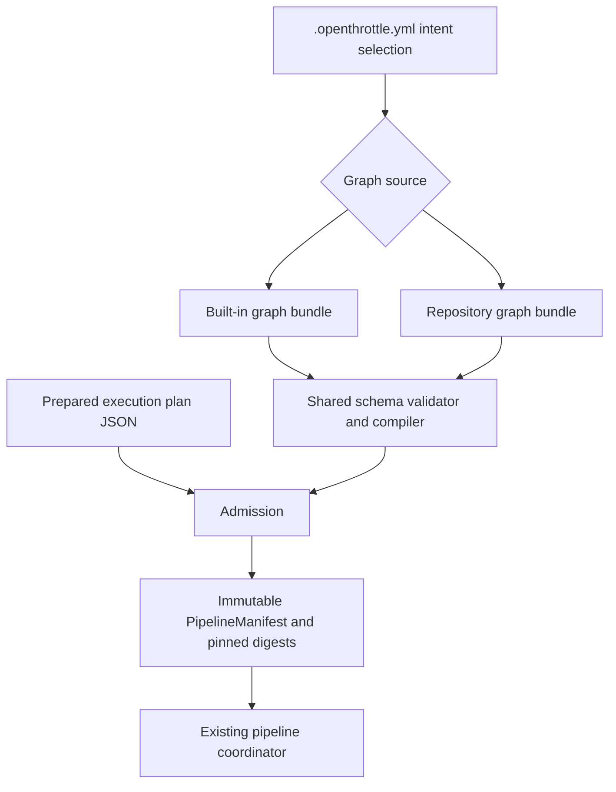
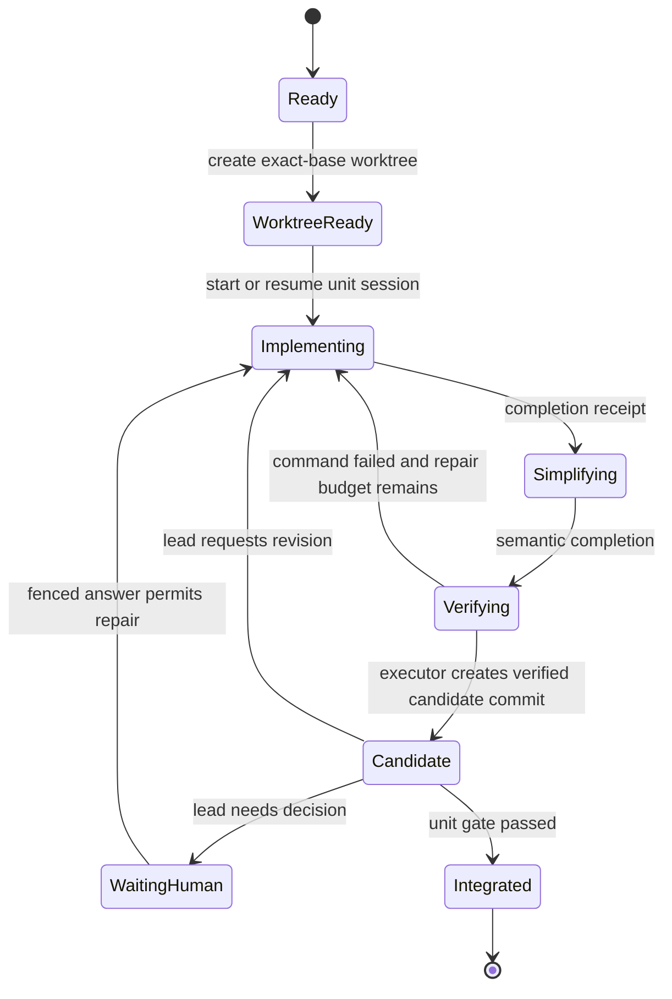
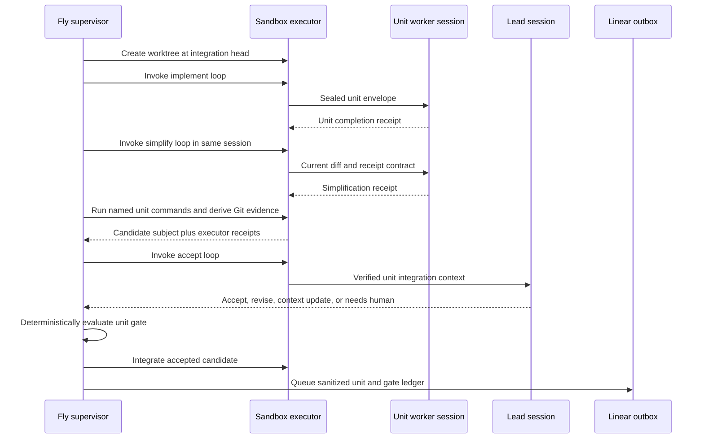
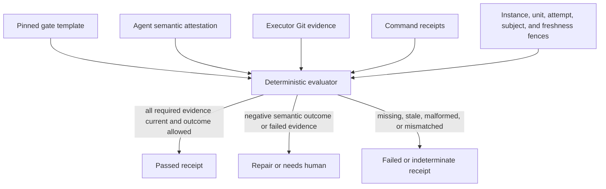
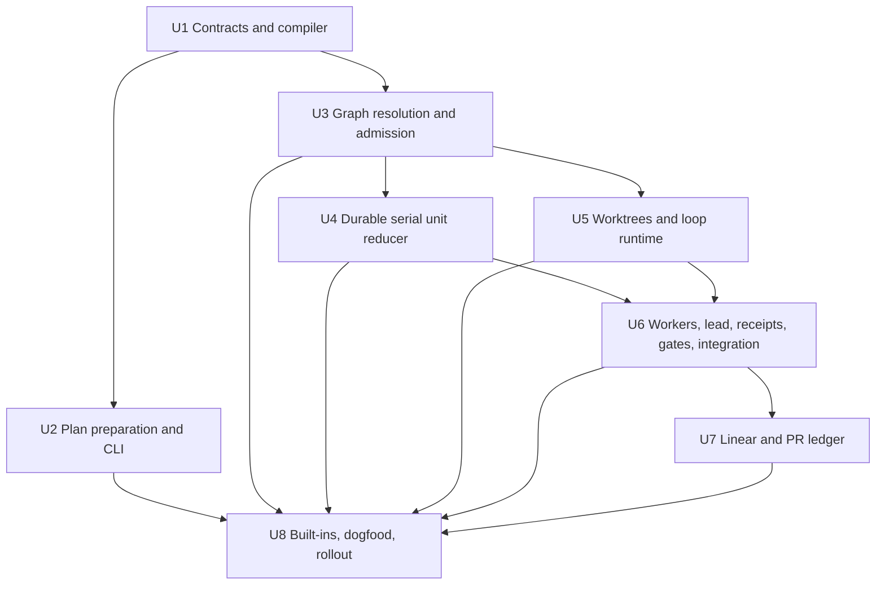

# Repository-configurable execution graphs - Plan

> **Re-grounded 2026-07-27 against current `origin/main` and the operator's finalized design decisions.** The 2026-07-25 module-boundaries refactor put supervisor responsibilities under `app/`, `http/`, `pipeline/`, `persistence/`, `providers/`, `runtime/`, `operations/`, and `shared/`, leaving only `index.ts` at the source root; the architecture test (`supervisor/src/__tests__/architecture.test.ts`) enforces that map, so new files land under `pipeline/` (graph/gate/publication contracts), `persistence/pipeline/` (SQLite stores), `operations/` (retryable effect draining), `app/` (admission orchestration), and `providers/` (fetch/delivery). A large hardening wave has landed since the 2026-07-26 re-grounding and this pass reflects it:
>
> - **The default implement pipeline is now `core/implement@4`** (`supervisor/pipelines/catalog.yaml` aliases `implement → core/implement@4`). It adds a global round-based repair budget (`max_repair_rounds`, tracked as `instance.reentry_count`), scoped repair re-entries (`max_reentries` per transition, tracked as `targetState.reentry_count`), and a whole-run net attempt cap (`max_attempts`, tracked as `instance.attempt_count`). Every "current simple manifest = `core/implement@1/2`" / "whole-plan `ce-work mode:return-to-caller`" baseline reference has been retargeted to this shape.
> - **OPE-25 added a conditional `post_simplify_review`** stage to `core/implement@4` (`simplification → post_simplify_review → test`), so the original motivation "a later simplifying change is not covered by review" is **already resolved** in the whole-plan pipeline. It is reframed here as the whole-change-gate ordering invariant Stage C must preserve, not a gap to close.
> - **`gates.ts` is the reuse basis** for Stage C gates: `semanticDecision` (incl. the AE6 tree-delta reclassify, `no_change_contradicted_by_tree_delta`), `commandDecision` (incl. R32 `not_configured`), and `validateFence` (provenance/subject/freshness/native-session/assurance) already exist and are the deterministic idioms the unit/whole-change gates specialize.
> - **`session-service.ts` was decomposed**: it is now a thin dispatcher; pin/compile/admission logic lives in `app/admission.ts` (`handleCreated`) and thread/human-reply routing in `app/thread-control.ts` (`handlePrompted`). All "modify `session-service.ts`" references are retargeted accordingly.
> - **`sandbox/runner/normalize.mjs` was deleted**; result normalization now lives in `sandbox/runner/artifacts.mjs`. Retargeted.
> - **`pipeline_work_bindings`** is the SPEC-reserved parent↔child bind seat (`docs/SPEC.md` §persistence; a `work_item ↔ pipeline_instance` junction that production code must not read while empty). Stage C is the sanctioned first writer of those rows.
> - **Net-new schema, not existing:** the `exited` terminal level (R39) does not exist yet (runs are `completed`/`canceled`/`superseded`/`failed`; actors `running`/`reaping`/`quarantined`/`settled`), there is no budget-reserve mechanism (R40's `budget_reserve_fraction` is genuinely new), and `COMMAND_NAMES` is a **closed enum** `[test, lint, build, format]` in `manifest.ts` — so R32/KTD12's arbitrary bounded command names is a real enum→named-map schema change. The latest migration is v12, so Stage C child tables land as **additive migration v13**.
> - **Depends on OPE-15 landing first.** The OPE-15 contraction (removal of `persistence/migrations/reconciliation.ts`, six table-folds, `createInstance` decomposition, and pruning of `core/implement@1/2/3` plus surplus `ce/*` manifests) is **in flight, not yet merged**. This plan targets the post-OPE-15 shapes; Stage C build starts after OPE-15 merges.
>
> Requirements (R1–R40), KTDs, flows (F1–F8), and acceptance examples (AE1–AE17) remain the authoritative contract; the prose, Problem Frame, operator decisions, unit breakdown, sequencing, and file/manifest references are what this pass updates.

## Goal Capsule

| Field | Contract |
|---|---|
| Objective | Add a small public graph → loop → worker authoring model and a **required** serial unit workflow — the full Stage C integration model, not a V0 — without replacing the deterministic pipeline coordinator delivered in PR #36 and hardened since (round-based repair budget, scoped re-entries, `post_simplify_review`). |
| Baseline | The current `openthrottle.pipeline/v1` manifest, `core/implement@4` default, coordinator, effect, artifact, gate (`gates.ts`), session, publication, and sandbox-stage contracts in `docs/SPEC.md` — **as of the post-OPE-15 tree** (this plan builds after OPE-15 merges). |
| Public model | A repository selects a named graph. A graph contains closed node kinds. Agent nodes invoke loops. Each loop binds one skill, worker, input scope, receipt type, and bounded retry behavior. The public graph is **kept and multi-codebase**: the operator runs it across several repositories via per-repo `.openthrottle.yml` intents. |
| Runtime model | The public graph compiles into the existing immutable `PipelineManifest`. Structured unit execution is one new composite stage capability whose child state remains supervisor-owned. |
| Default | The built-in `simple` graph remains the default and **must compile to a digest byte-identical to `core/implement@4`** — that equality is the compile-safety oracle for the whole feature. The built-in `structured` graph is the required integration workflow, selected per-intent. Both use the same public graph schema users can copy and edit. |
| Integration model | A unit is a work-**chunk**, not an independently shippable increment (a standalone increment is an ordinary one-shot ticket; a plan = units that are pieces of one whole). Each unit builds + simplifies in its own worktree, then **integrates onto one branch**. The **primary** correctness gate is the **whole-change review (R23)** with the whole-change final-repair loop (R25) as the main self-heal; per-unit review (R22) is a **light** build/progress check. One PR out (R37 slices are optional/later). |
| Unit behavior | A prepared plan supplies immutable units and dependencies. V1 executes units serially. One unit attempt keeps one worktree and worker native session across implementation, simplification, command verification, and bounded repair. |
| Lead behavior | One graph-scoped lead session reviews verified unit receipts, accepts or requests revision, records downstream context, or asks for a human. It also selects which ready unit dispatches next (R35), may propose a scope-preserving split of a pending unit (R36), and may propose publishing the integrated units as a releasable slice whose remainder becomes a typed continuation frontier (R37) — without these first-class moves, agents express ordering, granularity, and partial-completion needs by overloading repair/continuation outcomes or stranding remainder work in PR prose. It does not create worktrees, integrate Git, pass gates, or create work items: continuation across slices is supervisor-owned (R38). |
| Gate rule | Every gate decision is deterministic. Semantic skills may supply attestations, but only the supervisor can pass a gate after validating the receipt schema, producer, fences, exact Git subject, freshness, required corroborating evidence, and configured outcome. |
| Human source of truth | SQLite remains the transactional authority; the parent Linear issue and its AgentSession receive the sanitized unit/gate ledger, and the PR receives final exact-subject evidence. |
| Stop conditions | Do not add parallel unit execution, custom evaluator languages, worker Linear sessions, arbitrary base prompts, or token budgets in V1. The only runtime structural move is the R36 scope-preserving unit split; any other dynamic graph patch remains prohibited. Do not provision a structured run until its plan, graph, loops, workers, skills, commands, runtime capabilities, and digests validate. |

---

## Product Contract

**Product Contract changed:** R1–R40 and AE1–AE17 are the authoritative contract. The preserved U1–U8 implementation IDs target a serial V1. Public graph/loop/worker configuration replaces the earlier pipeline/workflow/execution-profile/role layers; parallel waves, graph mutation, custom gate composition, and worker-specific Linear sessions remain deferred.

**Operator design decisions are settled (no longer open):** (1) **Full Stage C is the decision** — there is no V0-vs-full ambiguity to resolve. (2) **The integration model is required** — units are chunks of one whole that build+simplify per-unit then integrate onto one branch, with the whole-change gate (R23) as the primary reviewer. (3) **The configurable public graph is kept and multi-codebase** — R1–R6 stay, the DSL is not deferrable, and it compiles to the immutable `PipelineManifest` (KTD1/F2) with per-repo selection via `.openthrottle.yml intents`. (4) **Deterministic-supervisor doctrine holds at every layer, and the lead/orchestrator is the last semantic layer added** — build the deterministic spine first (schema+compile, then child-reducer+integration+whole-change gate against STUB workers), then real workers, then the minimal lead, then splits/slices/remediation. (5) **The remediation-unit is a fast-follow, not a requirement** — R25 whole-change final-repair is the correctness backstop (nothing ships defective); a lead-proposed remediation-unit (validated as `remediation ⊆ already-integrated-unit scope`, dispatched over R36 plumbing) is a worthwhile reuse of R36, not a gate on shipping Stage C.

### Summary

OpenThrottle will offer two implementation graphs through one execution architecture:

1. `simple` passes the complete approved plan through the existing staged CE flow (`core/implement@4`: implementation → review → simplify → `post_simplify_review` → test → lint → build → publish → provider, with round-based repair) in one continuing agent context. Its compiled digest must be byte-identical to `core/implement@4`.
2. `structured` requires a validated execution-plan artifact, iterates its units serially in executor-owned worktrees, integrates each accepted unit onto one branch, uses a persistent lead for light per-unit acceptance, runs the whole-change gate as the primary review, and publishes one branch and PR.

Repositories can add more named graphs as configuration. A graph may compose only installed, closed node kinds. A `run` node invokes a configured loop; deterministic nodes run named commands, iterate prepared units, publish an exact subject, wait for provider evidence, or pause for a human. Graph configuration cannot define supervisor code, arbitrary expressions, runtime-generated topology, new credential authority, or a new artifact assurance class.

The graph is the public config-as-code surface. `PipelineManifest` remains the internal compiled runtime contract from PR #36; it is not a second user-authored layer. Built-ins are immutable graph files shipped with OpenThrottle, validated by the same compiler, inspectable through the CLI, and copyable into a repository as editable starting points.

### Problem Frame

PR #36 made the outer loop explicit and durable, and the hardening wave since (round-based repair budget, scoped re-entries, and OPE-25's `post_simplify_review`) closed the two gaps the earlier draft cited. The default `core/implement@4` pipeline now runs simplification **before** the review meant to cover it and bounds repair with a three-tier budget the coordinator already enforces. Two structural limits remain, and they are what Stage C addresses:

- **Whole-plan opacity.** `core/implement@4` still hands the full plan to one continuing `ce/implement@1` context (the `implement-plan` adapter invokes `ce-work mode:return-to-caller` for the whole stage). How that context splits work, creates worktrees, and orders sub-tasks stays inside one model and is opaque to the supervisor. A plan of several chunks cannot be reduced, integrated, or audited chunk-by-chunk.
- **No durable partial-completion state.** When a run self-scopes to a coherent slice, the remainder lives only in PR prose with no typed next action.

The structured release should improve plan-wide control without building a general workflow platform:

- A planning skill should transform an authored CE plan into uniform unit JSON while preserving semantic judgment at authoring time.
- A deterministic validator should prove shape, references, dependency validity, bounds, and digests before execution.
- The supervisor should select and reduce one ready unit at a time, **parametrizing the three-tier repair budget the coordinator already implements** (global `max_repair_rounds` / per-transition `max_reentries` / whole-run `max_attempts`) rather than inventing a new one.
- The sandbox executor should create the correct worktree, invoke the correct native session, derive Git evidence, and integrate an accepted candidate.
- The lead should preserve semantic continuity without becoming the scheduler, and is the **last** semantic layer added.
- The **whole-change gate (R23)** — reusing the same `post_simplify_review` ordering invariant already proven in `core/implement@4`, simplify-before-review — is the primary reviewer of the integrated subject; per-unit review is a light progress check.
- Linear should show how each unit and gate passed, not only a terminal status.

### Actors

- A1. Plan author — runs `ce-plan`, then uses the OpenThrottle preparation skill to produce or repair the execution-plan block.
- A2. Repository maintainer — defines allowed graphs, workers, loops, named commands, MCP inventory, and limits in committed configuration.
- A3. Human operator/reviewer — selects a graph, delegates and steers from the parent Linear issue, and reviews the final PR evidence.
- A4. Supervisor — pins configuration, compiles the graph, validates admission, owns child state, schedules serial actions, evaluates gates, and publishes durable state.
- A5. Sandbox executor — owns worktree/session/process mechanics, derives repository evidence, creates candidate commits, and integrates accepted results.
- A6. Lead agent — maintains graph-level semantic context and returns typed unit decisions or human escalations.
- A7. Unit worker — implements, simplifies, verifies, and repairs one unit inside one bounded attempt.
- A8. Reviewer/publisher workers — perform fresh whole-change review or exact-subject publication through separately scoped loops.
- A9. Runtime provider — hosts the sandbox through the provider-neutral runtime interface; Daytona is the initial adapter.

### Requirements

#### Configuration and compilation

- R1. `.openthrottle.yml` must use one closed, versioned configuration shape. No compatibility parser is required because there are no live users.
- R2. Each intent must declare a default graph and an allowlist of graph options; `simple` must remain the default for implement and investigate unless a repository explicitly changes it.
- R3. A graph bundle must declare one graph plus its loops and workers, or reference compatible definitions from the same pinned closure. Built-in and repository bundles must use the same schema and compiler.
- R4. V1 graph node kinds must be limited to `run`, `for_each_unit`, `command`, `publish`, `wait_for_provider`, and `human`.
- R5. A loop must bind a skill reference, worker reference, input scope, standard receipt schema, timeout, and bounded outcome behavior. It must not embed an arbitrary base prompt.
- R6. A worker must declare engine/model inheritance, session scope, authorized loop skills, allowed MCP server names, and logical credential scopes. The configured skill list controls which skill OpenThrottle may enter for that worker; it is not a security claim that a general shell-capable agent cannot observe other image-installed skill bytes. The sealed OpenThrottle instruction remains platform-owned.

#### Plan preparation and admission

- R7. OpenThrottle must ship an agent-neutral `prepare-execution-plan` skill intended to run against a completed CE unified plan.
- R8. The skill must produce exactly one `openthrottle.execution-plan/v1` JSON block containing stable unit IDs, dependencies, instruction references, acceptance references, named verification commands, and bounds.
- R9. Semantic decomposition belongs to the skill or human. A shared deterministic validator must reject malformed JSON, duplicate or unknown IDs, cycles, invalid references, traversal, excess bounds, and incompatible graph requirements.
- R10. `openthrottle plan validate` and `openthrottle ship` must use the same contract implementation as supervisor admission. A structured graph without a valid execution plan must fail before provisioning; `simple` may continue to accept the complete plan alone.

#### Runtime authority and serial unit execution

- R11. The public graph must compile into the existing immutable `PipelineManifest`; graph/config/skill/plan/runtime source and normalized digests must be pinned to the pipeline instance.
- R12. `for_each_unit` must compile to one installed composite stage capability. Its parent stage remains active while a supervisor-owned child reducer advances unit and loop attempts.
- R13. The child reducer must durably own unit status, action attempts, effect intents, worker/lead session bindings, worktree handles, candidate/integration subjects, receipts, gate decisions, and terminal aggregate.
- R14. V1 must execute at most one unit action process and one writable unit worktree at a time. Independent dependencies may establish readiness but must not cause parallel dispatch.
- R15. Graph topology and execution-plan units must be immutable during a run, with exactly one sanctioned structural move: the supervisor-validated scope-preserving unit split (R36). Agents may return downstream context for existing pending units; new units, changed external dependencies, or scope expansion must return `needs_human`.

#### Worker, lead, worktree, and integration behavior

- R16. One unit attempt must reuse one worker native session and one worktree across implement → simplify → command → repair cycles while its unit, graph revision, base, skill digests, and workspace remain current.
- R17. For every code-writing unit or final-repair attempt, the executor must create the worktree from the exact current integration head, prevent worker publication, derive the diff/tree/changed paths/cleanliness, create the internal candidate commit, and exclusively own any fast-forward of the integration branch.
- R18. A worker request must contain one immutable unit envelope, the selected loop, typed transition context, exact subjects/digests, allowed skills/MCPs/credentials, and the caller-owned receipt contract.
- R19. A unit completion receipt must capture outcome, summary, assumptions, decisions, issues, verification performed, downstream context, and requested human input. Executor-derived Git and command facts must remain separate evidence.
- R20. One graph-scoped lead session must receive the unit envelope, semantic receipt, executor evidence, command receipts, current integration context, and prior accepted context, then return `accept`, `revise`, `context_update`, or `needs_human`.

#### Deterministic gates and autonomous repair

- R21. Gate evaluation must be a deterministic function over pinned configuration and typed current evidence. Process exit zero or schema validity alone must never pass a gate.
- R22. The unit-acceptance gate must require a current worker completion receipt, executor-verified candidate subject, all configured unit commands passed or explicitly not configured, and a lead decision bound to that candidate.
- R23. The structured final gate sequence must run configured whole-change commands before a fresh semantic review over the exact integrated subject. Simplification must precede the review it is meant to cover.
- R24. A unit command failure or lead revision must resume the same current unit session by default. Exhaustion, stale context, or a foundational decision must pause for a human instead of silently widening scope.
- R25. A final command or review failure must enter a bounded whole-change repair loop owned by a dedicated repair worker in an executor-owned exact-base worktree. A current completion receipt and executor Git evidence permit only an internal candidate commit and fast-forward; that subject must rerun the configured commands and obtain a fresh semantic review before publication.
- R26. New evaluator mechanics, artifact schemas, assurance classes, side effects, or gate expression languages require reviewed runtime support. V1 repository configuration can compose existing node kinds, loops, commands, and standard receipts only.

#### Visibility, credentials, and portability

- R27. Every unit transition and gate receipt must be stored transactionally and queued as a sanitized, ordered activity on the parent Linear AgentSession; final receipts must also be rendered into the PR gate ledger.
- R28. V1 must not create Linear subissues or auxiliary worker AgentSessions. Human steering enters through the parent session and is routed by the supervisor to the active lead or unit action under exact fences.
- R29. SQLite remains coordinator authority, but a human must be able to understand unit status, assumptions, revision requests, gate rationale, exact subjects, and evidence links from Linear and GitHub.
- R30. Workers, lead, reviewer, repair, and publisher processes must receive only their configured logical credentials. Daytona secret names must not appear in graph, loop, or worker schemas.
- R31. `mcp_servers` must remain a repository-declared, validated inventory. A worker may receive only names in its allowlist; OpenThrottle must not import arbitrary personal Claude/Codex configuration.
- R32. Repository commands must be arbitrary bounded names mapped to exact command strings and execution policy. Graph nodes and execution-plan units reference names rather than hard-coded `test`/`lint`/`build` executor branches.
- R33. Repository and graph limits must bound units, dependencies, unit attempts, loop reentries, final repair rounds, command output, and wall time. A graph may lower but not raise platform/runtime limits.
- R34. Token/spend budgets, parallel isolation, dynamic graph changes beyond the R36 split, custom gate languages, and per-worker Linear sessions are deferred without weakening existing turn, timeout, credential, branch, subject, or publication fences.

#### Lead scheduling, splits, and slice continuation

- R35. When more than one unit is ready, the lead selects which ready unit dispatches next; the choice is recorded on the dispatch receipt. Absent a lead selection (timeout, missing decision, or recovery), the supervisor falls back to the deterministic plan order. Selection never overrides dependency readiness, and in V1 it changes order only, never concurrency.
- R36. The lead may propose splitting one pending, never-attempted unit into two or more child units via a typed `openthrottle.unit-split/v1` artifact carrying, per child, instructions, acceptance criteria, owned scope, and intra-split ordering. The supervisor validates deterministically — the union of child scopes and acceptance criteria must equal the parent's (no expansion, no loss), children inherit the parent's external dependency edges, and total attempt/budget limits are partitioned rather than multiplied — then applies the split as a recorded graph revision with its own digest, closing the parent unit as `split`. A proposal failing validation returns to the lead once; a second failure or any scope change returns `needs_human`. Splitting an in-progress unit is not permitted — continuation slices remain the mechanism inside an attempted unit.
- R37. When at least one unit has integrated and at least one pending unit remains, the lead may propose publishing the integrated units as a coherent releasable slice. The full final gate sequence (R23) runs over the exact integrated subject; the run then terminates `shipped` carrying a typed, digested **continuation frontier**: the remaining execution-plan units by stable ID (byte-identical to the pinned plan — the supervisor rejects any edit), the accepted downstream context records, and the published head. The frontier is durable state and is rendered in the terminal Linear receipt and PR body as the explicit remaining work.
- R38. Continuation is supervisor-owned, never agent-owned: when provider evidence confirms the slice PR **merged**, the supervisor admits a new generation on the same ticket seeded from the frontier — base resolved from the merge result, execution plan equal to the frontier units revalidated by the R9 validator, prior accepted context carried forward, fresh session lineage. Bounded by a configured maximum auto-continuation count per ticket. A PR closed without merging, a frontier that fails revalidation against the new base, or an exhausted continuation bound returns `needs_human` instead of chaining. No new Linear issue is created and no agent gains work-item creation authority: the human approved the full plan at ship time, and PR merge remains the recurring human gate (a repository with auto-merge policy thereby opts into a fully autonomous chain).

#### Unit status leveling and budget wind-down

- R39. A unit's terminal state must be leveled into exactly one of `completed` (its acceptance gate passed under R22), `exited` (it ended for a structural reason — superseded by a validated R36 split, a stop/supersede fence, or a drained budget reserve under R40), or `failed` (a defect — an executor/gate boundary violation, a malformed or unbindable receipt, or an unrecoverable effect error). The child reducer must derive one binary `alarm` bit from that level for operator surfaces (`failed` sets the alarm; `completed` and `exited` clear it) so Linear, the PR ledger, and `openthrottle status` distinguish "needs attention" from "ended cleanly" without re-deriving the taxonomy. When a leased unit action loses liveness past its heartbeat fence and cannot be reconciled to a current attempt, the supervisor must heal that unit to `exited` (never `failed`) and release its worktree/action so serial dispatch resumes deterministically rather than the unit lingering silently `running`. Terminal levels and the alarm bit are supervisor-derived from durable evidence only; no agent receipt may assert either.
- R40. Each unit attempt and each final-repair attempt must reserve a configured tail (default ~10%, a `budget_reserve_fraction` bound governed by R33) of its remaining budget across attempts, loop reentries, and wall-clock. When any of those axes drains into the reserve, the supervisor must instruct the active worker to stop starting new work and instead land committed, coherent state and hand off — the executor derives a candidate over its owned worktree, and the worker returns a bounded downstream-context record plus a wind-down receipt — so budget exhaustion yields resumable state rather than a stranded worktree. A wind-down that reaches a coherent handoff terminates the attempt as `exited` (R39) and settles by state. When the R37 preconditions hold — at least one unit integrated and at least one pending unit remaining — the handoff carries its downstream context into the continuation frontier (R37). When no unit has yet integrated there is no publishable slice: the attempt still terminates `exited` with its bounded downstream-context record preserved as durable evidence on the ticket, and the run pauses `needs_human` — a human chooses between re-delegation with a larger budget and abandonment. When the reserve drains during a final-repair attempt, every unit has already integrated but the whole-change gates are incomplete, so neither publication nor a frontier is valid: the attempt terminates `exited` with its candidate state committed and its context recorded, and the run pauses `needs_human`. A wind-down that cannot reach coherence returns `needs_human`. The reserve is bounded by R33 and never raises platform or runtime limits.

### Key Flows

#### F1. Prepare and ship a plan

1. The author completes a CE unified plan.
2. `prepare-execution-plan` reads the Product Contract and Implementation Units, proposes normalized unit JSON, and calls `openthrottle plan validate`.
3. The author resolves semantic ambiguity; deterministic validation confirms the final block.
4. `openthrottle ship <plan> --graph structured` validates the selected local graph and plan before creating/delegating the Linear issue.
5. `--graph simple` accepts the full plan without requiring unit JSON.

#### F2. Resolve and admit a graph

1. The supervisor resolves the exact base commit and fetches `.openthrottle.yml`, the selected built-in or repository graph bundle, referenced repository skills, commands, and execution plan.
2. It validates the closed schemas and runtime capability inventory.
3. It compiles the graph to a normalized `PipelineManifest`, pins every source and digest, and atomically creates the pipeline instance.
4. Any invalid, missing, changed, or unsupported input is published to the parent Linear session; no sandbox is provisioned.

#### F3. Execute one unit attempt

1. The child reducer selects the next ready U-ID by dependency order and stable plan order.
2. The executor creates one internal worktree at the exact integration head and starts a unit worker session.
3. The same session runs the configured implementation and simplification loops.
4. The command executor runs the unit's named commands. Failure resumes the same session through the repair loop while current and within bounds.
5. The executor derives Git evidence and creates an internal candidate commit.

#### F4. Accept and integrate a unit

1. The persistent lead receives the unit receipt, candidate evidence, command receipts, and integration context.
2. `revise` returns to the current worker attempt; `needs_human` pauses durably; `context_update` accompanies either a valid acceptance or revision.
3. The supervisor deterministically evaluates the unit gate.
4. On pass, the executor fast-forwards the integration branch to the accepted candidate, records the new head, removes the unit worktree, and unlocks the next unit.

#### F5. Carry downstream context and re-partition pending work without expanding scope

1. A unit receipt or lead decision identifies an assumption relevant to existing pending units.
2. The supervisor stores a bounded immutable context record tied to the source unit and integration head.
3. Later unit envelopes include applicable context records.
4. When several units are ready, the lead's recorded selection (R35) decides which dispatches next; the deterministic plan order is the fallback.
5. When a pending unit is too large for one attempt, the lead proposes an `openthrottle.unit-split/v1`; the supervisor validates scope preservation and applies it as a recorded graph revision (R36) instead of the agent cramming the unit into overloaded repair/continuation outcomes.
6. A requested new unit, external dependency change, or scope expansion pauses for a human and requires a newly validated run rather than an in-place graph patch.

#### F6. Complete whole-change gates and publish

1. When every unit integrates — or a validated R37 slice proposal selects the currently integrated units — the child stage emits one aggregate artifact bound to the exact integration head.
2. The graph runs full named commands, then fresh whole-change semantic review.
3. Failures enter the bounded final-repair loop and repeat the affected gates.
4. The publish loop alone receives provider write authority and publishes the exact gated tree to one `ot/*` branch and PR.
5. Provider evidence advances only for the exact published head.

#### F8. Publish a slice and continue autonomously

1. The lead proposes a slice publication naming the integrated units; the supervisor validates that every named unit is integrated and every remaining unit is byte-identical to the pinned plan.
2. The F6 final gates run over the integrated subject; the run terminates `shipped` with the typed continuation frontier rendered in the terminal receipt and PR body.
3. Provider evidence confirms the slice PR merged; the supervisor admits a continuation generation on the same ticket — frontier units revalidated against the merged base, accepted context carried forward, fresh sessions — without human action.
4. A PR closed without merge, a frontier failing revalidation, or an exhausted continuation bound pauses `needs_human` with the frontier preserved.

#### F7. Human steering, stop, and recovery

1. A `needs_human` decision publishes the question and evidence to the parent Linear session and pauses dispatch.
2. The supervisor binds the reply to the current unit/final-repair fence and invokes the lead or worker through a typed continuation.
3. Stop fences new child effects, terminates the active process, and cleans only validated graph-owned worktrees.
4. Restart reconciles persisted effects, candidate/integration subjects, and native sessions without duplicate agent invocation or integration.

### Acceptance Examples

- AE1. Given the default `simple` graph and a plan with no execution-plan block, delegation compiles to the current whole-plan CE stages and completes without child unit state.
- AE2. Given `simple`, `structured`, and a repository graph as allowed implement options, `--graph repo-docs` selects and pins only that allowed graph; an unknown option fails before issue delegation or provisioning.
- AE3. Given U3 depends on U4 and U4 depends on U3, local validation and supervisor admission identify the cycle and no sandbox is created.
- AE4. Given two dependency-independent units, the V1 reducer marks both logically ready but dispatches only the earlier stable unit; the second starts only after the first integrates.
- AE5. Given a worker tries to modify the integration checkout, sealed request, or another retained attempt, the executor rejects the attempt and records the boundary violation.
- AE6. Given a worker claims tests passed but the executor command receipt failed, the unit gate fails and Linear shows the discrepancy.
- AE7. Given accepted U1 discovers an assumption relevant to U3, the lead returns a bounded context update and U3 receives it; a request to add U4 instead pauses for a human.
- AE8. Given a lead revision while the unit worktree/session/base remain current, the same worker session repairs and simplifies again. A lost or stale workspace creates a new attempt with reconstruction context.
- AE9. Given the final `test` command fails after all units integrate, a dedicated final-repair session edits an exact-base worktree, the executor commits and internally integrates its candidate, the command reruns, and a fresh reviewer evaluates the new exact subject.
- AE10. Given three units and one revision, the parent Linear session shows each state, worker assumptions, lead rationale, command/Git evidence, and gate result without requiring direct SQLite access.
- AE11. Given a human answers a paused unit question, only the currently fenced action receives the answer; a stale answer is recorded but cannot mutate the run.
- AE12. Given four unit worktrees over time, only the integration branch is pushed and the PR tree equals the final gated subject.
- AE13. Given a maintainer copies the built-in structured graph, swaps the reviewer skill and adds a docs command, the repository graph compiles through the same schema without a supervisor code change.
- AE14. Given commands `unit`, `docs-check`, and `package`, a graph or unit may reference any of them; an undefined command fails admission rather than falling through to a stage name.
- AE15. Given a semantic review skill returns a passing standard review receipt for the wrong commit, deterministic evaluation rejects it. A current receipt with required evidence passes even when the skill is non-CE.
- AE16. Given the Daytona runtime supplies one outer sandbox but no sibling-process isolation, structured V1 still runs safely because only one writable unit action exists at a time.
- AE17. Given a validated slice publication with three units remaining, when the slice PR merges, a new generation on the same ticket adopts exactly those three units against the merged base without human action; when the PR is instead closed unmerged, the run pauses `needs_human` with the frontier preserved.

### Success Criteria

- The built-in `simple` graph compiles to a **digest byte-identical to `core/implement@4`** (and `investigate` to `core/investigate@1`) — same stage order including `post_simplify_review`, context policies, round-based repair transitions, gates, publication, and provider tail. This equality is the compile-safety oracle and the first operator checkpoint.
- The same graph and execution-plan fixtures normalize and hash identically in the contract package, packed CLI, and supervisor.
- A repository can copy a built-in graph, change compatible loops/workers/skills/commands, validate it, and select it without an OpenThrottle deployment.
- Structured serial execution survives crashes before/after worktree creation, agent completion, candidate commit, lead decision, integration, and publication acknowledgement without duplicate work or integration.
- Each unit gate has worker, executor, command, and lead evidence bound to one candidate subject; every final gate is bound to the final integrated/published subject.
- One worker native session is reused across a current unit attempt; one lead session is reused across the graph; each final review is fresh.
- The parent Linear issue and PR expose sanitized gate rationale and evidence links for every unit/final gate.
- CE-backed defaults and non-CE fixture skills satisfy the same loop/receipt contracts without coordinator branches.
- The full local contract suite passes, followed by one credentialed serial Linear → Fly → Daytona → GitHub acceptance run.

### Scope Boundaries

**In scope**

- One public `openthrottle.config/v1` plus `openthrottle.graph/v1` authoring model.
- Built-in and repository graph bundles using one compiler.
- User-defined loops, workers, named commands, skill references, MCP allowlists, and bounded limits.
- The `prepare-execution-plan` skill and shared local/admission validator.
- One serial `for_each_unit` composite stage with durable unit state.
- One persistent lead, one session/worktree per unit attempt, bounded final repair, and one integration branch/PR.
- Deterministic gate receipts and parent Linear/PR evidence.

**Deferred to follow-up work**

- Parallel unit dispatch, sibling worktree/process isolation, resource claims, conflict groups, and deterministic waves.
- **Remediation-unit as a fast-follow.** R25 whole-change final-repair is the correctness backstop (nothing ships defective); a lead-proposed remediation-unit — the supervisor validates it as `remediation ⊆ already-integrated-unit scope`, then dispatches it over the R36 split plumbing — is a worthwhile reuse that can follow Stage C, not a requirement for it.
- Dynamic graph patches beyond the R36 scope-preserving split; runtime-created units with new scope.
- Stacked continuation (admitting a follow-up generation off an unmerged slice PR); V1 chains only on merge evidence.
- Custom gate DSLs, custom receipt schemas, and repository-defined evaluator mechanics.
- Worker-specific Linear AgentSessions or a subissue per unit.
- Arbitrary worker base prompts/personas; a future pinned policy-skill field can cover a proven need.
- Token/spend budgets and cross-provider normalized usage enforcement.
- Importing personal MCP configuration, redesigning MCP secret references, or remote skill/plugin installation during a run.
- Multiple sandboxes/providers per graph and cross-repository units.

**Outside the product boundary**

- Agent-authored safety overrides, credential scopes, assurance upgrades, GitHub approvals, or branch-protection bypass.
- Ticket text supplying graph/skill bodies or arbitrary file references outside the pinned repository option.
- Replacing Linear as the human steering surface or GitHub as the publication/provider-evidence surface.

---

## Planning Contract

### Key Technical Decisions

- KTD1. **Compile public graphs into the PR #36 manifest.** A graph is authoring input; `PipelineManifest` remains the sole runtime sequence and gate authority. `for_each_unit` compiles to one new capability rather than a second top-level coordinator. (session-settled: user-directed — chosen over replacing the existing coordinator: PR #36 already supplies the durable deterministic outer loop.)
- KTD2. **Use graph → loop → worker as the public vocabulary.** Do not expose separate pipeline, workflow, execution-profile, role, action, and gate-DSL layers in V1. Internal code may retain pipeline terminology where it names the existing runtime contract. (session-settled: user-directed — chosen over the prior multi-layer schema: the first release should stay understandable and configurable.)
- KTD3. **Make the execution plan uniform, not every source plan.** The preparation skill may reason over CE prose, but the structured runner consumes only validated `openthrottle.execution-plan/v1` JSON. (session-settled: user-directed — chosen over runtime dependency inference: dependency creation is semantic while validation is deterministic.)
- KTD4. **Keep graph scope immutable; give the lead ordering and re-partitioning authority.** The lead may add typed context to existing pending units, select which ready unit dispatches next (R35), and propose supervisor-validated scope-preserving splits of pending units (R36) — but cannot add units, change external dependencies, or expand scope in V1; material scope change returns to the human and a new validated generation. (session-settled: user-directed 2026-07-24 — revised from full topology immutability after the OPE-6 live run showed agents forced to express granularity and ordering needs through overloaded repair/continuation outcomes; the invariant is now scope immutability, not shape immutability.)
- KTD5. **Keep one lead session and one session per unit attempt.** Implement, simplify, command repair, and lead revision stay in the unit session by default; review is fresh at the end. (session-settled: user-directed — chosen over fresh worker sessions for every loop: local context is valuable within one bounded attempt.)
- KTD6. **Make Git mechanics executor-owned.** The worker edits but does not commit or push. The executor creates a candidate commit, verifies it, and advances the integration branch only after the deterministic acceptance gate passes. (session-settled: user-directed — chosen over agent-created worktrees/branches: handoff and recovery must survive unrelated native sessions.)
- KTD7. **Treat semantic output as evidence, never authority.** A lead or CE reviewer returns a typed attestation. The supervisor deterministically checks schema, provenance, fences, subject, freshness, outcome, and corroborating executor/command evidence before passing the gate. (session-settled: user-directed — chosen over model-invoked “if X then pass” instructions: the outer loop must own advancement.)
- KTD8. **Keep CE as a shipped default, not a core dependency.** Built-in loops reference thin OpenThrottle adapters over the pinned CE plugin. Repository loops may select another compatible pinned skill with the same standard receipt. (session-settled: user-directed — chosen over baking CE semantics into the supervisor: future graphs and engines must be swappable.)
- KTD9. **Publish through the parent Linear session only.** Unit receipts and gate decisions become ordered parent activities; the PR carries final evidence. Worker sessions/subissues remain deferred. (session-settled: user-directed — chosen over SQLite-only or per-worker issue state: humans consult Linear and GitHub.)
- KTD10. **Keep credentials and MCPs logical and provider-neutral.** Worker config references logical scopes and allowed server names. Daytona Secrets may implement materialization inside the adapter but never become graph schema. (session-settled: user-approved — chosen over provider secret names in config: the sandbox provider should remain replaceable.)
- KTD11. **Ship serial execution first.** Dependencies determine readiness and ordering, but V1 permits only one writable unit action at once. This removes sibling isolation, merge-order, and race complexity while preserving the future seam. (session-settled: user-directed — chosen over automatic safe parallelism: parallel orchestration made the initial design too large.)
- KTD12. **Keep commands repository-defined.** The executor implements one bounded named-command protocol; `test`, `lint`, and `build` are default config names rather than hard-coded executor mechanics. (session-settled: user-directed — chosen over fixed command enums: platform defaults should use the same surface as repository graphs.)
- KTD13. **Bound structure and time before cost.** Enforce graph/unit/attempt/reentry/output/time limits and defer token budgets until provider usage is trustworthy and comparable. (session-settled: user-directed — chosen over V1 token accounting: portable usage data is not yet a reliable control input.)
- KTD14. **Make partial completion a managed handoff, not prose.** The 2026-07-24 gen-7 run self-scoped its PR to a coherent slice — the right instinct — but the remainder existed only in the PR body with no durable next action. Because execution-plan units are validated schema (R8-R9), the remainder needs no new authoring or approval: R37 captures it as a typed frontier and R38 lets the supervisor chain a continuation generation on merge evidence. Human authority is preserved at its two existing gates — plan approval and PR merge — and the agent never gains work-item creation authority. (session-settled: user-directed 2026-07-24.)
- KTD15. **Level unit terminal states and heal missing liveness to `exited`.** Distinguish `completed`/`exited`/`failed` and derive one operator alarm bit (R39), so a unit that ends for a structural reason (split, stop, drained reserve) or loses liveness is never conflated with a defect and never lingers as silently `running`. (session-settled: user-directed 2026-07-25 — adopted from the reviewed Fractal comparison's completed/exited/failed status leveling; the OPE-6/2026-07-24 incident window showed stuck-`running` actors were the dominant failure signature, so heal-to-`exited` is a first-class unit-level invariant rather than an incidental reaper side effect.)
- KTD16. **Spend a budget reserve on handoff, not new work.** When a unit or final-repair attempt drains into its ~10% reserve, wind down to committed coherent state plus a downstream-context record and a receipt instead of starting new work (R40), so exhaustion produces durable, resumable state — a continuation frontier whenever a publishable slice exists — rather than a stranded worktree. (session-settled: user-directed 2026-07-25 — adopted from the reviewed Fractal comparison's reserve wind-down budget; it wires to R33 bounds and the R37 frontier so the existing continuation machinery absorbs budget-limited runs whenever R37's preconditions hold, while a drain with nothing yet integrated or during final repair pauses `needs_human` with the context preserved.)

### High-Level Technical Design

The following shapes are directional contracts, not implementation syntax.

#### Configuration and compilation



Directional repository layout:

```text
.openthrottle.yml
.openthrottle/
  graphs/
    docs-release.yml
.agents/
  skills/
    docs-review/
      SKILL.md
```

Package-owned built-ins live in `supervisor/graphs/` with the same graph-bundle schema. `openthrottle graph copy structured` materializes an editable repository bundle under `.openthrottle/graphs/`.

Directional root configuration:

```yaml
schema: openthrottle.config/v1
agent: codex

post_bootstrap:
  - npm ci --prefix supervisor
  - npm ci --prefix cli
  - npm ci --prefix sandbox

intents:
  implement:
    default: simple
    options:
      simple: builtin://simple@1
      structured: builtin://structured@1
      docs-release: repo://.openthrottle/graphs/docs-release.yml

commands:
  test: { run: "...", timeout_seconds: 1800, mutation: read_only }
  lint: { run: "...", timeout_seconds: 900, mutation: read_only }
  build: { run: "...", timeout_seconds: 1800, mutation: read_only }

mcp_servers: {}
limits:
  max_turns: 200
  task_timeout_seconds: 7200
  max_units: 24
  max_unit_attempts: 3
  max_final_repairs: 2
  budget_reserve_fraction: 0.1
```

Directional graph bundle:

```yaml
schema: openthrottle.graph/v1
id: structured

workers:
  lead:
    engine: inherit
    session: graph
    skills: [builtin://accept-unit@1]
    mcp_servers: []
    credentials: [model.invoke]
  unit:
    engine: inherit
    session: attempt
    skills: [builtin://implement-unit@1, builtin://simplify-unit@1, builtin://repair-unit@1]
    mcp_servers: []
    credentials: [model.invoke]
  reviewer:
    engine: inherit
    session: fresh
    skills: [builtin://final-review@1]
    mcp_servers: []
    credentials: [model.invoke]
  final_repair:
    engine: inherit
    session: attempt
    skills: [builtin://final-repair@1]
    mcp_servers: []
    credentials: [model.invoke]
  publisher:
    engine: inherit
    session: fresh
    skills: [builtin://publish@1]
    mcp_servers: []
    credentials: [model.invoke, repo.write, provider.read]

loops:
  implement_unit: { worker: unit, skill: builtin://implement-unit@1, input: unit, receipt: unit_completion, timeout_seconds: 3600 }
  simplify_unit: { worker: unit, skill: builtin://simplify-unit@1, input: unit_diff, receipt: unit_completion, timeout_seconds: 1200 }
  repair_unit: { worker: unit, skill: builtin://repair-unit@1, input: unit_failure, receipt: unit_completion, timeout_seconds: 3600 }
  accept_unit: { worker: lead, skill: builtin://accept-unit@1, input: verified_unit, receipt: unit_decision, timeout_seconds: 1200 }
  final_review: { worker: reviewer, skill: builtin://final-review@1, input: whole_change, receipt: semantic_review, timeout_seconds: 1800 }
  final_repair: { worker: final_repair, skill: builtin://final-repair@1, input: final_failure, receipt: unit_completion, timeout_seconds: 3600 }
  publish_change: { worker: publisher, skill: builtin://publish@1, input: gated_subject, receipt: publish_subject, timeout_seconds: 1800 }

graph:
  - id: units
    for_each_unit:
      implement: implement_unit
      simplify: simplify_unit
      commands: unit.verification_commands
      repair: repair_unit
      accept: accept_unit
      max_attempts: inherit
  - id: final_test
    command: test
    on_failure: final_repair
  - id: final_lint
    command: lint
    on_failure: final_repair
  - id: final_build
    command: build
    on_failure: final_repair
  - id: final_review
    run: final_review
    on_success: publish
    on_failure: final_repair
  - id: final_repair
    run: final_repair
    on_success: final_test
    max_reentries: inherit
  - id: publish
    publish: publish_change
  - id: provider
    wait_for_provider: github
```

`session` is a closed enum: `graph` reuses one graph-scoped session, `attempt` reuses one current unit or whole-change repair attempt, and `fresh` starts a new session for every invocation. Fields such as `commands` and `on_repair` are closed parts of installed node kinds, not arbitrary expressions or model-authored transitions.

#### Unit lifecycle



#### Unit action and evidence sequence



#### Gate evaluation



The evaluator is deterministic even when one input is a semantic judgment. It does not decide whether code is “good” independently; it decides whether the configured, correctly bound semantic reviewer attested the allowed outcome and whether all required deterministic evidence corroborates the same subject.

### Durable State and Effects

The existing pipeline instance and stage attempt remain the parent. New child records land as **additive migration v13** (the latest merged migration is v12; all Stage C tables are new, checksum-pinned, and never rewrite historical rows) rather than adding unit-specific columns throughout `pipeline_stage_attempts`. The SPEC-reserved **`pipeline_work_bindings`** row is the sanctioned parent↔child bind seat: today it is an unused `work_item ↔ pipeline_instance` junction that production code must not read while empty, and Stage C is its first writer, binding each durable unit delivery to its fenced pipeline attempt and unit so unit-level inbox/result handling is auditable without overloading `run_stage_bindings`.

- `execution_graph_instances` — parent stage attempt, plan/graph digests, status, integration head, lead session binding, limits, and aggregate artifact.
- `execution_units` — immutable unit definition digest, dependency projection, stable order, current status, terminal level (`completed`/`exited`/`failed`) and derived alarm bit (R39, **net-new** — `exited` does not exist in the current run/actor enums), accepted subject, and downstream context cursor.
- `execution_work_attempts` — unit or final-repair scope, optional unit ID, ordinal, workspace, worker session, current loop, base/candidate subjects, fence, the reserve budget cursor (R40, **net-new** — no reserve mechanism exists today), and retry lineage.
- `execution_loop_attempts` — one sealed loop invocation, request/result hashes, native session binding, outcome, and liveness.
- `execution_context_records` — immutable bounded lead/worker context updates for existing pending units.
- `execution_gate_receipts` — deterministic unit/final child decisions and linked artifact hashes, produced by evaluators that **reuse the `gates.ts` idioms** (`semanticDecision` incl. the AE6 tree-delta reclassify, `commandDecision` incl. R32 `not_configured`, and `validateFence`) rather than reimplementing fence/provenance/subject/freshness checks.
- `execution_effect_intents` — idempotent worktree, loop dispatch, command, candidate, integration, stop, and cleanup actions.

The supervisor persists an intent before touching Daytona, a process, Git, Linear, or GitHub. Every acknowledgement includes the expected child version and fence. The child reducer emits exactly one `execution_graph_result` aggregate artifact to settle the parent `for_each_unit` stage.

### System-Wide Impact

- **Admission and configuration:** graph source resolution joins the existing exact-base config/catalog selection; repository graph and skill closures are trusted repository code but ticket-supplied selectors and content remain untrusted.
- **Pipeline coordinator:** the parent `for_each_unit` stage retains one stable `run_id` and ticket actor binding for the composite stage's lifetime. Child loop attempts carry that parent run plus their own action/attempt/request fences; they do not create competing ticket actors or overload `pipeline_stage_attempts.native_session_id`.
- **Sandbox events and liveness:** child results, activities, steering acknowledgements, and heartbeats add child action identity to the existing parent run fence. Active child progress renews the composite run; stale child events cannot keep a stopped or superseded parent alive.
- **Persistence:** child creation, one-active-action uniqueness, accepted-candidate uniqueness, integration-head CAS, gate receipt, and next-effect creation need explicit transaction boundaries and database constraints where SQLite can enforce them.
- **Runtime:** ordinary stages continue through `stage-executor@1`. The composite stage initializes child state, and its loop actions use `loop-action@1` against the same runtime resource instead of launching a second supervisor inside Daytona.
- **Git:** the integration checkout is executor-controlled; one disposable unit or final-repair worktree is agent-writable. Candidate creation, acceptance or repair completion, integration-head advancement, and cleanup are distinct idempotent effects.
- **Skills, credentials, and MCPs:** OpenThrottle invokes only the configured loop skill, while the security boundary remains credential/process/Git authority rather than assuming a shell-capable model cannot see globally installed CE skills. Each loop action receives a generated allowlisted MCP environment/config and must scrub action-scoped files and rotated credentials before another worker starts. Serial execution prevents overlap but does not make leftover credentials acceptable.
- **Linear and GitHub:** existing ordered publication remains the only external ledger path; child activities are projections of committed state and never become coordinator authority.

### Sequencing and Dependencies



**Depends on OPE-15 landing first.** Stage C builds against the post-OPE-15 tree (that contraction removes `persistence/migrations/reconciliation.ts`, folds six tables, decomposes `createInstance`, and prunes `core/implement@1/2/3` + surplus `ce/*`). Do not start U3/U4 file work until OPE-15 merges; U1 contracts and U2 planning can begin against current shapes since they add rather than move code.

**Serial spine, parallel workers.** U1 (contracts) and U3 (graph compile + admission pin) are **serial and foundational**: U3's compiler is the seam in `app/admission.ts` between `parseRepositoryConfig` and `resolvePipelineReference` (line ~233–238 today — `reference = config.pipelines?.[taskType] ?? taskType; resolvePipelineReference(catalog, reference)`). U2 (planning skill/CLI) parallels U1 and depends only on it. **U4** (durable serial child reducer + child gates + child tables via additive migration v13) and **U5** (executor-owned worktrees + `loop-action@1` runtime) run **in parallel** once U3 freezes its protocols. U6 is the integration point that joins U4+U5, real CE unit loops, unit acceptance, integration, and final repair as a thin `gates.ts` specialization. U7 (Linear/PR ledger) reuses the existing findings-with-dispositions + consolidated-status rendering. U8 (built-ins/dogfood/rollout) retains `simple` as the default until the structured serial live gate passes.

**Build order within the spine — the lead is last.** Per the deterministic-supervisor doctrine: build schema+compile, then the child-reducer + integration + whole-change gate driven by **STUB (non-CE) workers**, then real workers, then the **minimal lead** (`accept` / `revise` / `context_update` / `needs_human` plus deterministic-fallback ready-unit selection), and splits/slices/remediation-unit **last**.

**First ticket = the thinnest slice: a U1-subset + U3 `simple`-parity check, with zero runtime/reducer code.** The single acceptance criterion is that the built-in `simple` graph compiles to a digest **byte-identical to `core/implement@4`**. That equality is the compile-safety oracle for the whole feature and must be green before any child-state code is written.

**Then a walking skeleton before real workers:** a 2-unit `for_each_unit` driven by STUB (non-CE) loops proving compile → serial-integrate → whole-change review → one PR, so the deterministic path is exercised end-to-end before any real CE loop is wired in.

**Four operator checkpoints:**

1. **After U3** — digest parity of `simple` = `core/implement@4` (the compile-safety oracle).
2. **After U4** — crash-convergence, heal-to-`exited`, and budget wind-down matrices pass.
3. **After U6** — the Docker smoke integrates two STUB units into one final subject through the whole-change gate.
4. **After U8** — a single credentialed live acceptance run.

U4 and U5 may proceed independently only after U1/U3 freeze their shared protocols.

### Risks and Dependencies

- **A second coordinator by accident:** keep the composite unit reducer subordinate to one active parent stage and emit one aggregate result through the existing coordinator contract.
- **Configuration becoming a general DSL:** reject unknown node/receipt/session kinds and arbitrary expressions. Add future mechanics only as versioned runtime capabilities.
- **Native-session ambiguity:** bind every lead/worker session to graph, unit attempt, loop, request hash, and exact subjects; reconstruct rather than resume on a stale tuple.
- **Worktree authority:** a working directory is not an isolation boundary. V1's serial topology removes sibling concurrency, but executor/integration state and sealed requests still need root ownership or equivalent protection.
- **Long-lived lead drift:** pass bounded receipts plus durable references, publish assumptions, and support explicit lead reconstruction without claiming identity continuity.
- **Semantic false confidence:** name assurance classes in receipts and display the distinction between semantic attestation and executor/provider verification in Linear and the PR.
- **Linear outage:** progression may continue under configured policy, but ordered outbox debt and terminal publication gaps must remain visible and retryable.
- **Provider coupling:** keep worktree/session/secret handles opaque; Daytona APIs stay in `providers/daytona/adapter.ts`.
- **Final repair loops:** cap them and require a fresh review after each repair so autonomous convergence cannot become unbounded self-approval.

### Sources and Research

- `docs/SPEC.md` — normative PR #36 pipeline, stage, gate, effect, runtime, publication, and persistence contracts.
- `docs/PLAN.md` — completed coordinator cutover and current POC boundary.
- `docs/plans/2026-07-21-001-feat-configurable-agentic-pipeline-coordinator-plan.md` — implemented predecessor and explicit no-fan-out boundary.
- `docs/AGENTIC-LOOP-REVIEW.md` — original findings and current cutover re-audit.
- `supervisor/pipelines/catalog.yaml` and `supervisor/pipelines/core-implement-v4.yaml` — the current default (`implement → core/implement@4`), including the OPE-25 `post_simplify_review` stage, `max_repair_rounds`/`max_attempts` budgets, and the `simplification → post_simplify_review → test` ordering the `simple` graph must reproduce byte-for-byte.
- `supervisor/src/pipeline/manifest.ts` — strict manifest/config schema, installed executor/evaluator/artifact vocabulary, normalized digests, and the closed `COMMAND_NAMES = [test, lint, build, format]` enum that R32/KTD12 turns into a named map.
- `supervisor/src/pipeline/coordinator.ts`, `supervisor/src/pipeline/store.ts`, the SQLite implementations under `supervisor/src/persistence/pipeline/`, and `supervisor/src/operations/pipeline-effects.ts` — pure reduction, durable attempts/effects, one runtime resource, the current single-stage dispatch seam, and the three-tier repair budget (`instance.reentry_count` vs `manifest.max_repair_rounds`; `targetState.reentry_count` vs transition `max_reentries`; `instance.attempt_count` vs `manifest.max_attempts`) the child reducer parametrizes.
- `supervisor/src/pipeline/gates.ts` — the canonical `semanticDecision` (incl. AE6 tree-delta reclassify), `commandDecision` (incl. R32 `not_configured`), and `validateFence` idioms the Stage C unit/whole-change gates specialize.
- `supervisor/src/app/admission.ts` (`handleCreated`) and `supervisor/src/app/thread-control.ts` (`handlePrompted`) — the decomposed admission and human-reply routing that replace the former monolithic `session-service.ts`; the compile seam is between `parseRepositoryConfig` and `resolvePipelineReference` in `admission.ts`.
- `docs/SPEC.md` §persistence — the reserved `pipeline_work_bindings` junction Stage C first writes, and the migration model Stage C extends as additive v13.
- `supervisor/src/runtime/contracts.ts` — current `stage-executor@1` request and one-native-session-per-stage contract.
- `sandbox/runner/execute-stage.mjs` and `sandbox/runner/artifacts.mjs` — current 64 KiB task context, context policy handling, fixed command names, CE capability dispatch, one typed result, and the result normalization that moved from the now-deleted `normalize.mjs` into `artifacts.mjs`.
- `skills/tasks/implement-plan/SKILL.md` and `skills/README.md` — the per-stage `ce-work mode:return-to-caller` adapter (now one sealed stage, sequenced by `core/implement@4`, not a whole-plan hand-off) and single-source CE adapter rules.
- **OPE-15 (in flight):** removal of `supervisor/src/persistence/migrations/reconciliation.ts`, six table-folds, `createInstance` decomposition, and pruning of `core/implement@1/2/3` + surplus `ce/*`. This plan targets the post-OPE-15 tree and must not start file-moving units until it lands.
- No `STRATEGY.md`, `CONCEPTS.md`, or `docs/solutions/` corpus exists in this repository, so no additional institutional learning changed the plan.

---

## Implementation Units

### U1. Freeze the graph, loop, worker, execution-plan, and receipt contracts

**Goal:** Define the smallest public authoring model and shared deterministic contract package before changing runtime state, reusing the `manifest.ts` canonical-JSON/bounds/diagnostics idioms and the `gates.ts` receipt/fence idioms rather than inventing parallel machinery.

**Requirements:** R1–R9, R11, R18–R23, R26, R31–R34; AE1–AE4, AE13–AE16; KTD1–KTD3, KTD7, KTD11–KTD13.

**Dependencies:** None (may begin against current shapes before OPE-15 merges, since it adds a package rather than moving existing code).

**First ticket (thinnest slice):** a U1-subset + U3 `simple`-parity check with **zero runtime/reducer code** — the built-in `simple` graph compiles to a digest byte-identical to `core/implement@4`. Ship that equality oracle green before writing any child-state code.

**Files:**

- Modify `docs/SPEC.md` and `docs/PLAN.md` — make graph/loop/worker the public V1 vocabulary and describe compilation into the existing manifest.
- Add `contracts/package.json`, `contracts/src/config.ts`, `contracts/src/graph.ts`, `contracts/src/execution-plan.ts`, `contracts/src/receipts.ts`, `contracts/src/canonical.ts`, and `contracts/src/index.ts` — closed parsers, normalizers, bounds, digests, and compiler inputs.
- Add `contracts/tests/` and `contracts/fixtures/` — valid/invalid config, simple/structured/repository graph, execution-plan, and receipt corpora.
- Modify supervisor/CLI package and build metadata, `.github/workflows/ci.yml`, `.github/workflows/deploy.yml`, and `AGENTS.md` — consume the one shared package and document the additional project.

**Approach:**

1. Define `openthrottle.config/v1`, `openthrottle.graph/v1`, and `openthrottle.execution-plan/v1` with strict unknown-field rejection, byte/cardinality/string bounds, canonical JSON, and stable diagnostics.
2. Limit graph nodes, session scopes (`graph`, `attempt`, `fresh`), input scopes, receipt types, engines, and logical credential kinds to closed enums. Skills may be `builtin://` or exact-commit `repo://` references.
3. Define standard receipts for unit completion, unit decision, semantic review, command result, candidate/integration evidence, publish subject, provider evidence, and human approval. Keep semantic and executor assurance separate.
4. Define deterministic graph compilation inputs and output identities without implementing the child reducer. Preserve authored graph order; validate node references and bounded repair paths.
5. Remove the old scalar repository config from new admission. Preserve already-pinned instances only through stored normalized snapshots, not through a live compatibility parser.

**Test Scenarios:**

- Built-in and copied repository graph bundles normalize identically apart from source identity.
- Unknown nodes, inline prompts, unknown receipt/session kinds, missing skills/workers/loops/commands, cyclic graph transitions, traversal, and excess bounds fail with stable paths.
- Equivalent map ordering hashes identically while meaningful node/unit order remains distinct.
- Execution plans reject duplicate IDs, cycles, unknown dependencies/instruction/acceptance references, invalid command names, and out-of-bounds units.
- Semantic receipts cannot claim executor/provider assurance, and every receipt requires exact producer/subject/fence fields.
- Contract fixtures produce identical normalized bytes and digests in source, packed CLI, and built supervisor.

**Verification:**

- `npm run typecheck --prefix contracts`
- `npm run build --prefix contracts`
- `npm test --prefix contracts`
- `npm run typecheck --prefix supervisor`
- `npm run typecheck --prefix cli`

### U2. Ship the plan-preparation skill and local validation commands

**Goal:** Convert a completed CE plan into valid uniform units before runtime while preserving semantic author control.

**Requirements:** R7–R10; F1; AE2–AE3; KTD3.

**Dependencies:** U1.

**Files:**

- Add `skills/planning/prepare-execution-plan/SKILL.md`, `skills/planning/prepare-execution-plan/agents/openai.yaml`, and `skills/planning/prepare-execution-plan/references/execution-plan.md`.
- Modify `skills/README.md` — distinguish planning-time authoring skills from sandbox loop adapters.
- Add `cli/src/plan.ts` and `cli/src/plan.test.ts` — `plan prepare`, `plan validate`, JSON diagnostics, digest, and coverage output.
- Modify `cli/src/index.ts`, `cli/src/ship.ts`, and `cli/src/ship.test.ts` — add `--graph`, run local graph/plan validation, and require the execution block only for graphs that consume units.
- Modify `cli/src/init.ts` and `cli/src/init.test.ts` — write the canonical config with simple defaults and discoverable structured option.
- Modify CLI packaging so the planning skill and shared validator ship once.

**Approach:**

1. Have the skill scan stable unified-plan headings and U-IDs, propose dependencies/instruction references/acceptance/commands, and edit exactly one fenced JSON block.
2. Require the skill to call the deterministic validator before reporting success and to distinguish semantic ambiguity from structural failure.
3. Keep plan prose authoritative for humans. The JSON indexes source units and supplies runtime structure; it must not invent product requirements.
4. `plan prepare` launches the configured local engine with the canonical skill. `plan validate` remains agent-free and machine-readable.
5. `ship --graph` validates the selected graph locally, but supervisor admission independently repeats all checks against canonical Linear and exact-commit content.

**Test Scenarios:**

- A complete CE plan becomes one valid execution block with stable U-IDs and full cited requirement/acceptance coverage.
- An ambiguous plan causes the skill to surface a decision rather than fabricate a dependency.
- Running prepare twice updates the same block without duplicating it or changing stable IDs unnecessarily.
- Structured ship rejects missing/invalid blocks before Linear mutation; simple ship accepts the original complete plan.
- Packaged Claude/Codex/OpenCode delivery uses one skill body and surfaces unavailable local engine/auth errors.

**Verification:**

- `npm test --prefix cli -- src/plan.test.ts src/ship.test.ts src/init.test.ts`
- `npm run typecheck --prefix cli`
- `npm run build --prefix cli`
- `npm pack --prefix cli --dry-run`
- Behavioral skill fixtures cover valid, cyclic, ambiguous, and missing-acceptance plans.

### U3. Resolve, compile, and pin built-in or repository graphs at admission

**Goal:** Let repositories add static graphs as config while preserving fail-closed immutable selection and the existing runtime manifest.

**Requirements:** R1–R6, R9–R12, R26, R30–R34; F2; AE1–AE3, AE13–AE15; KTD1–KTD2, KTD8, KTD10, KTD12.

**Dependencies:** U1.

**Files:**

- Add `supervisor/src/pipeline/execution-graph.ts` and `supervisor/src/pipeline/execution-graph.test.ts` — compile resolved graph bundles to validated manifests (the compiler is a pure `pipeline` module importing only `pipeline`/`shared` plus the external `contracts` package; byte fetch and pinning stay in `app`/`providers`).
- Modify `supervisor/src/pipeline/manifest.ts` and `supervisor/src/pipeline/manifest.test.ts` — consume canonical config/commands and add only installed composite capability/artifact vocabulary. **Turn `COMMAND_NAMES` from the current closed enum `[test, lint, build, format]` into a repository-defined named map** (R32/KTD12): stages and units reference names, and the fixed `commandName: CommandName` field becomes a lookup into the pinned command inventory. This is a real schema change, not just config.
- Add `supervisor/graphs/simple-v1.yaml`, `supervisor/graphs/investigate-v1.yaml`, and `supervisor/graphs/structured-v1.yaml`; modify `supervisor/pipelines/catalog.yaml` to expose compiled immutable identities. `simple-v1.yaml` must compile to a digest **byte-identical to `core/implement@4`** (including its `post_simplify_review` ordering and round-based repair budget) — this equality is the U3 compile-safety oracle and the first operator checkpoint.
- Modify `supervisor/src/providers/github/client.ts` and tests — fetch bounded repository graph/skill closures at the exact base commit.
- Modify `supervisor/src/app/admission.ts` (`handleCreated`) — resolve graph selection, validate the execution plan, pin sources/digests, and compile through the `pipeline` compiler at the seam **between `parseRepositoryConfig` and `resolvePipelineReference`**, rejecting before provisioning (provider fetch flows through an application port, since `app` may not import `providers`). `session-service.ts` is now a thin dispatcher, so this is admission-flow work, covered by `supervisor/src/app/session-service.test.ts` and `supervisor/src/app/admission-preflight.test.ts`.
- Add `cli/src/graph.ts` and `cli/src/graph.test.ts`; modify `cli/src/index.ts` — inspect, copy, validate, and explain built-in/repository graph bundles.

**Approach:**

1. Resolve the repository default or an allowed `graph › <name>` ticket selection. Ticket text cannot name arbitrary sources.
2. Fetch graph/config/skill bytes from the exact base commit, reject symlink/path escape and size excess, and pin every blob/tree plus normalized digest.
3. Compile ordinary `run`/`command`/publish/provider/human nodes to existing stages. Compile `for_each_unit` to one installed `graph/for-each-unit@1` stage that produces an aggregate artifact.
4. Make the built-in simple graph compile to current implement behavior, including its existing context and repair rules. Do not silently reorder simple review/simplification in this unit.
5. Require a runtime capability descriptor that actually advertises every compiled executor/evaluator/artifact. Use test descriptors until U5/U6 ship; production remains fail-closed.

**Test Scenarios:**

- Simple implement/investigate graph compilation is behaviorally equivalent to current manifest fixtures.
- A repository-copied graph uses the same compiler and may swap compatible skills/workers/commands.
- Unknown graph selection, changed source blob, missing execution plan, unsupported node/receipt/capability, or mismatched skill digest fails before provision.
- Ticket content cannot select a path outside the allowed graph option.
- Repository skill closure escape, symlink, oversized asset, or undeclared reference fails admission.

**Verification:**

- `npm test --prefix supervisor -- src/pipeline/execution-graph.test.ts src/pipeline/manifest.test.ts src/app/session-service.test.ts src/app/admission-preflight.test.ts src/providers/github/client.test.ts`
- `npm test --prefix cli -- src/graph.test.ts`
- `npm run typecheck --prefix supervisor`
- `npm run build --prefix supervisor`

### U4. Add the durable serial unit reducer and deterministic child gates

**Goal:** Keep one parent composite stage active while the supervisor durably advances one unit/loop/effect at a time, including ready-unit selection and validated split revisions.

**Requirements:** R12–R15, R21–R26, R33–R37, R39–R40; F3–F8; AE3–AE4, AE6–AE11, AE17; KTD4, KTD7, KTD11, KTD13–KTD16.

**Dependencies:** U3.

**Files:**

- Modify `supervisor/src/persistence/migrations/definitions.ts`, `supervisor/src/persistence/schema.ts`, and `supervisor/src/persistence/migrations/runner.test.ts` — add child graph/unit/session/context/gate/effect records as **additive migration v13** (v12 is the latest merged; all new tables are checksum-pinned and never rewrite history). Include the net-new `exited` terminal level + alarm bit on `execution_units` (R39) and the reserve budget cursor on `execution_work_attempts` (R40) — neither exists in the current run/actor enums. Stage C becomes the first writer of the SPEC-reserved `pipeline_work_bindings` junction, binding each unit delivery to its fenced pipeline attempt/unit.
- Add `supervisor/src/persistence/pipeline/unit-store.ts` and `supervisor/src/persistence/pipeline/unit-store.test.ts` — the SQLite child store (only `persistence` may touch `better-sqlite3`).
- Add `supervisor/src/pipeline/unit-coordinator.ts` and `supervisor/src/pipeline/unit-coordinator.test.ts` — pure reducer and stable serial readiness (imports only `pipeline`/`shared`). **Parametrize the three-tier repair budget the parent coordinator already implements** — global `manifest.max_repair_rounds` (tracked as `instance.reentry_count`), per-transition `max_reentries` (`targetState.reentry_count`), and whole-run `max_attempts` (`instance.attempt_count`) — rather than inventing a child budget model.
- Add `supervisor/src/operations/unit-effects.ts` and `supervisor/src/operations/unit-effects.test.ts` — idempotent worktree, loop, command, candidate, integration, stop, and cleanup effects; intent creation stays in the pipeline reducer while draining/runtime invocation is `operations` orchestration.
- Modify `supervisor/src/pipeline/coordinator.ts`, `supervisor/src/pipeline/store.ts`, `supervisor/src/operations/pipeline-effects.ts`, and focused tests only at the composite-stage/aggregate seams.
- Modify `supervisor/src/runtime/events.ts`, `supervisor/src/runtime/event-poller.ts`, and tests — accept child liveness/results only under parent and child fences.

**Approach:**

1. Create child state atomically with the parent `for_each_unit` attempt. Sort ready units by dependency completion, authored order, then U-ID; lease only one active action.
2. Keep the parent composite stage's planned/current `run_id` as the one ticket actor for the child lifecycle. Model each loop invocation as a fenced child action under that run with its own request/result hash and native-session binding. Do not call `beginRun` per loop or overload the parent stage's single native session field.
3. Persist child effects before execution and reconcile provider/Git success by idempotency key and exact subject after crashes.
4. Enforce one-active-action, one-current-attempt-per-unit, accepted-candidate uniqueness, and integration-head compare-and-swap in the same transaction that records a gate and plans the next effect.
5. Evaluate unit gates deterministically from current standard receipts. Persist the full decision payload/hash and publish it before advancing when publication policy requires.
6. Treat downstream context as immutable records addressed to existing pending U-IDs. Reject every topology change except a validated R36 scope-preserving split of a pending, never-attempted unit, which the reducer applies as a recorded, digested graph revision (parent unit closed as `split`); anything else returns `needs_human`.
7. Roll all integrated units into one aggregate artifact that settles the parent stage exactly once.
8. Parent stop/supersede fences new child effects, terminates the active action, cleans known worktrees, and settles once.
9. Level each unit terminal into `completed`/`exited`/`failed`, derive the operator alarm bit, and heal a unit that loses liveness past its heartbeat fence to `exited` with action release (R39). Reserve a configured budget tail per attempt; on drain, transition the active worker to wind-down — a committed candidate plus a downstream-context record terminates the attempt `exited` and routes by state (into the R37 frontier when at least one unit has integrated and one remains pending; pausing the run `needs_human` with the record preserved when nothing has integrated or during final repair), and an incoherent wind-down returns `needs_human` (R40).

**Test Scenarios:**

- Independent units become logically ready but only one action leases; replay selects the same unit regardless of row order.
- Two supervisor workers race for a unit action and exactly one lease succeeds.
- Child loop actions share the exact composite parent run binding; no action can replace `tickets.run_id`, bind another pipeline attempt, or consume a sibling action's event.
- Crashes around every effect boundary converge without duplicate loop calls, candidate commits, integration, aggregate, or terminal publication.
- Concurrent gate/integration reducers cannot accept two candidates or advance from a stale integration head.
- Stale unit/loop/session/subject/context receipts cannot advance state.
- A context update reaches only named pending units; any unit/dependency mutation proposal returns `needs_human`.
- Stop during implement, command, lead review, or integration prevents later dispatch and cleans only bound resources.
- A unit whose lease loses liveness past its heartbeat fence heals to `exited` (not `failed`), releases its action, and lets serial dispatch resume; terminal levels and the derived alarm bit are supervisor-derived and no agent receipt can assert either.
- An attempt draining into its configured reserve winds down to a committed candidate plus a downstream-context record and terminates `exited`; context carries into the continuation frontier when the R37 preconditions hold, while a first-unit drain (nothing integrated) or a final-repair drain (nothing pending) pauses the run `needs_human` with the record preserved; a wind-down that cannot reach coherence returns `needs_human`.
- Simple stages execute without creating child records.

**Verification:**

- `npm test --prefix supervisor -- src/persistence/migrations/runner.test.ts src/persistence/pipeline/unit-store.test.ts src/pipeline/unit-coordinator.test.ts src/operations/unit-effects.test.ts src/pipeline/coordinator.test.ts src/operations/pipeline-effects.test.ts src/runtime/events.test.ts`
- `npm run typecheck --prefix supervisor`
- `npm run build --prefix supervisor`

### U5. Add executor-owned serial worktrees and loop-action sessions

**Goal:** Run bounded lead/worker/reviewer actions in one Daytona sandbox while keeping unit/final-repair worktree, Git, session, and sealed-state mechanics executor-owned.

**Requirements:** R14, R16–R19, R30–R31; F3–F4, F7; AE5, AE8, AE11–AE12, AE16; KTD5–KTD6, KTD10–KTD11.

**Dependencies:** U3. May proceed beside U4 against frozen U1/U3 contracts.

**Files:**

- Modify `supervisor/src/runtime/contracts.ts` and `supervisor/src/runtime/contracts.test.ts` — add opaque worktree and loop-action operations under a versioned capability.
- Modify `supervisor/src/providers/daytona/adapter.ts` and tests — implement those operations without exposing Daytona identifiers to graph policy (`@daytona/sdk` stays confined to `providers/daytona`).
- Add `sandbox/runner/worktrees.mjs` and `sandbox/runner/worktrees.test.mjs`.
- Add `sandbox/runner/execute-loop.mjs` and `sandbox/runner/execute-loop.test.mjs` — validate the sealed loop request, materialize worker policy, invoke or resume the correct engine session, and write one typed result.
- Modify `sandbox/runner/capabilities.mjs`, `sandbox/entrypoint.sh`, `sandbox/lib/runtime.sh`, and runtime tests — install/admit the new protocol and attempt-scoped paths.
- Modify `sandbox/safety/pre-push` and `sandbox/safety/seal.sh` tests — prevent unit/ref publication and protect integration/sealed state.
- Modify `sandbox/Dockerfile` — include canonical loop skills/runners with correct root/agent ownership.

**Approach:**

1. Keep one root/executor-controlled integration checkout. Worktrees run **inside the one Daytona sandbox via exec**, not in a sibling sandbox. Serial execution means exactly **one writable worktree at a time**; create it from the exact integration head, expose only the working files the unprivileged agent needs, and **remove it on integration** so retained worktrees cannot accumulate against the 30 GiB org disk cap (the MCP-289 disk-quota outage is the standing constraint here).
2. Let the worker edit and run tools but not commit or push. After each unit or final-repair cycle, the executor derives status/diff/tree and creates an internal candidate commit.
3. Add `loop-action@1` requests containing graph/unit/attempt/loop/worker identities, exact digests/subjects, input scope, allowed skills/MCPs/credentials, receipt schema, context records, timeout, and native session id.
4. Namespace all logs, result spools, activities, steering, and native-session metadata by child attempt. Atomic result writes prevent cross-attempt confusion.
5. Reuse a unit or final-repair native session only for its current attempt. Reuse the graph lead session across unit decisions. Force fresh final review sessions.
6. Invoke only the skill selected by the sealed loop request and treat that as routing policy, not sandbox containment: the pinned image may expose other native CE skill bytes to a shell-capable agent. Materialize per-worker MCP config and logical credentials from the pinned repository inventory and allowlist. Keep provider secret mechanics inside the runtime adapter, then remove action-scoped config/credential files and reconcile any rotated credential state before the next worker can start.

**Test Scenarios:**

- A unit worktree starts at the exact integration head with sealed remote/hooks policy and no pushed unit ref.
- Path/ref traversal, wrong base, dirty initial state, modified hooks, or unknown worktree handle fails before agent invocation.
- A worker cannot mutate the integration checkout, sealed request/config, executor state, or provider credentials and cannot push.
- Implement, simplify, and repair reuse one unit session; a different unit or stale attempt cannot reuse it.
- A final-repair worker uses a separate exact-base worktree/session, cannot write the integration checkout, and cannot reuse a unit attempt.
- The lead session persists across two unit decisions, while two final reviews receive fresh sessions.
- The loop runner enters only the configured skill; other installed skill visibility does not grant extra credentials, Git authority, or valid receipt provenance. Only configured MCP names appear in the generated worker config, and personal local config is absent.
- A completed/canceled worker leaves no credential or MCP config readable by the next unit, lead, reviewer, or retained failed worktree.
- Cancel and cleanup are idempotent and affect only the exact process/worktree.

**Verification:**

- `npm test --prefix supervisor -- src/runtime/contracts.test.ts src/providers/daytona/adapter.test.ts`
- `npm test --prefix sandbox -- runner/worktrees.test.mjs runner/execute-loop.test.mjs runner/capabilities.test.mjs`
- `bats sandbox/tests/runtime.bats`
- `docker build -f sandbox/Dockerfile -t openthrottle:graphs-test .`

### U6. Implement standard loops, receipts, unit acceptance, integration, and final repair

**Goal:** Connect CE and replaceable skills to deterministic unit/final gates; the lead gains recorded ready-unit selection and split proposals, but never Git or gate authority.

**Requirements:** R5–R6, R16–R26, R32–R37, R40; F3–F6, F8; AE5–AE9, AE12–AE15, AE17; KTD5–KTD8, KTD12–KTD14, KTD16.

**Dependencies:** U4, U5.

**Files:**

- Add thin adapters under `skills/tasks/implement-unit/`, `skills/tasks/simplify-unit/`, `skills/tasks/repair-unit/`, `skills/tasks/accept-unit/`, `skills/tasks/final-review/`, `skills/tasks/final-repair/`, and `skills/tasks/publish/`.
- Add non-CE fixture skills under `sandbox/tests/fixtures/skills/`.
- Modify `skills/README.md` and `sandbox/tests/ce-adapters.test.mjs` — document and test loop boundaries and single-source delivery.
- Add `sandbox/runner/unit-evidence.mjs` and `sandbox/runner/unit-evidence.test.mjs` — derive candidate Git facts and bind command receipts.
- Add `sandbox/runner/integrate-unit.mjs` and `sandbox/runner/integrate-unit.test.mjs` — executor commit/fast-forward and idempotent replay.
- Modify `sandbox/runner/artifacts.mjs` (result normalization now lives here — `normalize.mjs` was deleted), `sandbox/bin/ot-stage-result.mjs`, and tests — support standard child receipts without assurance upgrades.
- Add `supervisor/src/pipeline/execution-gates.ts` and `supervisor/src/pipeline/execution-gates.test.ts` — deterministic unit/final gate templates that **specialize the existing `gates.ts` idioms**: reuse `semanticDecision` (incl. the AE6 `no_change_contradicted_by_tree_delta` reclassify), `commandDecision` (incl. R32 `not_configured`), and `validateFence` (provenance/subject/freshness/native-session/assurance) rather than reimplementing them. The **whole-change gate (R23) is the primary reviewer** and reuses `core/implement@4`'s simplify-before-review (`post_simplify_review`) ordering; the **per-unit acceptance gate (R22) is a light build/progress check**.
- Complete `supervisor/src/operations/unit-effects.ts` integration with the U5 runtime.

**Approach:**

1. The CE implement adapter invokes `ce-work mode:return-to-caller` **scoped to one unit** (the same capability `core/implement@4`'s `ce/implement@1` stage uses for the whole plan today, now bounded to a chunk) and explicitly leaves simplification, review, commit, publish, and provider work to configured later nodes.
2. The simplification adapter invokes `ce-simplify-code` in the same unit session. Repair adapters receive only current failures/decisions plus the existing unit or whole-change scope. The lead is added **last** and stays minimal: `accept` / `revise` / `context_update` / `needs_human` plus recorded ready-unit selection with deterministic-order fallback.
3. The lead adapter returns one standard decision and bounded context. It cannot call worker tools, write code, mutate the graph, commit, or integrate.
4. The executor derives the candidate commit and all command facts. The unit evaluator passes only when every required current artifact targets that candidate and the lead allows acceptance.
5. After all units, run full commands and a fresh `ce-code-review`-backed default review. On failure, invoke the dedicated final-repair path in an exact-base worktree. A current completion receipt plus executor Git evidence may create and fast-forward only the internal integration candidate; then rerun the configured commands and a new fresh review on that new head within bounds.
6. Keep skill references generic. A non-CE fixture must implement each relevant standard receipt without coordinator changes.

**Test Scenarios:**

- CE and non-CE unit workers receive identical envelopes and produce accepted standard receipts.
- Worker claims conflicting file/test facts; executor evidence wins and the deterministic gate fails visibly.
- Unit command failure resumes the same worker, simplifies again, and reruns the command before lead acceptance.
- Lead accept/revise/context-update/needs-human each maps to exactly one durable transition.
- Candidate/integration replay recognizes an already-applied exact tree and never commits/integrates twice.
- Full commands precede final review in structured mode; any final repair invalidates prior review and requires a fresh current-subject review.
- Final repair cannot mutate the integration checkout directly; its candidate fast-forward is executor-owned, and any failure before rerun leaves publication fenced.
- A valid review receipt for the wrong subject, stale attempt, wrong skill digest, or missing command evidence fails.
- The current simple graph remains behaviorally unchanged, including its existing review/simplification order.

**Verification:**

- `npm test --prefix sandbox -- runner/unit-evidence.test.mjs runner/integrate-unit.test.mjs runner/artifacts.test.mjs tests/ce-adapters.test.mjs`
- `npm test --prefix supervisor -- src/pipeline/execution-gates.test.ts src/operations/unit-effects.test.ts src/pipeline/unit-coordinator.test.ts`
- Behavioral skill fixtures cover unit success, command repair, lead revision, final review repair, and non-CE substitution.
- Docker smoke integrates two serial stub units into one exact final subject.

### U7. Publish the unit and gate ledger to Linear and GitHub

**Goal:** Make the parent Linear issue and final PR sufficient to understand how the structured run advanced.

**Requirements:** R19–R20, R27–R29, R37–R39; F4–F8; AE6–AE12, AE15, AE17; KTD7, KTD9, KTD14–KTD15.

**Dependencies:** U6.

**Files:**

- Add `supervisor/src/pipeline/execution-publication.ts` and `supervisor/src/pipeline/execution-publication.test.ts` — render unit status, receipts, decisions, context, gate rationale, subjects, and evidence links as neutral publication envelopes.
- Modify `supervisor/src/providers/linear/outbox.ts`, `supervisor/src/providers/linear/client.ts`, and tests — queue ordered parent activities and full-plan replacements where supported.
- Modify `supervisor/src/app/thread-control.ts` (`handlePrompted`, where prompt/human-reply routing now lives after the `session-service.ts` decomposition) and its coverage in `supervisor/src/app/session-service.test.ts` — route parent human replies to exact current child fences.
- Modify `supervisor/src/pipeline/publication.ts` and tests — include aggregate and final gate receipts.
- Modify `supervisor/src/providers/github/pipeline-publication.ts`, `supervisor/src/providers/github/events.ts`, and tests — render the final unit/gate ledger in the PR and retain exact-head feedback behavior.
- Modify `supervisor/src/shared/sanitize.ts`, `supervisor/src/http/server.ts`, and `cli/src/status.ts` with focused tests — bound/redact new fields and expose unit state/publication debt.

**Approach:**

1. Render stable U-ID, state, attempt, concise worker assumptions/issues, lead rationale, command result, candidate/integration subject, and gate outcome as sanitized ordered parent activities.
2. Publish the deterministic gate payload in human-readable form, including why it passed/failed and which artifact hashes/commit links supported it.
3. Keep full transactional state in SQLite but never require SQLite inspection for ordinary review. Large/raw logs remain private and bounded; Linear receives the reviewable artifact.
4. Route a parent answer only to the currently paused unit/final repair. Stale answers remain audit context but cannot advance state.
5. Update the PR gate section only from durable acknowledged receipts bound to the exact published head.

**Test Scenarios:**

- A three-unit run with revision and repair produces ordered, non-duplicated parent activities after restart.
- Assumptions, issues, lead rationale, and gate evidence appear without secret-shaped values or raw prompt/log leakage.
- Linear outage preserves outbox order and later converges without rolling back unit state.
- A stale human answer or stale PR head cannot advance or overwrite current evidence.
- The PR gate ledger distinguishes semantic attestation, executor verification, and provider verification.
- The parent Linear activity and PR ledger show each unit's `completed`/`exited`/`failed` level and the derived alarm bit, so an operator reads "needs attention" versus "ended cleanly" without re-deriving the taxonomy from raw state.

**Verification:**

- `npm test --prefix supervisor -- src/pipeline/execution-publication.test.ts src/pipeline/publication.test.ts src/providers/linear/outbox.test.ts src/providers/linear/client.test.ts src/app/session-service.test.ts src/shared/sanitize.test.ts src/providers/github/pipeline-publication.test.ts src/providers/github/client.test.ts` (the `thread-control.ts` routing is exercised through `session-service.test.ts`)
- `npm test --prefix cli -- src/operator.test.ts`
- Fault-injection publication test completes a serial graph during a Linear outage, restarts, restores delivery, and proves ordered convergence.

### U8. Ship built-ins, dogfood serial structured execution, and re-audit the loop

**Goal:** Migrate this repository to the public config, keep simple as default, prove structured serial execution end to end, and reassess the original autonomy audit.

**Requirements:** All requirements and acceptance examples.

**Dependencies:** U2–U7.

**Files:**

- Finalize `supervisor/graphs/` built-ins, `supervisor/pipelines/catalog.yaml`, and the runtime capability descriptor generated by the sandbox build.
- Modify `.openthrottle.yml` and add one repository graph under `.openthrottle/graphs/` — define canonical intents, commands, limits, MCP inventory, simple default, and an explicit structured canary.
- Modify `sandbox/tests/smoke.sh`, `.github/workflows/ci.yml`, and lifecycle fixtures — cover simple parity, structured serial units, repair, stop, restart, and one publication subject.
- Add `docs/runbooks/execution-graphs-rollout.md`; modify `README.md`, `sandbox/README.md`, `supervisor/README.md`, and CLI help.
- Update `docs/AGENTIC-LOOP-REVIEW.md` with a post-feature audit, retaining findings not actually resolved by PR #36 or this implementation.

**Approach:**

1. Express built-in simple and structured behavior through the same graph-bundle schema. Keep immutable versions and expose inspect/copy/validate/explain commands.
2. Migrate this repository in one clean config change. Keep `simple` as the default and run structured only through explicit selection until live acceptance succeeds.
3. Dogfood a copied repository graph that swaps one compatible skill or command to prove the public extension seam.
4. Run a real serial CE plan through preparation, admission, two or more units, same-session unit repair, persistent lead acceptance, final commands/review, one PR, provider feedback, Linear ledger, and cleanup.
5. Induce one supervisor restart and one stop during an active unit in controlled acceptance runs.
6. Re-review the original audit after implementation. Mark findings resolved only with code/test/live evidence; keep credential and real-engine gaps visible.

**Test Scenarios:**

- Simple implement/investigate smoke produces no child rows and matches current outcomes.
- Structured smoke runs two serial units with one lead session, separate unit sessions/worktrees, deterministic gates, and one exact final subject.
- Repository graph copy/swap works without runtime code changes.
- Restart after worker completion but before integration neither reruns the worker nor integrates twice.
- Stop removes the active unit worktree/process and prevents downstream dispatch.
- Config rollback to simple affects new generations only; pinned structured instances retain their exact graph/runtime.
- The audit accounts for every prior finding and separates local proof from credentialed deployment proof.

**Verification:**

- Run the complete Verification Contract.
- Complete one explicitly authorized credentialed Linear → Fly → Daytona → GitHub serial structured acceptance and save only sanitized receipt IDs, digests, and links.
- Confirm the repository default remains `simple` at merge unless a separate product decision changes it.

---

## Verification Contract

### Static and unit suite

```bash
npm ci --prefix contracts
npm ci --prefix supervisor
npm ci --prefix cli
npm ci --prefix sandbox

npm run typecheck --prefix contracts
npm run typecheck --prefix supervisor
npm run typecheck --prefix cli

npm run build --prefix contracts
npm run build --prefix supervisor
npm run build --prefix cli

npm test --prefix contracts
npm test --prefix supervisor
npm test --prefix cli
npm test --prefix sandbox
bats sandbox/tests/runtime.bats
```

### Required behavioral matrices

1. **Config/compiler:** built-in and repository sources, simple parity, all node kinds, unknown fields, missing refs, unsupported capabilities, canonical digests, and exact-commit skill closures.
2. **Execution plan:** valid CE plan, missing/multiple blocks, duplicate IDs, cycles, unknown refs, bounds, structured-required versus simple-optional behavior, and CLI/supervisor parity.
3. **Serial reducer:** stable readiness order, recorded lead unit selection with deterministic fallback order, one action lease, loop retries, same/fresh session rules, downstream context, validated split application and split-rejection paths, human pause, stop, exhaustion, and exact-once aggregate.
4. **Worktree/Git:** exact integration base, sealed state, worker no-commit/no-push, unit and final-repair candidate creation, lead-bound unit subjects, executor-owned integration, cleanup, and wrong-subject rejection.
5. **Gates:** semantic pass/fail, executor discrepancy, command pass/fail/missing, freshness/provenance/fence checks, final repair invalidating prior review, publish subject, and provider head.
6. **Publication:** parent Linear ledger, sanitization, ordered retry, stale answer, final PR gate section, and visible publication debt.
7. **Skill portability:** CE defaults and non-CE fixtures for unit, lead, review, repair, and publish receipt contracts.
8. **Slice continuation:** lead slice-proposal validation, frontier byte-identity and digesting, terminal rendering of remaining work, merge-evidence continuation admission on the same ticket, and the needs_human paths for closed-unmerged PRs, stale frontiers, and exhausted continuation bounds.
9. **Unit status and budget wind-down:** terminal leveling into `completed`/`exited`/`failed`, the derived operator alarm bit, missing-liveness heal-to-`exited` with action release, reserve-triggered wind-down to a committed candidate plus downstream context and receipt, exited-into-frontier carry when the R37 preconditions hold, the needs_human pauses for a first-unit drain (nothing integrated) and a final-repair drain (nothing pending) with the context record preserved, and the needs_human path when wind-down cannot reach coherence.

### Image and lifecycle gate

```bash
docker build -f sandbox/Dockerfile -t openthrottle:graphs-test .
sandbox/tests/smoke.sh openthrottle:graphs-test
```

The smoke must cover simple and structured serial modes, at least two units, one same-session unit repair, one persistent lead, final fresh review, one integrated subject, stop, and restart reconciliation.

### Credentialed deployment gate

Using a registered test repository/team and real Linear, Daytona, selected agent engine, and GitHub:

1. Prepare and validate a multi-unit CE plan.
2. Select `structured` and confirm all graph/config/plan/skill/runtime/base digests pin before provisioning.
3. Observe serial unit worktrees/sessions, one reused lead session, deterministic unit gates, and parent Linear receipts.
4. Trigger one bounded repair and verify the same current unit session resumes.
5. Restart the supervisor after a persisted child effect and verify reconciliation.
6. Confirm full commands run before fresh final review and the published commit tree equals the gated subject.
7. Confirm one `ot/*` branch/PR, no pushed unit branches, exact provider-head evidence, and ordered cleanup/publication.

This gate consumes operator credentials and must never be reported as locally passed.

### Release blockers

- Any new runtime path that bypasses the existing pipeline instance, stage, effect, artifact, gate, publication, or terminal fences.
- Any repository graph accepted without closed-schema compilation and exact source/capability pinning.
- Any structured run provisioned before its execution plan validates.
- Any agent able to schedule units, create/alter graph topology, pass a gate, integrate Git, publish a unit branch, or upgrade assurance.
- Any unit gate that can pass without current worker, executor, command-policy, and lead evidence for the same candidate subject.
- Any final repair that reuses a stale semantic review.
- Any final-repair worker that writes the integration checkout directly or advances its own candidate.
- Any worker able to mutate sealed or integration state or receive undeclared MCP/credential authority.
- Any gate/unit rationale stored only in SQLite and unavailable through the parent Linear/PR ledger.
- Any failed crash/stop/idempotency matrix, simple-graph regression, or missing credentialed serial acceptance.

---

## Definition of Done

### Global completion

- R1–R40 and AE1–AE17 are traceable to code, tests, and durable artifacts.
- Lead ready-unit selection is recorded on dispatch receipts, a validated scope-preserving split lands as a digested graph revision, and a merged slice PR admits a continuation generation from the typed frontier without human action — each proven by the R35–R38 matrices.
- Unit terminal states are leveled `completed`/`exited`/`failed` with a supervisor-derived operator alarm bit, and a unit that loses liveness heals to `exited` and releases its action rather than lingering `running` — proven by the R39 matrix.
- A unit or final-repair attempt that drains into its configured reserve winds down to committed, resumable state and downstream context instead of starting new work, so budget exhaustion feeds the continuation frontier when a publishable slice exists and otherwise pauses `needs_human` with the context preserved, rather than stranding a worktree — proven by the R40 matrix.
- Repositories select among multiple named graphs and can copy/edit a built-in using graph/loop/worker/command/skill/MCP/limit configuration only.
- `simple` continues to accept a complete plan and preserves current whole-plan behavior.
- `structured` requires validator-clean unit JSON and executes one serial unit at a time.
- The supervisor owns every durable transition and deterministically passes every gate from typed, current, exact-subject evidence.
- One unit attempt keeps one worktree/session through implement, simplify, verification, and bounded repair; a final-repair attempt uses the same isolated attempt contract; the lead persists across units; final reviews are fresh.
- The executor owns candidate commits and integration; only the final publisher can push one integration branch/PR.
- CE is a swappable default expressed through skills, with no CE-specific coordinator branch.
- The parent Linear issue and PR explain how each unit/final gate passed, including assumptions, discrepancies, assurance, subjects, and evidence links.
- Structural/time bounds, stop, restart, stale-event, cleanup, and publication recovery are proven.
- The full local suite and one credentialed serial acceptance pass; deferred parallel/custom-gate/session features remain absent.

### Unit completion

- U1. Shared contracts, compiler inputs, standard receipts, canonical digests, fixtures, and normative vocabulary are frozen.
- U2. The preparation skill and CLI create/validate one execution-plan block and fail early for structured selection.
- U3. Built-in/repository graphs compile and pin through one admission path while simple behavior remains equivalent.
- U4. The serial child reducer, leases, effects, gates, context, stop, and recovery settle exactly once.
- U5. Worktrees and loop actions are exact-base, session-correct, sealed, provider-neutral, and serial.
- U6. CE/non-CE loops, executor evidence, lead decisions, unit integration, whole-change commands/review, and final repair satisfy deterministic gates.
- U7. Linear and GitHub ledgers converge through sanitized durable publication and safe human steering.
- U8. Built-ins, repository dogfood, documentation, full smoke, credentialed acceptance, rollback, and audit refresh are complete.

---

## Appendix

### Requirement-to-unit traceability

| Concern | Requirements | Primary units |
|---|---|---|
| Config, graphs, loops, workers | R1–R6 | U1, U3, U8 |
| Plan preparation and admission | R7–R10 | U1, U2, U3 |
| Compilation and serial child state | R11–R15 | U3, U4 |
| Sessions, worktrees, receipts, lead | R16–R20 | U4, U5, U6 |
| Deterministic gates and repair | R21–R26 | U4, U6 |
| Linear, PR, credentials, MCP | R27–R31 | U5, U7, U8 |
| Commands and bounds | R32–R34 | U1, U3, U4, U6, U8 |
| Lead scheduling, splits, slice continuation | R35–R38 | U3, U4, U6, U7 |
| Unit status leveling and liveness heal | R39 | U4, U7 |
| Budget reserve wind-down | R40 | U4, U6 |

### Execution contract for this plan

When this plan is itself prepared for structured execution, preserve U1–U8 IDs and the dependency graph in `Sequencing and Dependencies`. U4 and U5 are intentionally independent after U1/U3 freeze their interfaces, so V1 may execute either first while still dispatching only one unit at a time; U6 integrates them.
