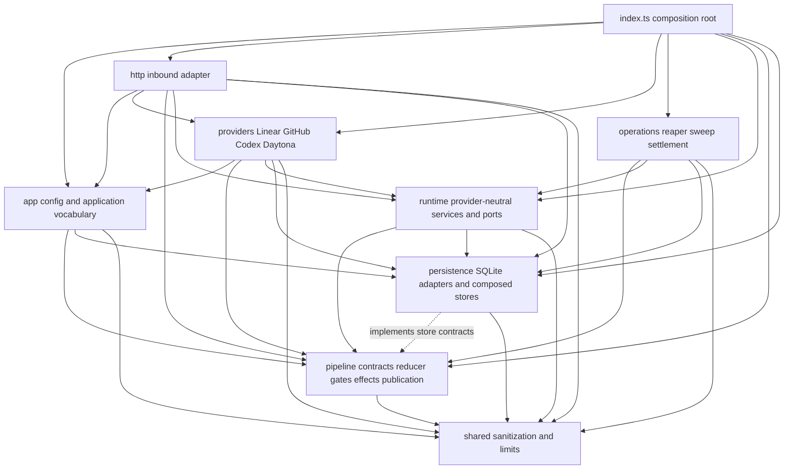
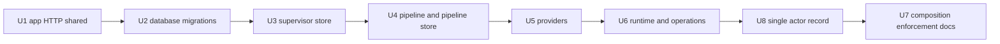

# Supervisor module boundaries and persistence decomposition - Plan

## PLAN COMPLETE (2026-07-25)

**This plan is a closed historical record. No units remain. Do not execute, ship, or delegate it — a run admitted against this document must stop immediately and surface that it was given a completed plan.**

Execution record — all eight units merged to `main`:
- U1–U4: PR #49, merged as `566f552`.
- U5: PR #50 ("rehome provider boundaries"), merged as `010bf1f`.
- U6: PR #51 ("isolate runtime operations", plus the `runtime/events` extraction and the `337b106` CI parity-path fix), merged as `527fad9`.
- U8: PR #52 ("unify stage attempt actor state"), merged as `8483233` — additive `pipeline_attempt_actors` migration with a backfill preserving heartbeat/reaping/quarantine/settlement state; sandbox-backed attempts own actor liveness and settlement directly; legacy `runs`/`run_liveness` rows retained as read-only compatibility history.
- U7: PR #53 ("enforce module boundaries"), merged as `44cf6a6` — composition root, executable architecture test, CI focused-path updates, `AGENTS.md`/README ownership map, transitional structure removed.
- Post-merge U8 review follow-up (attempt-actor stall coverage + settlement dedup): PR #55.

Completion verification performed and satisfied: supervisor typecheck/build/tests green (241 tests at close); `better-sqlite3` confined to `persistence/`; `hono` confined to `http/`; provider SDK/client imports confined to `providers/*`; `@daytona/sdk` confined to the Daytona adapter; historical migration checksums identical with exactly one new `pipeline_attempt_actors` ledger entry; reaper/stop/settlement matrices green against the unified actor model.

Remaining tail, intentionally outside this plan's scope: destructive schema contraction of the legacy `runs`/`run_liveness` rows (a separate, later, independently approved release per R21), and disposition of the recorded coverage-gap debt for new persistence/pipeline modules.

Everything below this banner — per-unit STATUS markers included — is preserved authoring and continuation history: read it as record, not instruction. The Problem Frame's counts describe the pre-U1 baseline.

## Goal Capsule

| Field | Contract |
|---|---|
| Objective | Reorganize `supervisor/src` into explicit module boundaries, decompose its monolithic SQLite stores, and collapse the dual run/pipeline actor state machine into one attempt-owned actor record — without changing observable behavior or external contracts. The target domain model (one actor record per stage attempt) is the organizing principle for the persistence decomposition, so boundaries are drawn around where the code is going, not where it currently is. |
| Authority | `docs/SPEC.md` remains normative. This plan governs internal source ownership and migration sequencing. Existing contract tests govern observable behavior. |
| Execution profile | Execute the units serially in sequenced order (U1-U6, then U8, then U7). Close every unit with focused tests, the supervisor typecheck, the full supervisor test suite, and a **local git commit inside the implementation stage** — the 2026-07-24 test run carried four slices of work as uncommitted tree state, which is both unrecoverable on runtime loss and invisible to review; per-unit commits make "reviewable unit-level commits" real and the publish stage pushes the accumulated series. Land the completed refactor as one PR. |
| Continuation budget | This plan needs roughly one implementation slice per unit plus headroom (~10 slices). The executing pipeline must budget for that: `ce/implement@3` raised the implementation `semantic_repair_required` re-entry bound to 8 for exactly this purpose (the 2026-07-24 test run exhausted the old bound of 3 after four verified-progress slices and terminated `needs_human` half-done). Do not delegate this plan to a manifest whose continuation budget cannot cover the unit count. |
| Scope | Supervisor source structure, persistence composition, provider/runtime ports, co-located tests, CI paths, and contributor documentation. |
| Stop conditions | Stop and surface a blocker if the refactor requires a migration checksum change, route/config/manifest change, pipeline transition change, or sandbox protocol change. Database schema changes are prohibited in U1-U7; U8 alone may make the additive actor-record change specified by R20-R22 and must stop if that change cannot preserve every observable transition. |
| Tail ownership | The implementing workflow owns simplification, semantic code review, the complete verification contract, removal of transitional files, and the final PR. |

---

## Product Contract

### Summary

Restructure the supervisor into bounded areas for application/HTTP, pipeline coordination, persistence, provider integrations, sandbox runtime, operations, and shared utilities.
Break up the oversized persistence modules rather than performing a folder-only move, while preserving APIs, database state, pipeline behavior, and runtime contracts.

### Problem Frame

The configurable coordinator cutover removed the legacy execution architecture, but most supervisor production and test files still occupy one flat directory.
The flat shape makes unrelated modules appear equally coupled, hides the intended provider-neutral boundaries, and makes new work likely to extend whichever large file is already nearby.
At the current branch head, `supervisor/src` contains 59 top-level TypeScript files: 33 production modules and 26 test modules.

The main persistence surface compounds the problem.
The 1,750-line `supervisor/src/db.ts` combines schema bootstrap, ticket/session/run state, repository routing, webhooks, Linear outbox, steering, sandbox events, settings, leases, feedback coordination, work delivery, and pipeline admission in one store type.
The 1,866-line `supervisor/src/pipeline-store.ts` combines pipeline contracts, request construction, catalog persistence, instance lifecycle, stage attempts, transitions, effects, runtime resources, inbox events, status projections, and publication receipts.
The 976-line `supervisor/src/db-migrations.ts` adds a third path-sensitive persistence surface whose immutable source strings cannot tolerate mechanical reformatting.
Both files own valid transaction boundaries, so splitting them by arbitrary line count would be unsafe; the decomposition must follow aggregate and transaction ownership.

Several application and operational modules also import `@daytona/sdk` directly even though the coordinator design calls for an explicit provider-neutral sandbox runtime port.
The current code keeps the reducer itself provider-neutral, but the source layout does not make that rule obvious or enforceable.

The deepest structural liability is that the cutover removed the legacy execution *path* but kept the legacy *state substrate*: `tickets`/`runs`/`run_liveness` still own actor liveness, reaping, quarantine, and settlement, while `pipeline_instances`/`stage_attempts` own pipeline progression, bridged by `settleStageEvidence -> finishRun`. Every stuck-actor defect observed in the 2026-07-24 incident window (runs left `running` after executor exit, stall reaps racing dispatch retries, terminals that never release the runtime) lived in that seam. A decomposition that faithfully reorganizes both state machines would preserve the seam and freeze it behind newly approved boundaries; this plan therefore treats the collapse to a single actor record (U8) as part of the restructure, not deferred follow-up.

The current supervisor baseline is green at 27 test files and 208 tests.
This refactor treats those scenarios as characterization coverage: paths and ownership may change, but the observed behavior must not.

### Requirements

#### Source ownership

- R1. `supervisor/src/index.ts` must remain the sole top-level production entrypoint; all other production modules must live under a named responsibility boundary.
- R2. The target boundaries must be `app`, `http`, `pipeline`, `persistence`, `providers`, `runtime`, `operations`, and `shared`, with nested folders only where a boundary contains multiple cohesive subdomains.
- R3. Production tests must move with the module they characterize, while shared fixtures remain under `supervisor/src/__fixtures__`.
- R4. Imports must remain direct and explicit; the refactor must not introduce a repository-wide barrel or a compatibility facade that survives the final unit.

#### Persistence

- R5. SQLite bootstrap, base schema, immutable migration definitions, reconciliation backfills, and the migration runner must have separate ownership while preserving the exact schema and migration checksums.
- R6. The broad `TicketStore` surface must become an accurately named composed supervisor store whose consumers receive only the ticket, session, run, delivery, outbox, steering, event, settings, feedback, or work capabilities they use.
- R7. No production consumer outside persistence may use a raw SQLite handle for transaction control; existing cross-store atomicity must move behind a persistence-owned transaction or aggregate operation.
- R8. Narrow pipeline store capability contracts and pure stage-request construction must move into the pipeline boundary, while SQLite implementations are split under persistence by catalog/selection, instance/execution, transition, effect/resource, and publication responsibility.
- R9. Pipeline transition persistence, ticket-plus-instance admission, run settlement, work acknowledgement, and publication acknowledgement must retain their current atomic boundaries and idempotency behavior.

#### Actor-state unification (U8 only)

- R20. After U8, exactly one durable record owns a sandbox actor's identity, liveness lease, heartbeat baseline, reaping/quarantine claim, and terminal settlement, and that record is owned by the stage attempt (a sandbox-backed attempt has exactly one actor; provider-wait stages have none). The `settleStageEvidence -> finishRun` bridge and duplicated run/attempt actor bookkeeping are removed.
- R21. The schema change is additive only: new actor columns/tables carry a normal migration; the legacy `runs`/`run_liveness` rows are retained read-only for history and reconciled on upgrade (an in-flight legacy `running` row must map onto the unified actor without losing its lease, heartbeat, or quarantine state). No destructive contraction in this PR.
- R22. Every observable behavior is preserved: reaper cadence and messages, stop/quarantine semantics and their HTTP status codes, Linear publications, `/status` payloads, terminal outcomes, and the one-active-actor guarantee. The existing reaper/settlement/stop/completion-race test matrices must pass against the unified model with only mechanical setup changes.

#### Provider and runtime boundaries

- R10. `@daytona/sdk` imports must be confined to the Daytona adapter and its tests; HTTP, runtime services, operations, and the composition root must consume provider-neutral ports.
- R11. Hono imports must be confined to the HTTP boundary, GitHub, Linear, Codex, and Daytona API clients must be confined to their provider boundaries, and cross-provider workflows must be application services composed through provider-neutral ports.
- R12. The pipeline manifest, reducer, deterministic gate logic, publication envelope construction, and runtime contracts must not import provider SDKs or provider-specific error types.
- R13. The Daytona adapter may implement multiple narrow runtime capabilities, but each consumer must depend on the smallest relevant stage, event, steering, log, lifecycle, or inventory port.

#### Compatibility and verification

- R14. HTTP routes, authentication behavior, environment variables, `.openthrottle.yml`, pipeline manifests, runtime capability descriptors, sandbox request/result schemas, and CLI-visible payloads must remain unchanged.
- R15. Fresh database schema, upgraded database behavior, migration ledger names/checksums, legacy-row reconciliation, and all durable state transitions must remain unchanged through U1-U7; U8 may alter internal actor storage only as specified by R20-R22 while preserving every observable transition and all historical ledger checksums.
- R16. Nested source and test paths must resolve the shipped pipeline catalog, runtime capability descriptor, retired-history fixture, and pipeline fixtures in both source execution and compiled/Docker execution.
- R17. CI must invoke the relocated focused tests and continue discovering every nested Vitest test automatically.
- R18. An executable architecture test must reject new top-level production files, forbidden provider/framework imports, persistence leakage, and disallowed cross-boundary imports.
- R19. Active contributor documentation must describe the new ownership map, while point-in-time audits and historical implementation plans retain their original path evidence.

### Acceptance Examples

- AE1. **Given** a fresh in-memory database before and after the refactor, **when** the schema and migration ledger are inspected, **then** the same tables, indexes, migration names, and checksums are present.
- AE2. **Given** a database containing the historical direct-run/work shapes recognized by the migration suite, **when** the reorganized migration runner opens it, **then** reconciliation produces the same conservative records without creating a retired execution path.
- AE3. **Given** a nested pipeline or runtime test, **when** it loads shipped and fixture resources through `import.meta.url`, **then** source tests and the compiled supervisor resolve the intended files rather than a fixture or stale relative path.
- AE4. **Given** a pipeline-domain module imports a GitHub, Linear, Daytona, Hono, or SQLite implementation package, **when** the architecture suite runs, **then** the suite fails with the owning boundary and forbidden dependency.
- AE5. **Given** a server request, pipeline event, provider event, steering acknowledgement, or reaper transition covered by the current suite, **when** it runs against the reorganized modules, **then** its response, durable writes, and side effects match the pre-refactor behavior.
- AE6. **Given** the final source tree, **when** top-level production files and transitional import shims are inspected, **then** only `supervisor/src/index.ts` remains at the root and every previous flat module has one authoritative owner.

### Success Criteria

- The existing 208 supervisor test scenarios remain present and green, with additional architecture and decomposition coverage added where ownership changes.
- `npm run typecheck --prefix supervisor`, `npm run build --prefix supervisor`, and `npm test --prefix supervisor` pass after every unit.
- The built supervisor still starts from `dist/index.js`, and the production image contains and resolves the shipped pipeline resources.
- No production file outside `supervisor/src/providers/daytona` imports `@daytona/sdk`.
- No production file outside `supervisor/src/persistence` imports `better-sqlite3`.
- No production file outside `supervisor/src/http` imports Hono.
- Pipeline modules have no imports from `providers`, `http`, or provider SDK packages.
- No broad store type or raw database handle grants an application service unrelated persistence capabilities.
- The old flat production modules are removed rather than retained as re-export shims.

### Scope Boundaries

#### In scope

- All current production and test modules under `supervisor/src`.
- Decomposition of `supervisor/src/db.ts`, `supervisor/src/db-migrations.ts`, and `supervisor/src/pipeline-store.ts`.
- Separation of pure pipeline publication construction from GitHub delivery.
- Provider-neutral runtime ports for event polling, steering, logs, lifecycle, and inventory operations currently expressed through Daytona types.
- Collapse of the dual run/pipeline actor state machine into one attempt-owned actor record (U8, per R20-R22).
- Path updates in active CI and contributor documentation.

#### Out of scope

- Reorganizing `cli`, `sandbox`, or `skills`.
- Changing public HTTP, CLI, database, pipeline, artifact, gate, effect, or sandbox contracts.
- Any behavior-changing operational or product work, including everything in the 2026-07-24 hardening wave (effect error taxonomy, terminal runtime release, command-stage fallback results, admission preflight, `ce/implement@3`): those land before this refactor via the pipeline-hardening staging PR, and this refactor rebases onto them. Humanized Linear receipts and `needs_human` reply re-delegation remain separate follow-ups after this refactor.
- Adding repository-authored execution graphs, unit coordinators, parallel execution, or any feature from `docs/plans/2026-07-22-001-feat-repository-configurable-structured-workflows-plan.md`.
- Renaming pipeline manifest versions or deleting historical migration compatibility solely because the pre-production deployment has no active consumers.
- Rewriting point-in-time evidence in `docs/archive/AGENTIC-LOOP-REVIEW.md` or prior implementation plans.
- Introducing a monorepo framework, dependency-injection framework, ORM, query builder, or module-resolution alias.

### Dependencies

- The implementation base must contain the coordinator-only cutover represented by the current PR 36 head; otherwise the file and behavior baseline in this plan is not present.
- The 2026-07-24 pipeline-hardening staging PR (effect error taxonomy, terminal runtime release, command-stage fallback, admission preflight, `ce/implement@3`) and the fresh-review control fix (PR 37) must merge first; this plan's file baseline and test counts are then re-verified against the updated main before U1 starts.
- `docs/SPEC.md` is the behavioral authority and takes precedence if an internal move appears to require a contract change.
- `docs/plans/2026-07-22-001-feat-repository-configurable-structured-workflows-plan.md` assumes the current flat paths and must be re-grounded after this cleanup before it is executed; its feature work is not part of this PR.

---

## Planning Contract

### Key Technical Decisions

| ID | Decision | Rationale |
|---|---|---|
| KTD1 | Use responsibility boundaries, not one folder per file type. (session-settled: user-approved — chosen over a folder-only reshuffle: the confirmed scope includes persistence decomposition.) | The useful distinction is who owns behavior and dependencies, not whether a file is a controller, service, or utility. |
| KTD2 | Keep `supervisor/src/index.ts` as the only composition root. | Construction of concrete SQLite and provider adapters stays visible in one place, while lower layers consume ports. |
| KTD3 | Split persistence by transaction-owning aggregate. (session-settled: user-approved — chosen over moving the existing monolith unchanged: the cleanup must address structure inside the large stores.) | One-table-per-file would scatter atomic operations; aggregate modules preserve ticket/session admission, run settlement, work acknowledgement, pipeline transition, and publication fences. |
| KTD4 | Replace `TicketStore` with a composed supervisor store and narrow consumer ports. | The current name understates its authority and lets every caller see unrelated methods. Narrow ports make dependencies reviewable without duplicating storage implementations. |
| KTD5 | Put narrow, capability-aligned pipeline store contracts in `pipeline` and SQLite implementations in `persistence/pipeline`. | The reducer and application services can depend on only the provider-neutral catalog, instance, transition, effect, or publication capabilities they use, while `better-sqlite3` remains an outbound implementation detail. |
| KTD6 | Split pure pipeline publication from GitHub delivery. | Publication envelope construction is deterministic pipeline logic; comment upsert, retry classification, and target reconciliation are GitHub adapter behavior. |
| KTD7 | Use one Daytona adapter implementing narrow runtime capability interfaces. | This confines the SDK while avoiding several independently constructed clients and lets each caller depend only on the operations it needs. |
| KTD8 | Use explicit relative NodeNext imports and no path aliases or broad barrels. | Relative `.js` imports match the existing ESM build and keep cross-boundary dependencies visible to review and architecture tests. |
| KTD9 | Land one PR with unit-level commits. | Cross-cutting path moves and interface changes are easier to validate at one integrated head; stacked PRs would require temporary shims or repeated import churn. |
| KTD10 | Enforce the final dependency map in Vitest without adding a new architecture dependency. (session-settled: user-approved — chosen over documentation-only boundaries: the user confirmed automated boundary enforcement.) | The repository already depends on TypeScript and Vitest; a focused test can use the TypeScript compiler API to inspect imports reliably without a regex-only scanner or new package. |
| KTD11 | Preserve immutable migration source and checksums byte-for-byte. | File ownership can change, but historical ledger identity is a durable compatibility contract and must not be regenerated. |
| KTD12 | Put delegation, prompted-command, and merge orchestration in `app`, with Linear and GitHub modules acting as adapters to application-owned ports. | The current Linear event handler calls both Linear and GitHub behavior; moving it wholesale under `providers/linear` would disguise cross-provider orchestration rather than create a clean boundary. |
| KTD13 | Collapse the dual actor state machine to one attempt-owned actor record inside this restructure (U8), and draw the run-lifecycle persistence boundaries around that target model. | Reorganizing both state machines faithfully would freeze the `runs`/`stage_attempts` settlement seam — the source of every observed stuck-actor defect — behind newly approved boundaries, and a later collapse would re-churn the same modules twice. Behavior stays observable-identical (R22); only the internal model changes. |

### High-Level Technical Design



The dotted persistence-to-pipeline relationship means the SQLite adapter implements contracts owned by the pipeline boundary.
Concrete factories are created only from `supervisor/src/index.ts` or tests.

### Target Directory Ownership

| Boundary | Owns | Must not own |
|---|---|---|
| `supervisor/src/app` | Environment/config parsing, delegation and prompted-command orchestration, merge coordination, and application-owned provider ports. | Concrete provider clients, SQL, Hono routes, or pipeline reduction. |
| `supervisor/src/http` | Hono server, bearer/HMAC route handling, and durable webhook delivery orchestration. | Daytona SDK access, SQL statements, or deterministic pipeline policy. |
| `supervisor/src/pipeline` | Manifest/config validation, store contracts, stage-request construction, reducer, controls, gates/evidence, effect intents, and neutral publication envelopes. | Hono, provider SDKs, runtime execution, or SQLite implementations. |
| `supervisor/src/persistence` | SQLite bootstrap, schema, migrations, composed supervisor stores, and all concrete SQL repositories. | Provider network I/O or HTTP routing. |
| `supervisor/src/providers/linear` | Linear GraphQL/OAuth client, webhook event adapter, and ordered outbox delivery. | Daytona or GitHub behavior, command policy, or cross-provider orchestration. |
| `supervisor/src/providers/github` | GitHub client, webhook event adapter, provider evidence routing, and GitHub publication delivery. | Pipeline transition policy or SQLite statements. |
| `supervisor/src/providers/codex` | Codex credential capture, validation, refresh, and seed materialization. | General supervisor settings or other model providers. |
| `supervisor/src/providers/daytona` | Daytona SDK construction and implementation of runtime capability ports. | Coordinator decisions or direct durable-state mutation. |
| `supervisor/src/runtime` | Provider-neutral stage/runtime contracts, event parsing/polling, steering delivery, and lifecycle reconciliation services. | Daytona SDK types or provider-specific errors. |
| `supervisor/src/operations` | Retryable pipeline-effect draining, reaping, sweeping, exclusive actor settlement, and recovery orchestration. | Direct provider SDK or SQL implementation access. |
| `supervisor/src/shared` | Sanitization and bounded log constants with no business ownership. | Domain records, provider clients, or mutable state. |

### Persistence Decomposition

The supervisor store remains one composition object because all repositories share one SQLite connection, but it exposes named capabilities rather than one flat `TicketStore`.
Application services accept the narrow capability or small capability intersection they require.

The decomposition follows these aggregates:

- **Database lifecycle:** base schema, column compatibility, connection pragmas, migration invocation, and close ownership.
- **Ticket admission:** tickets, agent sessions, repository registrations, and the atomic ticket-plus-pipeline admission operation.
- **Run lifecycle:** the unified actor record targeted by U8 — attempt-owned actor creation, liveness, exclusive reaping/quarantine, terminal settlement, and work-release coupling. Until U8 lands, this aggregate temporarily fronts the existing `runs`/`run_liveness` tables behind the same capability interface so U3 can complete without the schema change; U8 swaps the implementation, not the boundary.
- **Delivery:** webhook inbox, ordered Linear outbox records, sandbox event inbox, and retention.
- **Steering and work:** steering records plus durable work items/deliveries and exact acknowledgement fencing.
- **Feedback and settings:** provider feedback snapshots/events, supervisor leases, and durable settings.
- **Pipeline persistence:** catalog/runtime/config snapshots, instances/attempts, atomic transitions, effects/runtime resources, provider inbox events, publications, and status projections.

The migration decomposition separates immutable SQL/source definitions, historical reconciliation functions, and the checksum/ledger runner.
Existing migration `source` strings remain identical, including whitespace that contributes to their checksums.

### Provider-Neutral Runtime Shape

`supervisor/src/runtime/contracts.ts` owns a composed runtime contract made from narrow stage execution, event journal, steering, lifecycle, log, and inventory capabilities.
The Daytona adapter implements those capabilities and owns SDK object creation.
Runtime and operational services accept only the required capability interfaces, so a future provider can implement the same port without exposing Daytona resource types.

The refactor does not change opaque provider resource IDs, the sealed stage request, event files, inbox acknowledgement files, autostop behavior, or stop/quarantine semantics.

### Import and Architecture Rules

The architecture test parses production TypeScript with the existing TypeScript compiler API, collecting static imports, export-from declarations, and string-literal dynamic imports before enforcing:

- only `supervisor/src/index.ts` may be a top-level production file;
- every cross-boundary relative import must follow a directed edge in the High-Level Technical Design;
- `@daytona/sdk` is allowed only under `supervisor/src/providers/daytona`;
- `better-sqlite3` is allowed only under `supervisor/src/persistence`;
- `hono` and `@hono/node-server` are allowed only under `supervisor/src/http`;
- `supervisor/src/pipeline` may not import from `providers` or `http`;
- `supervisor/src/pipeline` may not import from `persistence`;
- `supervisor/src/runtime` and `supervisor/src/operations` may not import concrete provider modules;
- `supervisor/src/app` may not import `http`, `providers`, `runtime`, or `operations`;
- one provider subfolder may not import a sibling provider subfolder;
- `supervisor/src/shared` may not import any other supervisor boundary;
- production modules may not import test fixtures;
- imports remain relative `.js` specifiers and resolve to a source module;
- deleted flat paths may not return as re-export facades.

The test may encode a small explicit exception list only for a proven type-only dependency.
Every exception requires a rationale in the test and must not expose a provider or database implementation.

### Sequencing and Landing

U1 moves low-risk leaves first so later work imports from stable shared/application paths.
U2 separates database bootstrap and immutable migrations before store APIs change.
U3 decomposes the composed supervisor store and removes raw database access from consumers.
U4 separates pipeline contracts and deterministic logic from its SQLite implementation.
U5 rehomes external provider adapters and separates GitHub delivery from neutral publication construction.
U6 creates the complete provider-neutral runtime surface and moves lifecycle/recovery services.
U8 collapses the dual actor state machine into the attempt-owned actor record behind the run-lifecycle boundary established in U3, after all module homes are stable and before final enforcement.
U7 reduces the root to the composition entrypoint, enables the final architecture rules, updates active documentation/CI, and runs the full contract suite.

Each unit ends green and may be committed independently, but the branch is published as one PR only after U7.
Temporary files used during an in-progress unit must be removed before that unit is committed where practical, and all transitional facades must be gone before U7 closes.



### Alternative Approaches Considered

- **Folder-only relocation:** Rejected because it would leave the broad store authority, raw database access, and provider leakage intact behind new path names.
- **Technical-layer folders such as controllers/services/models:** Rejected because OpenThrottle's important boundaries are coordinator policy, durable state, provider adapters, and runtime effects rather than generic framework roles.
- **Separate npm packages for supervisor domains:** Rejected because the supervisor is one deployable process with one SQLite transaction boundary; package extraction would add build and release surfaces without improving the current POC.
- **Stacked PRs by directory:** Rejected because intermediate import graphs would require temporary facades or duplicate moves. Unit-level commits in one PR preserve reviewability without treating transitional heads as supported architecture.

### System-Wide Impact

- **Durable state:** No tables, columns, indexes, migration identities, retention rules, or state transitions change.
- **Runtime resources:** Daytona construction moves, but resource identity, stage dispatch, event collection, steering, stop, quarantine, and cleanup behavior remain unchanged.
- **Security:** SDK and raw database authority become more confined; secret sanitization and credential scopes remain unchanged.
- **Build:** Nested source paths continue compiling under the existing NodeNext `rootDir`, with `dist/index.js` retained as the entrypoint.
- **Tests:** Vitest already discovers nested `src/**/*.test.ts`; only the explicit CI test paths and resource-relative paths require updates.
- **Future plans:** New supervisor work must select an existing boundary or intentionally revise the architecture guard instead of adding a flat root module.

### Risks and Mitigations

| Risk | Mitigation |
|---|---|
| A file move changes an `import.meta.url` resource target. | Update and exercise every catalog/runtime/fixture path in source, test, build, and supervisor Docker contexts. |
| Splitting migration definitions changes a checksum through whitespace. | Preserve migration source strings exactly and run the immutable checksum suite immediately after U2. |
| Decomposing stores accidentally breaks an atomic transaction. | Split by aggregate, keep transaction-owning operations intact, and add failure/rollback assertions before deleting the old implementation. |
| TypeScript type-only cycles become runtime cycles after moves. | Use `import type`, move shared contracts to the owning boundary, and verify emitted build imports. |
| Temporary facades become permanent and recreate the flat API. | Track their deletion in U7 and make the architecture suite reject deleted root paths. |
| A broad architecture rule blocks a legitimate adapter flow. | Keep rules directional and responsibility-based; allow only documented type-only exceptions rather than disabling the boundary. |
| The downstream structured-workflow plan writes new flat files. | Re-ground that plan against the new tree after this refactor lands, before its implementation begins. |

### Sources and Research

- `docs/SPEC.md` — normative coordinator, persistence, runtime, security, and verification contracts.
- `AGENTS.md` — current supervisor ownership map and repository verification commands.
- `docs/plans/2026-07-21-001-feat-configurable-agentic-pipeline-coordinator-plan.md` — explicitly defers broad `db.ts` decomposition until the coordinator contracts stabilize.
- `supervisor/src/index.ts` — current composition root and concrete dependency wiring.
- `supervisor/src/db.ts` and `supervisor/src/db-migrations.ts` — current broad store, base schema, migration ledger, and transaction boundaries.
- `supervisor/src/pipeline-store.ts`, `supervisor/src/pipeline-coordinator.ts`, and `supervisor/src/pipeline-publication.ts` — current store/reducer/publication coupling.
- `supervisor/src/sandbox-runtime.ts` and `supervisor/src/daytona.ts` — existing provider-neutral stage port and Daytona implementation.
- `supervisor/package.json`, `supervisor/tsconfig.json`, `supervisor/tsconfig.build.json`, and `supervisor/Dockerfile` — nested test discovery, build output, entrypoint, and production resource layout.
- `.github/workflows/ci.yml` — focused test paths and full repository gates that must survive relocation.

---

## Output Structure

The target tree is a scope declaration.
The implementer may adjust a filename when a transaction boundary proves different during implementation, but the ownership boundaries and dependency rules remain authoritative.

```text
supervisor/src/
  index.ts
  __fixtures__/
    pipelines/
    retired-pipeline-history-v1.json
  __tests__/
    architecture.test.ts
  app/
    config.ts
    config.test.ts
    commands.ts
    commands.test.ts
    ports.ts
    session-service.ts
    session-service.test.ts
  http/
    listener.ts
    server.ts
    server.test.ts
    webhook-delivery.ts
    webhook-delivery.test.ts
  pipeline/
    types.ts
    manifest.ts
    manifest.test.ts
    store.ts
    stage-request.ts
    stage-request.test.ts
    coordinator.ts
    coordinator.test.ts
    control.ts
    gates.ts
    gates.test.ts
    evidence.ts
    evidence.test.ts
    publication.ts
    publication.test.ts
  persistence/
    schema.ts
    database.ts
    store.ts
    admission-store.ts
    admission-store.test.ts
    run-store.ts
    run-store.test.ts
    delivery-store.ts
    delivery-store.test.ts
    steering-store.ts
    steering-store.test.ts
    settings-store.ts
    settings-store.test.ts
    work-store.ts
    work-store.test.ts
    feedback-store.ts
    feedback-store.test.ts
    migrations/
      definitions.ts
      reconciliation.ts
      runner.ts
      runner.test.ts
    pipeline/
      catalog-store.ts
      catalog-store.test.ts
      instance-store.ts
      instance-store.test.ts
      transition-store.ts
      transition-store.test.ts
      effect-store.ts
      effect-store.test.ts
      publication-store.ts
      publication-store.test.ts
      create-store.ts
  providers/
    linear/
      client.ts
      client.test.ts
      auth.ts
      auth.test.ts
      events.ts
      outbox.ts
    github/
      client.ts
      client.test.ts
      events.ts
      pipeline-publication.ts
      pipeline-publication.test.ts
    codex/
      auth.ts
      auth.test.ts
    daytona/
      adapter.ts
      adapter.test.ts
  runtime/
    contracts.ts
    contracts.test.ts
    events.ts
    events.test.ts
    event-poller.ts
    event-poller.test.ts
    lifecycle.ts
    steering.ts
    steering.test.ts
  operations/
    pipeline-effects.ts
    pipeline-effects.test.ts
    actor-settlement.ts
    reaper.ts
    reaper.test.ts
    sweep.ts
    sweep.test.ts
  shared/
    logs.ts
    sanitize.ts
    sanitize.test.ts
```

---

## Implementation Units

### U1. Establish leaf contracts, application, HTTP, and shared boundaries

**STATUS: COMPLETE — shipped in PR #49 (merged). Verify, do not re-execute.**

- **Goal:** Move low-risk vocabulary, leaf, and inbound modules first so later units import stable pipeline-type, application, HTTP, and shared paths.
- **Requirements:** R1, R2, R3, R4, R11, R14, R16
- **Dependencies:** None.
- **Files:**
  - Move `supervisor/src/config.ts` and `supervisor/src/config.test.ts` to `supervisor/src/app/config.ts` and `supervisor/src/app/config.test.ts`.
  - Move `supervisor/src/commands.ts` and `supervisor/src/commands.test.ts` to `supervisor/src/app/commands.ts` and `supervisor/src/app/commands.test.ts`.
  - Add `supervisor/src/pipeline/types.ts` as the authoritative owner of the shared `Agent` and `TaskType` pipeline vocabulary currently embedded in `supervisor/src/db.ts` and repeated in pipeline persistence records.
  - Move `supervisor/src/server.ts` and `supervisor/src/server.test.ts` to `supervisor/src/http/server.ts` and `supervisor/src/http/server.test.ts`.
  - Add `supervisor/src/http/listener.ts` as the sole owner of `@hono/node-server`; `supervisor/src/index.ts` starts the injected Hono application through this wrapper rather than importing the framework adapter.
  - Move `supervisor/src/webhook-delivery.ts` and `supervisor/src/webhook-delivery.test.ts` to `supervisor/src/http/webhook-delivery.ts` and `supervisor/src/http/webhook-delivery.test.ts`.
  - Move `supervisor/src/sanitize.ts` and `supervisor/src/sanitize.test.ts` to `supervisor/src/shared/sanitize.ts` and `supervisor/src/shared/sanitize.test.ts`.
  - Move `supervisor/src/logs.ts` to `supervisor/src/shared/logs.ts`.
  - Modify `supervisor/src/index.ts` and every affected `supervisor/src/**/*.ts` import specifier.
- **Approach:**
  - Follow KTD1: the move establishes responsibility ownership rather than reproducing the flat layout in a generic folder.
  - Preserve exported names and observable behavior during the move.
  - Update config, admission, pipeline, and provider type references to import `Agent` and `TaskType` from `pipeline/types.ts`; do not leave pipeline vocabulary owned by a SQLite implementation.
  - Adjust `app/config.ts` resource defaults so both `src/app/config.ts` and `dist/app/config.js` resolve `supervisor/pipelines`.
  - Keep the HTTP dependency injection surface unchanged until U6 removes its concrete Daytona type.
  - Move tests with production files and update their fixture paths rather than adding forwarding modules.
- **Test Scenarios:**
  - Config defaults load the shipped catalog and runtime descriptor from the nested source and compiled locations.
  - Server authentication, webhook routing, status, logs, stop, and repository registration scenarios remain unchanged.
  - Webhook claim/lease/retry behavior remains unchanged.
  - Sanitization still redacts named, nested, bearer, GitHub, OpenAI, and Linear token shapes covered by the current suite.
- **Verification:** The relocated focused suites, supervisor typecheck, complete supervisor suite, and production build pass with no root forwarding modules.

### U2. Separate database bootstrap and immutable migrations

**STATUS: COMPLETE — shipped in PR #49 (merged). Verify, do not re-execute.**

- **Goal:** Isolate SQLite lifecycle and migration ownership before changing the store surface.
- **Requirements:** R5, R9, R15, R16
- **Dependencies:** U1.
- **Files:**
  - Add `supervisor/src/persistence/schema.ts` for the base schema, compatible column additions, and base backfill helpers currently owned by `supervisor/src/db.ts`.
  - Add `supervisor/src/persistence/database.ts` for `openDb`, SQLite pragmas, schema application, and migration invocation.
  - Split `supervisor/src/db-migrations.ts` into `supervisor/src/persistence/migrations/definitions.ts`, `supervisor/src/persistence/migrations/reconciliation.ts`, and `supervisor/src/persistence/migrations/runner.ts`.
  - Move `supervisor/src/db-migrations.test.ts` to `supervisor/src/persistence/migrations/runner.test.ts`.
  - Move `supervisor/src/work-store.ts` and `supervisor/src/work-store.test.ts` to `supervisor/src/persistence/work-store.ts` and `supervisor/src/persistence/work-store.test.ts`.
  - Move `supervisor/src/feedback-store.ts` and `supervisor/src/feedback-store.test.ts` to `supervisor/src/persistence/feedback-store.ts` and `supervisor/src/persistence/feedback-store.test.ts`.
  - Modify the still-transitional `supervisor/src/db.ts`, its tests, and all `openDb` imports to consume the new persistence modules directly.
  - Delete `supervisor/src/db-migrations.ts`, `supervisor/src/db-migrations.test.ts`, `supervisor/src/work-store.ts`, `supervisor/src/work-store.test.ts`, `supervisor/src/feedback-store.ts`, and `supervisor/src/feedback-store.test.ts`.
- **Approach:**
  - Follow KTD3 and KTD11: split on migration ownership while preserving every immutable migration source string.
  - Move immutable migration source strings without editing their contents.
  - Keep each backfill with the migration definitions that invoke it, but keep checksum/ledger mechanics in the runner.
  - Preserve the exclusive migration transaction and the rule that the ledger is read only after the lock is held.
  - Keep the old `db.ts` only as the active store implementation for U3, not as a re-export facade.
- **Test Scenarios:**
  - Covers AE1. All eight migration names and checksums match the pre-refactor values.
  - Reopening a current database is idempotent.
  - Checksum tampering and unknown future migrations fail closed.
  - Covers AE2. Legacy work, inbox, lifecycle, publication, and pipeline identities reconcile identically.
  - Fresh databases do not create the retired `session_work` table.
  - Work delivery and feedback snapshot lease/idempotency suites remain unchanged.
- **Verification:** Migration, work, feedback, and transitional store suites pass; recorded checksums match the baseline; the supervisor typecheck, complete suite, and build pass.

### U3. Decompose the composed supervisor store

**STATUS: COMPLETE — shipped in PR #49 (merged). Verify, do not re-execute.**

- **Goal:** Replace the broad `TicketStore` implementation with cohesive repositories and narrow consumer capabilities while preserving cross-store transactions.
- **Requirements:** R6, R7, R9, R14, R15
- **Dependencies:** U2.
- **Files:**
  - Add `supervisor/src/persistence/store.ts` for the composed `SupervisorStore` contract, construction, and persistence-owned transaction boundary.
  - Add `supervisor/src/persistence/admission-store.ts` for tickets, agent sessions, repository registrations, and atomic ticket-plus-pipeline admission.
  - Add `supervisor/src/persistence/run-store.ts` for run creation, liveness, reaping, quarantine, settlement, and work-release coupling.
  - Add `supervisor/src/persistence/delivery-store.ts` for the Linear outbox, webhook inbox, sandbox event inbox, and their leasing/retention operations.
  - Add `supervisor/src/persistence/steering-store.ts` for session inbox persistence and exact work-delivery acknowledgement.
  - Add `supervisor/src/persistence/settings-store.ts` for settings and supervisor leases.
  - Split `supervisor/src/db.test.ts` into co-located aggregate suites for admission, runs, delivery, steering, and settings according to transaction and scenario ownership.
  - Modify all production consumers and tests that currently import `TicketStore`, `Ticket`, `Run`, `LinearOutboxRecord`, `WebhookDelivery`, or `SteerInboxRecord` from `supervisor/src/db.ts`.
  - Delete `supervisor/src/db.ts` and `supervisor/src/db.test.ts`.
- **Approach:**
  - Follow KTD3 and KTD4: preserve aggregate transactions while replacing the broad flat store authority with narrow capabilities.
  - Compose named repository capabilities over one database connection.
  - Rename the aggregate to `SupervisorStore`; do not reproduce the flat `TicketStore` interface under a new file.
  - Give each service the smallest named port or port intersection it needs.
  - Move the raw `db.transaction` uses from actor settlement and gate evaluation behind persistence-owned operations while preserving the same transition and callback ordering.
  - Keep ticket-plus-pipeline admission atomic through a dedicated admission operation; do not weaken it into sequential ticket and instance writes.
  - Preserve exact SQL predicates, compare-and-set behavior, retry timestamps, and retention semantics.
- **Test Scenarios:**
  - Ticket/session generation, branch uniqueness, repository routing, and failed-admission rollback match the existing suite.
  - Run serialization, completion, reaping, quarantine, and liveness remain exclusive.
  - Linear outbox ordering and acknowledgement fields are unchanged.
  - Webhook delivery leasing, sandbox event leasing, and steering acknowledgement remain restart-safe and fenced.
  - Services cannot access unrelated repository methods through their declared dependency types.
  - No production consumer outside persistence imports `better-sqlite3` or accesses a raw database handle.
- **Verification:** All persistence suites pass, consumers compile against narrow capabilities, no raw database import remains outside persistence, and the complete supervisor suite/build pass.

### U4. Separate pipeline contracts, deterministic logic, and SQLite storage

**STATUS: COMPLETE — shipped in PR #49 (merged), including the review-driven extraction of GitHub delivery to `providers/github/publication-delivery.ts`. Verify, do not re-execute.**

- **Goal:** Rehome the pipeline domain and split its large store by responsibility without changing reducer or transition behavior.
- **Requirements:** R2, R3, R4, R8, R9, R12, R15, R16
- **Dependencies:** U3.
- **Files:**
  - Move `supervisor/src/pipeline-manifest.ts` and its test to `supervisor/src/pipeline/manifest.ts` and `supervisor/src/pipeline/manifest.test.ts`.
  - Move `supervisor/src/pipeline-coordinator.ts` and its test to `supervisor/src/pipeline/coordinator.ts` and `supervisor/src/pipeline/coordinator.test.ts`.
  - Move `supervisor/src/pipeline-control.ts` to `supervisor/src/pipeline/control.ts`.
  - Move `supervisor/src/pipeline-effects.ts` and its test to `supervisor/src/operations/pipeline-effects.ts` and `supervisor/src/operations/pipeline-effects.test.ts`.
  - Split `supervisor/src/gate-evaluators.ts` and its test into `supervisor/src/pipeline/gates.ts`, `supervisor/src/pipeline/evidence.ts`, and co-located tests.
  - Split the neutral envelope/rendering portion of `supervisor/src/pipeline-publication.ts` into `supervisor/src/pipeline/publication.ts` and `supervisor/src/pipeline/publication.test.ts`; defer the GitHub delivery processor to U5.
  - Add `supervisor/src/pipeline/store.ts` for pipeline record types, narrow catalog/instance/transition/effect/publication capability contracts, and their composed `PipelineStore` contract.
  - Add `supervisor/src/pipeline/stage-request.ts` and `supervisor/src/pipeline/stage-request.test.ts` for pure request construction and request fencing.
  - Split `supervisor/src/pipeline-store.ts` into `supervisor/src/persistence/pipeline/catalog-store.ts`, `supervisor/src/persistence/pipeline/instance-store.ts`, `supervisor/src/persistence/pipeline/transition-store.ts`, `supervisor/src/persistence/pipeline/effect-store.ts`, `supervisor/src/persistence/pipeline/publication-store.ts`, and `supervisor/src/persistence/pipeline/create-store.ts`.
  - Split `supervisor/src/pipeline-store.test.ts` into co-located persistence pipeline suites by responsibility.
  - Modify `supervisor/src/__fixtures__` resource consumers and all affected imports.
  - Delete all replaced flat pipeline production and test files.
- **Approach:**
  - Keep manifest validation, the reducer, gate evaluation, stage-request building, and publication-envelope building free of SQL and provider APIs.
  - Keep effect-intent creation and transition policy in pipeline, but treat retryable effect draining and runtime invocation as application orchestration under `operations`; this preserves the one-way `operations -> runtime -> pipeline` dependency shape.
  - Keep `applyTransition` and all state/history/artifact/gate/effect writes in one transition-store transaction.
  - Keep catalog/runtime/config acceptance and ticket-plus-instance admission rollback behavior unchanged.
  - Keep publication claim/bind/acknowledge transitions in the publication store.
  - Preserve provider evidence processing as an application-facing pipeline service while separating its deterministic evaluation from delivery adapters.
  - Follow KTD5 and KTD6 by keeping contracts and deterministic publication in pipeline while moving concrete SQL and GitHub delivery outward.
  - Give every pipeline service the smallest store capability or capability intersection it uses; the composed `PipelineStore` is reserved for construction and workflows that genuinely span those capabilities.
  - Update all nested fixture and shipped-resource paths explicitly.
- **Test Scenarios:**
  - Manifest/config validation and catalog alias resolution remain strict and digest-stable.
  - Reducer duplicate, stale, generation, request, subject, attempt, outcome, repair, exhaustion, and terminal matrices remain unchanged.
  - Transition fault injection still rolls back every partial write.
  - Stage requests retain identical hashes and idempotency keys.
  - Provider evidence, assurance, subject reconciliation, deferred evidence, and gate receipt outcomes remain unchanged.
  - Publication envelope parsing, sanitization, attachment thresholds, template selection, and payload hashes remain unchanged.
  - Covers AE3. Nested pipeline tests resolve the shipped catalog and fixture catalog from the intended locations.
  - Pipeline core source remains CE-neutral and provider-neutral.
- **Verification:** All pipeline and pipeline-persistence suites pass, reducer/storage fault-injection behavior is unchanged, path-sensitive resources resolve, and the complete supervisor typecheck/suite/build pass.

### U5. Rehome Linear, GitHub, and Codex providers

**STATUS: COMPLETE — shipped in PR #50 (merged as `010bf1f`). Verify, do not re-execute.**

- **Goal:** Make external API ownership explicit and complete the separation between neutral pipeline publication and provider delivery.
- **Requirements:** R2, R3, R4, R11, R12, R14, R16
- **Dependencies:** U4.
- **Files:**
  - Move `supervisor/src/linear.ts` and `supervisor/src/linear.test.ts` to `supervisor/src/providers/linear/client.ts` and `supervisor/src/providers/linear/client.test.ts`.
  - Move `supervisor/src/linear-auth.ts` and `supervisor/src/linear-auth.test.ts` to `supervisor/src/providers/linear/auth.ts` and `supervisor/src/providers/linear/auth.test.ts`.
  - Split `supervisor/src/linear-events.ts` into `supervisor/src/providers/linear/events.ts` for provider payload translation and `supervisor/src/app/session-service.ts` for delegation, prompted-command, admission, stop, and merge orchestration.
  - Add `supervisor/src/app/ports.ts` for the narrow repository, merge, activity-publication, and related provider capabilities used by application and provider-event services.
  - Move `supervisor/src/pipeline-admission.test.ts` into the application service suite at `supervisor/src/app/session-service.test.ts`.
  - Move `supervisor/src/linear-outbox.ts` to `supervisor/src/providers/linear/outbox.ts`.
  - Move `supervisor/src/github.ts` and `supervisor/src/github.test.ts` to `supervisor/src/providers/github/client.ts` and `supervisor/src/providers/github/client.test.ts`.
  - Move `supervisor/src/github-events.ts` to `supervisor/src/providers/github/events.ts`.
  - Add `supervisor/src/providers/github/pipeline-publication.ts` and a co-located test for the GitHub delivery processor extracted in U4.
  - Move `supervisor/src/codex-auth.ts` and `supervisor/src/codex-auth.test.ts` to `supervisor/src/providers/codex/auth.ts` and `supervisor/src/providers/codex/auth.test.ts`.
  - Modify HTTP, pipeline, persistence, runtime, operations, and composition imports.
  - Delete the replaced flat provider files.
- **Approach:**
  - Preserve API request/response parsing, OAuth refresh, timeout, retry, deduplication, and sanitization behavior.
  - Follow KTD12: the Linear event adapter validates and translates provider payloads, while the application session service owns command policy and coordinates injected activity-publication, repository/merge, persistence, and pipeline ports.
  - Replace the GitHub event service's direct dependency on the Linear outbox processor with the application-owned activity-publication port implemented by the Linear adapter.
  - Keep webhook payloads and review bodies as untrusted data.
  - Keep Linear outbox persistence in `persistence`; the provider outbox module only performs ordered delivery and acknowledgement.
  - Keep GitHub publication target binding and receipt state in the pipeline store while the provider module owns comment upsert and network retry classification.
  - Keep admission behavior fail-closed and atomically pinned through the persistence admission port.
- **Test Scenarios:**
  - Linear webhook parsing, OAuth refresh/persistence, activity/session/file publication, and command parsing remain unchanged.
  - Pipeline admission still resolves exact base/config/catalog/runtime inputs before provisioning and rolls back invalid replacements.
  - GitHub event verification, current-head evidence, review/check/workflow routing, and stale snapshot handling remain unchanged.
  - GitHub pipeline publication remains idempotent across claim, target binding, upsert, retry, skip, and acknowledgement.
  - Codex refresh remains bounded, sanitized, account-pinned, and deduplicated through the shared in-flight promise.
  - Provider modules import pipeline/runtime/store contracts but pipeline modules do not import provider modules.
- **Verification:** All Linear, GitHub, and Codex suites pass from their provider paths; no reverse provider dependency enters pipeline; and the complete supervisor typecheck/suite/build pass.

### U6. Isolate the Daytona adapter and rehome runtime operations

**STATUS: COMPLETE — shipped in PR #51 (verify merged). Verify, do not re-execute.**

- **Goal:** Confine the Daytona SDK to one adapter and make runtime, steering, liveness, settlement, and recovery services depend on provider-neutral ports.
- **Requirements:** R2, R3, R4, R10, R12, R13, R14, R16
- **Dependencies:** U5.
- **Files:**
  - Move and expand `supervisor/src/sandbox-runtime.ts` into `supervisor/src/runtime/contracts.ts`; move its tests to `supervisor/src/runtime/contracts.test.ts`.
  - Split `supervisor/src/sandbox-events.ts` into `supervisor/src/runtime/events.ts` and `supervisor/src/runtime/event-poller.ts` with co-located tests.
  - Move `supervisor/src/sandbox-lifecycle.ts` to `supervisor/src/runtime/lifecycle.ts`.
  - Move `supervisor/src/inbox.ts` and `supervisor/src/inbox.test.ts` to `supervisor/src/runtime/steering.ts` and `supervisor/src/runtime/steering.test.ts`.
  - Move and refactor `supervisor/src/daytona.ts` and `supervisor/src/daytona.test.ts` into `supervisor/src/providers/daytona/adapter.ts` and `supervisor/src/providers/daytona/adapter.test.ts`.
  - Move `supervisor/src/actor-settlement.ts` to `supervisor/src/operations/actor-settlement.ts`.
  - Move `supervisor/src/reaper.ts` and `supervisor/src/reaper.test.ts` to `supervisor/src/operations/reaper.ts` and `supervisor/src/operations/reaper.test.ts`.
  - Move `supervisor/src/sweep.ts` and `supervisor/src/sweep.test.ts` to `supervisor/src/operations/sweep.ts` and `supervisor/src/operations/sweep.test.ts`.
  - Modify `supervisor/src/http/server.ts`, `supervisor/src/operations/pipeline-effects.ts`, `supervisor/src/index.ts`, and affected tests to consume narrow runtime ports.
  - Delete all replaced flat runtime and operations files.
- **Approach:**
  - Follow KTD7 by constructing one Daytona adapter whose consumers receive only the runtime capability they use.
  - Extend the existing stage runtime contract with narrow event-journal, steering, logs, autostop/lifecycle, stop/delete, and inventory interfaces.
  - Let the Daytona adapter construct the SDK client and implement the composed runtime.
  - Keep resource IDs opaque outside the adapter and persistence records.
  - Make event parsing provider-neutral; provider-specific file listing/download/delete operations remain adapter methods.
  - Replace the current Linear activity/plan DTO imports in sandbox event polling with runtime-owned progress event types; the composition root adapts those callbacks to the Linear activity publisher.
  - Keep the credential-materialization callback at the composition seam, preserve the existing scope-to-environment allowlist, and pass only the stage-scoped credential values already authorized by the sealed request.
  - Preserve exact acknowledgement, liveness, autostop, stop confirmation, quarantine, orphan grace, and cleanup behavior.
  - Keep operation services responsible for policy/order and the adapter responsible for provider calls.
- **Test Scenarios:**
  - The stage runtime contract remains deterministic and contains no Daytona names or SDK types.
  - Stage provision/bootstrap/credential/dispatch/result/liveness/stop/quarantine/cleanup behavior remains unchanged.
  - Activity, plan, heartbeat, and stage-result parsing and fencing remain unchanged.
  - Steering writes untrusted bodies as data, persists exact acknowledgements, and retains retryable journals.
  - Reaper winner/loser, planned-run, supersession, quarantine, and cleanup scenarios remain unchanged.
  - Sweep protects active bindings, prunes durable inbox/outbox state, and deletes only eligible orphans.
  - Source scanning finds no `@daytona/sdk` import outside `supervisor/src/providers/daytona`.
- **Verification:** Runtime, Daytona adapter, reaper, sweep, and steering suites pass; the SDK confinement scan is clean; and the complete supervisor typecheck/suite/build pass.

### U7. Finalize composition, enforce boundaries, and update active documentation

**STATUS: COMPLETE — shipped in PR #53 (merged as `44cf6a6`): architecture test, composition root, CI paths, AGENTS.md/README updates.**

- **Goal:** Remove all transitional structure, lock the dependency map, update active paths, and prove the complete refactor.
- **Requirements:** R1-R19
- **Dependencies:** U1-U6, U8.
- **Files:**
  - Modify `supervisor/src/index.ts` to construct the composed persistence store, provider clients, Daytona adapter, runtime services, pipeline services, operations, and HTTP server.
  - Add `supervisor/src/__tests__/architecture.test.ts`.
  - Modify `.github/workflows/ci.yml` to use the relocated focused manifest/runtime tests.
  - Modify `AGENTS.md` to document the new supervisor ownership map and focused test examples.
  - Modify `supervisor/README.md` to describe the source boundaries and composition root.
  - Modify `docs/SPEC.md` only if an active source-path reference requires correction; do not change normative behavior.
  - Delete any remaining transitional facades, temporary aliases, empty directories, or root production modules other than `supervisor/src/index.ts`.
- **Approach:**
  - Follow KTD10 by making the final ownership rules executable and requiring an explicit, reviewed exception for any type-only edge.
  - Make `index.ts` the only module that sees concrete store factories and complete provider adapters.
  - Encode the final import rules and top-level-file rule in the architecture test using the existing TypeScript compiler API rather than regex matching.
  - Keep direct module imports; do not add folder barrels to shorten the composition root.
  - Update active docs and CI only after final paths are stable.
  - Review the final diff for accidental behavior edits hidden among moves and separate them from the refactor or stop if they are required.
- **Test Scenarios:**
  - Covers AE4. The architecture suite rejects representative forbidden root, SDK, framework, database, fixture, and cross-boundary imports.
  - The architecture suite accepts the intended composition-root and type-only contract edges.
  - Focused CI paths point at nested tests and run successfully.
  - The production build emits `dist/index.js` plus nested modules without test files.
  - The supervisor Docker image builds and resolves `pipelines/catalog.yaml` and `pipelines/runtime-capabilities-v1.json`.
  - Covers AE6. No deleted root module remains as a re-export, duplicate implementation, or stale documentation example.
- **Verification:** Architecture and focused contract suites pass, the nested production build and supervisor image resolve their resources, active docs/CI use final paths, and every command in the Verification Contract passes.

### U8. Collapse the dual actor state machine into one attempt-owned actor record

**STATUS: COMPLETE — shipped in PR #52 (verify merged). Verify, do not re-execute.**

Sequenced between U6 and U7 (defined here after U7 only for numbering continuity).

- **Goal:** One durable record owns each sandbox actor. Stage attempts own liveness, heartbeat baseline, exclusive reaping/quarantine, and terminal settlement; the `settleStageEvidence -> finishRun` bridge and the parallel `runs`/`run_liveness` actor bookkeeping are removed from the live path.
- **Requirements:** R20-R22; KTD13.
- **Dependencies:** U1-U6 (the run-lifecycle persistence boundary from U3 and the pipeline persistence split from U4 must be in place so U8 swaps an implementation behind a stable capability interface rather than re-cutting boundaries).
- **Files:**
  - Modify the U3 run-lifecycle persistence module(s) to store the unified actor on/with stage attempts (additive migration; new migration entry, historical checksums untouched).
  - Modify `operations/reaper.ts`, `operations/actor-settlement.ts`, `operations/sweep.ts`, and `operations/pipeline-effects.ts` to read/claim/settle the attempt-owned actor.
  - Modify the gate-evaluation settlement path to end an attempt's actor directly instead of bridging into `finishRun`.
  - Add an upgrade-reconciliation migration test fixture containing an in-flight legacy `running` row.
- **Approach:**
  - Design the unified actor record first (identity, lease, heartbeat baseline, reap/quarantine claim, settlement outcome) and derive any remaining `runs` reads as projections; legacy rows stay read-only for history.
  - Preserve exact observable semantics: stall cutoff math over `COALESCE(heartbeat, started)`, compare-and-set exclusivity between completion/stop/reaper, quarantine visibility, `202 stop_requested`/`200 stopped`, and one-active-actor per ticket.
  - Migrate in one additive step with upgrade reconciliation for in-flight actors; stop and surface if any observable transition cannot be preserved (Goal Capsule stop condition).
  - Do not change reaper cadence, messages, Linear publications, or `/status` payload shapes in this unit.
- **Test Scenarios:**
  - Covers R22. The existing reaper, expiry, stop-settlement, quarantine, and completion/reaper-race matrices pass against the unified model with only mechanical setup changes.
  - An upgraded database containing an in-flight legacy `running` row maps onto the unified actor without losing lease, heartbeat, or quarantine state.
  - A sandbox-backed attempt has exactly one actor; a provider-wait stage has none; a superseded generation cannot revive a settled actor.
  - No production code path outside persistence reads `runs`/`run_liveness` directly after this unit.
- **Verification:** Full supervisor suite green; the fresh-schema ledger gains exactly one new migration entry with all historical names/checksums identical; grep confirms the settlement bridge is gone.

---

## Verification Contract

### Unit completion gates

Every U-ID must pass its focused tests, `npm run typecheck --prefix supervisor`, `npm test --prefix supervisor`, and `npm run build --prefix supervisor` before the next unit begins.
No unit may intentionally leave the branch uncompilable for a later unit to repair.

### Required behavioral matrices

| Matrix | Required evidence |
|---|---|
| Database identity | Fresh schema, migration ledger, immutable checksums, idempotent reopen, checksum mismatch failure, and historical reconciliation tests. |
| Admission and routing | Repository registration, base/config fetch, catalog/runtime validation, generation pinning, duplicate delivery, invalid replacement rollback, and no direct task-run creation. |
| Pipeline execution | Reducer transition matrix, duplicate/stale fences, stage request hashes, transaction rollback, effects, gates, evidence, publication receipts, and status projections. |
| Runtime lifecycle | Provision, bootstrap, credential materialization, dispatch, event collection, liveness, steering acknowledgement, stop, quarantine, cleanup, reaping, and orphan sweep. |
| Provider behavior | Linear webhook/OAuth/outbox and GitHub webhook/evidence/publication behavior, including retry and sanitization. |
| HTTP compatibility | Webhook, operator, OAuth, status, log, repository, steer, stop, health, and authentication routes. |
| Architecture | Root-file ownership, allowed dependency directions, SDK/framework/SQLite confinement, relative `.js` imports, fixture isolation, and no surviving facades. |

### Supervisor gates

```bash
npm run typecheck --prefix supervisor
npm run build --prefix supervisor
npm test --prefix supervisor
docker build -f supervisor/Dockerfile -t openthrottle-supervisor:test supervisor
```

### Full repository regression gates

```bash
npm run typecheck --prefix cli
npm run build --prefix cli
npm test --prefix cli
npm test --prefix sandbox
bats sandbox/tests/runtime.bats
bats sandbox/tests/inbox-drain.bats
docker build -f sandbox/Dockerfile -t openthrottle:test .
sandbox/tests/smoke.sh openthrottle:test
```

### Static completion checks

- The final diff has no whitespace errors.
- The worktree contains only the plan and intended refactor changes, with no generated build output, temporary migration artifacts, or unrelated modifications.

### Review gates

- Run simplification after U7 to remove repeated adapters, accidental facades, dead imports, and temporary compatibility code.
- Run semantic code review over `origin/main...HEAD`, with special attention to transaction boundaries, migration identity, path resolution, provider confinement, and test scenario preservation.
- Treat any P0/P1 review finding, changed migration checksum, changed public contract, or missing baseline scenario as a release blocker.
- Credentialed Linear/Daytona/GitHub acceptance is not required for this structural refactor; the deterministic Docker/unit contract is the completion gate unless behavior changes are discovered.

---

## Definition of Done

### Global completion

- R1-R19 are satisfied and traceable to passing tests or final source inspection.
- U1-U7 are complete in dependency order.
- `supervisor/src/index.ts` is the sole top-level production file.
- The target boundaries own all current supervisor production modules and their co-located tests.
- `db.ts`, `db-migrations.ts`, `pipeline-store.ts`, and all other replaced flat modules are deleted.
- No final compatibility facade, broad barrel, raw database leak, provider SDK leak, or undocumented architecture exception remains.
- Fresh and migrated database behavior, immutable checksums, state transitions, HTTP contracts, pipeline behavior, provider behavior, and runtime behavior match the baseline.
- The supervisor typecheck, build, tests, Docker build, full repository regression gates, simplification, and semantic review pass.
- Active CI and contributor documentation use the final paths.
- Point-in-time audit and historical plan evidence remains untouched.
- The downstream structured-workflow plan is identified for re-grounding rather than partially implemented in this refactor.
- Abandoned approaches, duplicate files, empty directories, generated artifacts, and temporary scripts are removed from the final diff.
- One PR contains the complete integrated refactor with unit-level commits and a description that calls out behavior preservation, persistence decomposition, and architecture enforcement.

### Unit completion

- U1 is done when application/HTTP/shared modules and their tests run from nested paths with source and compiled resources resolving correctly.
- U2 is done when database bootstrap and migrations are separated, immutable checksums are unchanged, and work/feedback stores run from persistence.
- U3 is done when the broad `TicketStore` is gone, consumers use narrow capabilities, raw database access is persistence-owned, and all store behavior remains green.
- U4 is done when pipeline contracts and deterministic logic are provider/SQL-neutral, the pipeline store implementation is decomposed, and the complete transition/gate/publication suite passes.
- U5 is done when Linear, GitHub, and Codex modules own their integrations and neutral pipeline modules have no provider imports.
- U6 is done when Daytona is confined to its adapter, runtime/operations use narrow ports, and the full lifecycle suite passes.
- U7 is done when composition, architecture enforcement, CI/docs, cleanup, full gates, simplification, and semantic review are complete.

---

## Appendix

### Requirement-to-unit traceability

| Requirement | Units |
|---|---|
| R1-R4 | U1, U4, U5, U6, U7 |
| R5 | U2, U7 |
| R6-R7 | U3, U7 |
| R8-R9 | U3, U4, U7 |
| R10 | U6, U7 |
| R11-R13 | U4, U5, U6, U7 |
| R14-R15 | U1-U7 |
| R16-R17 | U1, U4, U5, U6, U7 |
| R18 | U7 |
| R19 | U7 |
| R20-R22 | U8 |

### Current-to-target module map

| Current module cluster | Target owner |
|---|---|
| `config.ts`, `commands.ts` | `app/` |
| `admission-preflight.ts` (added by the 2026-07-24 hardening wave) | `app/` |
| Cross-provider orchestration in `linear-events.ts` and `pipeline-admission.test.ts` | `app/session-service.ts` and `app/session-service.test.ts` |
| `server.ts`, `webhook-delivery.ts` | `http/` |
| `pipeline-manifest.ts`, `pipeline-coordinator.ts`, `pipeline-control.ts`, `gate-evaluators.ts`, neutral `pipeline-publication.ts` | `pipeline/` |
| `db.ts`, `db-migrations.ts`, `work-store.ts`, `feedback-store.ts`, SQL portions of `pipeline-store.ts` | `persistence/` |
| Linear-specific parsing/delivery in `linear.ts`, `linear-auth.ts`, `linear-events.ts`, and `linear-outbox.ts` | `providers/linear/` |
| `github.ts`, `github-events.ts`, GitHub delivery from `pipeline-publication.ts` | `providers/github/` |
| `codex-auth.ts` | `providers/codex/` |
| `daytona.ts` | `providers/daytona/` |
| `sandbox-runtime.ts`, `sandbox-events.ts`, `sandbox-lifecycle.ts`, `inbox.ts` | `runtime/` |
| `actor-settlement.ts`, `reaper.ts`, `sweep.ts` | `operations/` |
| `pipeline-effects.ts` | `operations/pipeline-effects.ts` |
| `sanitize.ts`, `logs.ts` | `shared/` |
