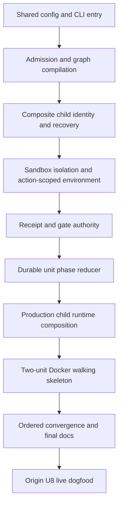

# Complete structured workflows U2-U7 before live dogfood - Plan

## Goal Capsule

| Field | Contract |
|---|---|
| Objective | Close the verified origin U2-U7 gaps on current `main` so the structured graph is reachable, fenced, recoverable, observable, and proven by a local two-unit Docker walking skeleton before origin U8 starts live credentialed dogfood. |
| Authority | `docs/SPEC.md` owns runtime contracts. The original structured-workflows plan owns intended origin U2-U7 behavior. This remediation plan owns the review-derived repair order and acceptance evidence. |
| Execution profile | Create one parent Linear tracker and 11 fresh child issues. Delegate one child at a time through the existing default pipeline. Merge and allow deployment/release effects to settle before delegating its dependent child. |
| Stop conditions | Do not weaken subject, session, generation, request, receipt, Git, or credential fences. Do not move origin U8 repository migration, live OPE-35 dogfood, origin requirements R35-R38/R40, or production rollout into these repairs. |
| Tail ownership | The operator monitors each pipeline PR, resolves feedback and CI, squash-merges authorized green PRs, confirms the resulting `main` deployment or snapshot is usable, then delegates the next child. |

---

## Product Contract

### Summary

The origin U1-U7 implementation contains the intended contract types, compiler scaffolding, child stores, sandbox loop helpers, evidence helpers, skills, and ledger renderer, but the structured route is not production-reachable or safe enough to activate.
This plan closes the 18 confirmed review findings in dependency order.
The completion proof is a deterministic Docker smoke with two serial units, not the live Linear-to-Daytona dogfood that belongs to origin U8.

### Problem Frame

Current tests prove many isolated helpers but not the structured execution spine.
Admission still selects the legacy pipeline contract, `for_each_unit` cannot compile, and the unit runtime is not composed.
If those activation gaps were bypassed, the child store would skip required phases, exited units could aggregate as success, worktree containment and action-scoped credentials would be incomplete, and publication would occur only as a terminal snapshot.
The repair chain must therefore close activation, authority, state-machine, and observability gaps before any credentialed run.

### Requirements

#### Shared contract and local entry

- RR1. A clean delegated checkout must install and test all four npm projects, and must build and typecheck `contracts`, `supervisor`, and `cli`.
- RR2. `openthrottle.config/v1` must own repository-defined named commands, MCP inventory, repository graph defaults, and platform-bounded limits. `openthrottle.graph/v1` workers must own engine/model inheritance, session scope, authorized skills, MCP-name allowlists, and logical credential scopes. No second legacy production parser may own either contract.
- RR3. Canonical JSON and digest computation must have one shared implementation in `contracts`, consumed by supervisor and CLI.
- RR4. `openthrottle plan prepare` must invoke the configured local engine and canonical preparation skill, while `plan validate` remains deterministic and agent-free.
- RR5. `openthrottle init` and `ship --graph` must emit and validate the canonical config/graph selection; structured ship must fail before Linear mutation only when its graph or execution plan is invalid.

#### Admission and durable child authority

- RR6. Admission must resolve an allowed built-in or exact-commit repository graph, validate the execution plan, pin every bounded regular-file source and normalized digest, compile the graph before provisioning, and preserve simple-graph behavioral parity.
- RR7. `for_each_unit` must compile to `graph/for-each-unit@1`. Production admission must remain fail closed until the matching runtime capability and dispatcher land atomically in RU9.
- RR8. Parent pipeline instance, stage attempt, child graph, unit, and work-attempt identities must be relationally fenced as one composite identity in a new immutable migration.
- RR9. Expired dispatched or running child actions must reconcile durable runtime results before a compare-and-set liveness heal may level the unit to `exited`.
- RR10. Structured status lookup must use a graph-scoped index rather than scanning and sorting every historical execution unit.

#### Sandbox and evidence authority

- RR11. Executor-created worktrees must be usable by the unprivileged agent in the built image and start at the exact integration head. Executor-private paths must be action-attempt namespaced and unreadable and unwritable by the agent, including through absolute paths, symlinks, Git alternates, hooks, process-visible descriptors, or sibling action state.
- RR12. Each loop action must materialize only its declared logical credentials and MCP servers from a clean trusted baseline, without importing personal configuration or exposing provider secret identifiers. Cleanup must remove files, caches, sockets, subprocess environment, and rotated state before any subsequent worker, lead, reviewer, or retained worktree can read them.
- RR13. Every standard receipt must bind the exact graph, parent attempt/run/request, unit/action attempt, generation, native session, producer and skill digest, input subject, output subject, artifact hashes, and assurance class required for its gate.
- RR14. The final review skill must be report-only. All edits after whole-change review must occur through the dedicated final-repair action and invalidate the prior review receipt.

#### Structured reduction and operator truth

- RR15. The durable unit reducer must advance through implement, simplify, configured commands, lead acceptance, executor candidate creation, integration, final commands, fresh final review, and bounded final repair without allowing an agent to commit, push, integrate, or pass a gate.
- RR16. Only units with accepted exact-subject integration evidence count toward a successful aggregate. A stopped, healed, exited, failed, or otherwise unintegrated graph must settle as `needs_human`, cancellation, supersession, or failure according to durable evidence.
- RR17. The production composition root must construct and drain the child effect runtime through provider-neutral ports and the Daytona adapter, preserving one active action and exact replay semantics.
- RR18. Linear activities and the final GitHub ledger must converge from durable ordered child events, route human replies through exact current child steering fences, and recover from delivery outage or supervisor restart without duplication or stale-head overwrite. One bounded publication-envelope sanitizer must reject or redact secret-shaped values and prohibit raw prompts, logs, and command output before durable external outbox insertion.

### Acceptance Examples

- RAE1. Given a valid prepared two-unit plan and the structured built-in, when admission runs, then it pins and compiles one composite parent stage before provisioning.
- RAE2. Given unit 1 integrated at commit A, when unit 2 starts, then its worktree base is exactly A and no agent can mutate the executor-owned integration checkout.
- RAE3. Given a command or lead rejection, when the unit repairs, then it resumes the same current unit session and cannot consume a stale receipt or sibling action result.
- RAE4. Given a final review failure, when final repair produces commit B, then full commands and a fresh report-only review rerun against B before publication.
- RAE5. Given a dispatched child whose heartbeat expires after its result was durably written, when the supervisor reconciles, then it collects that result rather than leveling the unit to `exited`.
- RAE6. Given one integrated unit and one exited unit, when aggregate evaluation runs, then the parent cannot report structured success.
- RAE7. Given a Linear outage and supervisor restart, when delivery returns, then child activities and the final exact-head ledger appear once in deterministic order.
- RAE8. Given the local Docker walking skeleton, when two stub units run, then the second starts at the first unit's integrated head and the parent emits one aggregate result for one exact final subject without external credentials.

### Scope Boundaries

Deferred to origin U8:

- Repository migration to make the public graph/config surface the dogfood default.
- Live Linear, Fly, Daytona, GitHub, or model-credential acceptance using OPE-35 or a fresh equivalent ticket.
- Built-in help/runbook polish, copied repository graph swap dogfood, and the final agentic-loop audit refresh.

Deferred beyond V1:

- Lead scheduling, unit splits, slice continuation, parallel units, budget wind-down, and origin requirements R35-R38/R40.

---

## Planning Contract

### Key Technical Decisions

- KTD1. **Land fresh tickets serially.** (session-settled: user-directed — chosen over waiting for origin U8 or sending one large repair ticket: each independently verifiable slice must merge before its dependent run selects a new base.) The parent tracker is an execution ledger, not a runnable mega-ticket.
- KTD2. **Enable explicit structured selection without invoking it on hosted credentials.** RU2 and RU3 make selection, validation, resolution, and compilation technically usable while `simple` remains the repository default. RU3 proves the composite against test capability descriptors; production admission stays fail closed until RU9 atomically installs the runtime capability and dispatcher. Origin U8, after RU11 passes, owns the first credentialed invocation and any repository migration.
- KTD3. **Use operating-system boundaries for executor-owned paths.** Prompt instructions, skill routing, and receipt validation do not substitute for filesystem permissions or isolated mount/namespace policy.
- KTD4. **Treat receipts as evidence, never authority.** A receipt is usable only after the supervisor validates every identity and subject fence against executor/provider facts.
- KTD5. **Reconcile before healing.** Liveness timeout permits a compare-and-set transition only after idempotent runtime collection cannot recover a current durable result.
- KTD6. **Require a two-unit Docker walking skeleton before live dogfood.** The smoke uses the real compiled structured graph, child reducer, sandbox loop/worktree executors, commands, gates, integration, and aggregate path with deterministic stub agents and no operator credentials.
- KTD7. **Separate local completion from origin U8 activation.** Passing the Docker skeleton proves the serial spine. It does not prove hosted credentials, webhooks, deployment state, or provider feedback.

### High-Level Technical Design

The existing parent coordinator remains the only top-level pipeline authority.
The composite stage owns one child graph bound to the current parent attempt and run.
The child reducer persists action intents before operations execute them.
The sandbox returns typed results, while the supervisor derives Git, command, gate, terminal, and publication authority from current fenced evidence.

### Sequencing and Rollout

Each child issue starts from the latest merged `main`.
A child may be created in advance but is delegated only after all dependencies are merged and the corresponding deployment or snapshot workflow is green.
If a child PR reveals that its scope cannot remain independently mergeable, stop that child and update the tracker rather than silently absorbing a later unit.

### Risks and Mitigations

| Risk | Mitigation |
|---|---|
| A repair merges but the next run uses an older supervisor or snapshot. | Confirm post-merge deployment and image-release workflows before delegation of dependent runtime work. |
| Cross-package contract changes drift during serial tickets. | Put the shared schema in `contracts`, use cross-environment fixtures, and remove legacy production implementations in the same owning slice. |
| Sandbox tests pass on the host but fail in the image. | RU5 and RU6 require built-image ownership and leakage tests; RU10 runs the checkpoint Docker lifecycle and RU11 reruns the final suite. |
| A broad reducer ticket becomes unreviewable. | RU8 changes only durable phase transitions; RU9 owns runtime composition and aggregate settlement. |
| Publication work grows the existing large module. | RU11 adds or uses the dedicated execution-publication boundary and avoids expanding unrelated publication logic. |

---

## Implementation Units

| Unit | Title | Primary files | Depends on |
|---|---|---|---|
| RU1 | Close bootstrap and shared configuration contracts | `.openthrottle.yml`, `contracts/src/config.ts`, `contracts/src/graph.ts`, `contracts/src/canonical.ts`, supervisor/CLI contract consumers | None |
| RU2 | Make plan preparation and structured ship usable | `cli/src/plan.ts`, `cli/src/ship.ts`, `cli/src/init.ts`, planning skill packaging | RU1 |
| RU3 | Finish admission and structured graph compilation | `supervisor/src/app/admission.ts`, `supervisor/src/pipeline/execution-graph.ts`, graph catalog/fixtures | RU1 |
| RU4 | Fence child persistence and reconcile liveness | migrations, `persistence/pipeline/unit-store.ts`, `status-store.ts` | RU3 |
| RU5 | Enforce worktree and checkout isolation | sandbox worktree/loop runners, Docker image, Daytona adapter | RU3 |
| RU6 | Enforce action-scoped credentials and MCPs | Daytona adapter, loop runner, runtime contracts | RU5 |
| RU7 | Complete receipt provenance and report-only review | contracts receipts, sandbox result normalization, execution gates, final-review skill | RU3, RU6 |
| RU8 | Implement the durable structured phase machine | unit store/coordinator/effects and focused tests | RU4, RU7 |
| RU9 | Compose the child runtime and fail-closed aggregate | composition root, operations/runtime adapters, aggregate settlement | RU3, RU5, RU8 |
| RU10 | Prove the two-unit Docker walking skeleton | Docker smoke harness and deterministic stub fixtures | RU9 |
| RU11 | Converge publication, steering, and final docs | execution publication, Linear/GitHub projections, `docs/SPEC.md`, `docs/PLAN.md` | RU10 |

### RU1. Close bootstrap and shared configuration contracts

- **Goal:** Restore clean four-project bootstrap and make `contracts` the single public configuration and digest authority.
- **Requirements:** RR1-RR3.
- **Files:** `.openthrottle.yml`, `contracts/src/config.ts`, `contracts/src/graph.ts`, `contracts/src/canonical.ts`, `contracts/src/index.ts`, `supervisor/src/pipeline/manifest.ts`, CLI config/graph consumers, cross-reference fixtures, focused tests.
- **Approach:** Add contracts install/build/typecheck/test commands to committed bootstrap and gates. Put named commands, MCP inventory, repository defaults, and limits in the shared config parser. Put worker engine/model inheritance, session scope, skills, MCP-name allowlists, and closed logical credential scopes in the shared graph parser. Reject provider-secret identifiers in repository schemas. Replace supervisor-local canonical JSON/digest logic with the shared package.
- **Test Scenarios:** A clean archive can bootstrap and run all configured gates. Unknown config/graph fields, provider-secret names, and invalid worker/command/MCP references fail with stable diagnostics. Canonically equivalent input hashes identically in contracts, built supervisor, and packed CLI.
- **Verification:** Run contracts typecheck/build/tests; supervisor and CLI typecheck/build; clean-archive bootstrap; `git diff --check`.

### RU2. Make plan preparation and structured ship usable

- **Goal:** Finish the local authoring and validation entry point without mutating Linear on invalid input.
- **Requirements:** RR4-RR5.
- **Files:** `cli/src/plan.ts`, `cli/src/plan.test.ts`, `cli/src/ship.ts`, `cli/src/ship.test.ts`, `cli/src/init.ts`, `cli/src/init.test.ts`, `skills/planning/prepare-execution-plan/`, CLI package metadata.
- **Approach:** Replace the unconditional prepare error with configured local-engine invocation of the one canonical skill. Keep validate deterministic. Make init emit canonical simple defaults and discoverable structured selection. Let `ship --graph` accept a valid structured graph/execution block and fail before issue creation on invalid input.
- **Test Scenarios:** Prepare updates exactly one execution-plan block. Missing engine/auth errors are actionable. Structured ship accepts valid input and rejects missing/cyclic/invalid input before GraphQL mutation. Simple ship remains compatible with a complete plan.
- **Verification:** Run focused CLI tests, CLI typecheck/build, and `npm pack --prefix cli --dry-run`.

### RU3. Finish admission resolution and structured graph compilation

- **Goal:** Resolve, pin, compile, and capability-check the selected graph before provisioning, while production remains fail closed until RU9 installs the composite runtime.
- **Requirements:** RR6-RR7.
- **Files:** `supervisor/src/app/admission.ts`, `supervisor/src/pipeline/execution-graph.ts`, `supervisor/src/pipeline/manifest.ts`, built-in graph/catalog files, GitHub exact-commit fetch port/adapter, focused admission/compiler tests.
- **Approach:** Replace legacy production pipeline selection with the shared config/graph contract. Ticket content may select only a repository-allowlisted graph name. Fetch graph, config, and transitive skill closure entries as bounded regular files at the exact base commit. Reject symlinks, traversal, oversized or undeclared closure entries, and changed blobs. Pin every accepted blob/tree and normalized digest. Compile `for_each_unit` to `graph/for-each-unit@1` against test capability descriptors. Install the immutable structured built-in while leaving repository defaults unchanged and production admission fail closed for the composite until RU9. Preserve the full `core/implement@4` simple parity oracle.
- **Test Scenarios:** Valid simple and structured bundles compile and pin against test descriptors. Unknown selection, missing execution plan, changed blob, symlink, traversal, size excess, undeclared reference, unsupported capability, or digest mismatch fails before provisioning. Production descriptors reject the composite until RU9. Simple parity covers all stages, transitions, context policies, and three repair bounds.
- **Verification:** Run focused compiler, manifest, admission, session-service, preflight, and GitHub client tests; supervisor typecheck/build.

### RU4. Fence child persistence and reconcile liveness

- **Goal:** Make child identity, expiry recovery, and status lookup safe before phase expansion.
- **Requirements:** RR8-RR10.
- **Files:** additive migration definitions/schema/tests, `supervisor/src/persistence/pipeline/unit-store.ts`, `unit-store.test.ts`, `status-store.ts`, `supervisor/src/operations/unit-effects.ts`, runtime event/poller tests.
- **Approach:** Add composite foreign keys or equivalent composite constraints that prevent cross-instance parent-attempt bindings. Recovery first identifies the exact expired current action, then invokes idempotent runtime collection outside the SQLite transaction. A recovered result completes through a current-pointer compare-and-set. Only a no-result collection may heal through a separate current-pointer compare-and-set. Add an `execution_graph_id`-leading status index and query path.
- **Test Scenarios:** Cross-instance and mixed-attempt inserts fail. A late durable result is collected once instead of exited. Concurrent collection/heal produces one terminal outcome. Status query uses the graph index and preserves authored order.
- **Verification:** Run migration, unit-store, status-store, runtime event/poller tests; supervisor typecheck/build.

### RU5. Enforce worktree and checkout isolation

- **Goal:** Make executor-owned Git paths usable in the image and unwritable by loop agents.
- **Requirements:** RR11.
- **Files:** `sandbox/runner/worktrees.mjs`, `sandbox/runner/execute-loop.mjs`, Dockerfile, safety scripts/tests, runtime contracts and Daytona adapter as needed.
- **Approach:** Correct root/agent ownership for writable unit worktrees. Namespace logs, result spools, activities, steering, sealed requests, and native-session metadata by child action attempt. Keep integration checkout, hooks, sealed inputs, and all sibling/executor state unreadable and unwritable by the agent UID through OS-enforced isolation. Expose only the current action's bounded inputs. Give lead/reviewer actions read-only repository views.
- **Test Scenarios:** The built image creates a worktree as designed. Agent writes succeed only inside the current unit/final-repair worktree. Absolute paths, symlinks, Git alternates, hooks, process descriptors, and sibling/prior-attempt paths cannot read or mutate integration or executor state. Wrong base, dirty state, traversal, ref publication, and stale handles fail closed.
- **Verification:** Run focused supervisor runtime/Daytona tests, sandbox worktree/loop/safety tests, Bats runtime tests, and a built-image ownership probe.

### RU6. Enforce action-scoped credentials and MCPs

- **Goal:** Materialize and remove the exact sealed environment for each loop action.
- **Requirements:** RR12.
- **Files:** `supervisor/src/providers/daytona/adapter.ts`, runtime contracts, `sandbox/runner/execute-loop.mjs`, engine-specific MCP/config materializers, focused tests.
- **Approach:** Keep provider secret identifiers exclusively in the supervisor adapter. Map a closed logical-scope set to the minimal sandbox credential classes and reject operator-only Daytona, Fly, webhook, install, and supervisor credentials. Build engine and MCP configuration from a clean trusted baseline without importing personal local configuration. Remove action config, auth files, caches, sockets, subprocess environment, and rotated state at completion, cancellation, failure, and reconciliation before the next action.
- **Test Scenarios:** Each worker sees only declared credentials/MCPs. Repository schemas and sealed requests cannot name provider-secret identifiers. Lead and final review have read-only scopes. A subsequent action and retained failed worktree cannot read prior action files, caches, sockets, subprocess environment, or rotated state. Cleanup is idempotent after restart.
- **Verification:** Run focused runtime/Daytona and sandbox loop tests, sanitizer checks, and built-image cross-action leakage tests.

### RU7. Complete receipt provenance and report-only review

- **Goal:** Bind every semantic result to current executor evidence and remove review-time edit authority.
- **Requirements:** RR13-RR14.
- **Files:** `contracts/src/receipts.ts`, `sandbox/runner/artifacts.mjs`, `sandbox/runner/unit-evidence.mjs`, `supervisor/src/pipeline/execution-gates.ts`, `skills/tasks/final-review/SKILL.md`, focused fixtures/tests.
- **Approach:** Extend the standard receipt envelope with every graph/parent/action/session/producer/subject fence. Validate current exact-subject executor facts before gate evaluation. Invoke `ce-code-review` in report-only mode. Route any change through final repair and require new commands and fresh review.
- **Test Scenarios:** Wrong graph, attempt, run, request, unit, action, session, skill digest, input/output subject, artifact, or assurance fails. Exact replay is idempotent and conflicting replay fails. Final review cannot edit; repaired head invalidates the old review.
- **Verification:** Run contracts receipt tests, sandbox artifact/evidence/adapter tests, execution-gate tests, contracts and supervisor typecheck/build, and sandbox tests.

### RU8. Implement the durable structured phase machine

- **Goal:** Replace implement-to-integrated shortcuts with the complete durable origin U6 reducer.
- **Requirements:** RR15.
- **Files:** new immutable migration definitions/schema/runner tests, `supervisor/src/persistence/pipeline/unit-store.ts`, `supervisor/src/pipeline/unit-coordinator.ts`, `supervisor/src/operations/unit-effects.ts`, focused tests.
- **Approach:** Widen the durable action-kind vocabulary and TypeScript union for every named unit and whole-change phase, preserving uniqueness and migration from current child tables. Then represent every implement, simplify, named-command, lead-decision, unit-repair, candidate, integration, final-command, final-review, and final-repair action as a persisted fenced transition. Preserve one active action. Resume the correct unit or final-repair session within bounds and force fresh final review sessions.
- **Test Scenarios:** Unit success traverses every required phase. Command failure repairs then re-simplifies and reruns commands. Lead outcomes map to one transition. Candidate/integration replay is idempotent. Final repair reruns full commands and fresh review. No agent result can skip a phase.
- **Verification:** Run unit-store, unit-coordinator, unit-effects, execution-gates, and sandbox evidence/integration tests; supervisor typecheck/build.

### RU9. Compose the child runtime and fail-closed aggregate

- **Goal:** Make the phase machine production-reachable and settle the parent only from accepted integration evidence.
- **Requirements:** RR16-RR17.
- **Files:** `supervisor/src/index.ts`, `supervisor/pipelines/runtime-capabilities-v1.json`, sandbox capability descriptor, provider-neutral runtime/operations ports, Daytona adapter, coordinator/aggregate paths, integration tests.
- **Approach:** Atomically add `graph/for-each-unit@1` to the generated supervisor/sandbox runtime descriptor and install its parent-stage dispatch seam. Construct the child effect processor in the composition root and drain its worktree, loop, command, candidate, integration, stop, and cleanup intents. Bind every result to the composite parent run. Count only accepted integrated units as successful aggregate inputs. Route exited or incomplete graphs to their typed non-success outcome.
- **Test Scenarios:** A two-unit in-process integration test advances through the real operations ports. Restart at each intent boundary neither duplicates nor skips work. One exited unit cannot yield success. Aggregate and parent stage result settle exactly once.
- **Verification:** Run composition/architecture, operations, coordinator, persistence, runtime event, and Daytona adapter tests; supervisor typecheck/build.

### RU10. Prove the two-unit Docker walking skeleton

- **Goal:** Exercise the real local structured spine before external publication behavior is added.
- **Requirements:** RR1-RR17; RAE1-RAE6, RAE8.
- **Files:** `sandbox/tests/structured-walking-skeleton.mjs`, sandbox Docker smoke fixtures/scripts, and existing local smoke entry points only where needed.
- **Approach:** Add a host-side walking-skeleton harness that composes built supervisor child coordinator/effect modules with a test-only provider-neutral runtime adapter whose methods invoke the built container's sealed worktree, loop, command, result-collection, integration, and cleanup executors. Keep all reduction and gate decisions in production modules. Run two ordered stub units through implement, simplify, commands, lead scope acceptance, executor candidate/integration, full commands, one fresh final review, and one aggregate parent result. Assert unit 2 starts at unit 1's exact integrated head. Use no Linear, Daytona, Fly, GitHub, or model credentials. Do not add rollout help or new CI wiring in this slice unless an existing assertion must be corrected for the local smoke to run.
- **Test Scenarios:** Happy path yields one final subject and aggregate. A unit command repair resumes correctly. Exited/incomplete unit fails aggregate. Restart/replay does not duplicate integration. Direct agent commit/push/integration attempts fail.
- **Verification:** Run the focused structured walking skeleton, Bats, Docker build, and existing `sandbox/tests/smoke.sh openthrottle:test`; confirm no operator credential is read.

### RU11. Converge publication, steering, and final docs

- **Goal:** Make Linear and GitHub a restart-safe projection of durable child progress, then align normative documentation and rerun the complete local proof.
- **Requirements:** RR18; RAE7; final traceability for RR1-RR17 and RAE1-RAE6, RAE8.
- **Files:** child publication migration/store fields as needed, `supervisor/src/persistence/pipeline/unit-store.ts`, `supervisor/src/pipeline/execution-publication.ts`, Linear outbox/client, GitHub pipeline publication/events, `app/thread-control.ts`, steering store, sanitizer, CLI status tests, `docs/SPEC.md`, `docs/PLAN.md`.
- **Approach:** Insert a deterministic ordered child-publication event or compatible outbox record in the same transaction as each reportable child transition. Project and acknowledge those durable records independently. Apply one bounded sanitizer before external outbox insertion; prohibit raw prompts/logs/command output and redact secret-shaped values while retaining large/raw evidence only in private bounded storage. Render the final exact-head ledger from acknowledged receipts. Route parent replies through the existing steering buffer only to the exact current child fence. Update SPEC and PLAN from the final shared schema and runtime behavior, then rerun the complete local suite and RU10 walking skeleton.
- **Test Scenarios:** Multi-unit revision/repair activities appear once and in order. Outage plus restart converges from transactional child publication records. Sanitization occurs before durable outbox insertion and cannot be bypassed on replay. A buffered current reply reaches the child; stale session/request/subject replies remain audit-only. A stale GitHub head cannot replace current evidence. The final full-suite rerun preserves the RU10 subjects and aggregate.
- **Verification:** Run execution/publication, Linear outbox/client, GitHub publication/events, session/thread-control, steering, sanitizer, and CLI operator tests; then run the full repository contract suite, Bats, Docker build, and `sandbox/tests/smoke.sh openthrottle:test`.

---

## Verification Contract

| Gate | Applies to | Command or proof |
|---|---|---|
| Shared contracts | RU1-RU11 | `npm run typecheck --prefix contracts && npm run build --prefix contracts && npm test --prefix contracts` |
| Supervisor | RU1, RU3-RU11 | `npm run typecheck --prefix supervisor && npm run build --prefix supervisor && npm test --prefix supervisor` |
| CLI | RU1-RU3, RU11 | `npm run typecheck --prefix cli && npm run build --prefix cli && npm test --prefix cli` |
| Sandbox | RU5-RU11 | `npm test --prefix sandbox` |
| Shell runtime | RU5-RU7, RU10-RU11 | `bats sandbox/tests/runtime.bats` |
| Docker lifecycle | RU5, RU6, RU9-RU11 | `docker build -f sandbox/Dockerfile -t openthrottle:test .` and `sandbox/tests/smoke.sh openthrottle:test` |
| Architecture | Any supervisor composition change | `npm test --prefix supervisor -- src/__tests__/architecture.test.ts` |
| CI and review | Every child PR | Required GitHub checks pass and all actionable review threads are resolved on the current head. |
| Deployment readiness | Before each dependent delegation | The merge commit is on `main`; any supervisor deploy or sandbox snapshot workflow needed by the next slice is green and active. |

The local environment may lack Bats or hosted credentials.
That does not permit deleting or weakening the gate.
CI must execute Bats, while live credentials remain outside this plan.

---

## Definition of Done

- All 18 review findings are mapped to a merged child issue and a concrete passing regression test.
- The parent Linear tracker shows all 11 children completed in dependency order with PR and merge links.
- Current `main` passes all four npm project suites, Bats, the sandbox image build, and the two-unit structured Docker smoke.
- The structured graph reaches the real child reducer/runtime in local Docker without hidden test-only activation paths.
- Worktree isolation, per-action secret/MCP cleanup, receipt fences, and executor-only Git authority are proven in the built image.
- Exited, stopped, stale, malformed, or partially integrated child state cannot aggregate as success.
- Ordered Linear/PR ledger projections converge after outage and restart and reject stale steering/subjects.
- `docs/SPEC.md` and `docs/PLAN.md` describe the final public config, graph, child-runtime, evidence, and local proof contracts.
- The repository default remains `simple`, and no origin U8 live dogfood or deferred autonomy behavior is claimed complete.
- Abandoned experiments, compatibility shims, duplicate canonical/digest implementations, and dead activation paths introduced or exposed during the repair chain are removed.
