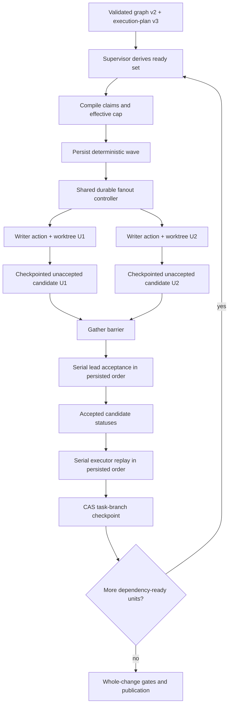
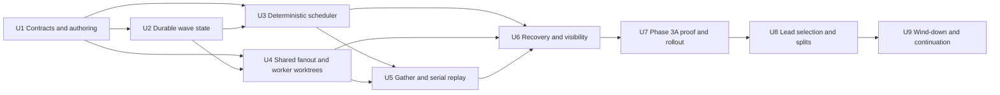

# Parallel Structured Units

## Goal capsule

| Field | Decision |
|---|---|
| Objective | Let independent structured implementation units execute concurrently through the same durable fanout model as reviewers, without weakening deterministic scheduling, worktree ownership, exact-SHA recovery, serial integration, or human approval boundaries. |
| Step 1 | Phase 3A ships deterministic, claim-safe parallel waves selected entirely by the supervisor. |
| Later layer | Phase 3B lets a graph-declared lead prefer ready work, propose scope-preserving splits, wind down into durable handoffs, and propose coherent slices. The supervisor continues to validate and execute every state change. |
| Rollback | Effective concurrency `1` preserves the existing serial structured behavior. Existing graph v1 and execution-plan v2 inputs remain serial. |
| Non-goal | Integration never runs in parallel. Agents never push the task branch, merge pull requests, expand approved scope, or override dependencies, claims, budgets, or provider gates. |

## Product contract

### Problem frame

Structured execution already models a dependency graph, but its runtime leases
one active child action for the whole parent. Independent units therefore wait
even when their repository scopes do not overlap. Review personas already use a
durable bounded fanout window inside one Daytona task sandbox. Writable units
should grow that same primitive with worktree ownership, candidate capture,
same-base integration, multi-action recovery, and unit-level operator visibility.

The serial constraint is enforced in several layers:

- `openthrottle.graph/v1` accepts `max_parallel` only as `1`, and the graph
  compiler rejects parallel `for_each_unit` phases.
- `selectNextReadyUnit` returns no work while any unit is running, and the unit
  store transactionally leases one active child action per parent attempt.
- review subactions already share one Daytona runtime resource and use sealed
  requests, action-local state, a durable dispatch ledger, bounded launch
  windows, and a gather barrier. Writable unit fanout needs the same lifecycle
  plus dedicated Git worktrees/indexes and executor-owned integration.
- every unit candidate is currently expected to fast-forward the integration
  subject. Two candidates produced from one common base cannot both satisfy
  that rule after the first integrates.
- status, reaping, stop, supersede, and cleanup project one active child rather
  than a durable set of sibling actions.

Phase 3 extracts and grows the existing review-fanout, graph, unit reducer,
runtime-resource, checkpoint, and publication architecture. It does not
introduce a parallel scheduler beside review fanout or an agent-owned scheduler.

### Key decisions

1. **Deterministic waves precede semantic scheduling.** Phase 3A proves bounded
   parallel execution using stable plan order and deterministic claims. Phase
   3B adds lead preferences only over the supervisor-certified ready set.
   (session-settled: user-directed, 2026-08-19; this isolates mechanical
   concurrency risk before adding semantic autonomy.)
2. **Public contracts evolve additively.** `openthrottle.graph/v2` adds a
   `for_each_unit.max_parallel_units` bound. `openthrottle.execution-plan/v3`
   adds atomic requirement/acceptance IDs and machine-checkable claims.
   Graph v1 and execution-plan v2 remain accepted and force serial execution.
3. **Unknown authoritative safety means serial.** Missing claims, free-form v2
   `files`, graph-scoped sessions, unknown shared runtime services, and supervisor-owned
   command gates without proven parallel-safety metadata acquire conservative
   mutexes. Agent-internal exploratory commands are non-authoritative and run
   with slot-local home/temp/cache state; any non-namespaced shared capability
   compiles to a full-action exclusive resource. Safety is never inferred
   semantically at runtime.
4. **Reviewer and worker fanout share one durable orchestration primitive.**
   One structured parent attempt keeps one Daytona task sandbox. Each fanout
   member gets a persisted child identity, bounded active-window slot, sealed
   request, action directory, agent home, native session, process group, logs,
   and deterministic collection/gather state. Writable members additionally
   get a dedicated Git worktree/index, candidate lineage, write claims, and
   integration evidence. Siblings are collaborators in the same trust boundary:
   repository-worktree visibility is allowed, but only the executor may accept
   a unit's candidate or mutate the integration worktree/task ref. Credentials,
   action control files, and private agent/session state remain inaccessible to
   sibling principals.
   (session-settled: user-directed, 2026-08-19; this rejects one Daytona
   resource per writer and keeps reviewer/worker orchestration convergent.)
5. **Waves and scheduling reasons are durable objects.** The supervisor records
   the common base, ready set, selected roster, authored order, claims, policy
   digest, effective cap, and exclusion reasons before dispatch. Restart and
   sibling completion timing cannot change a wave already opened.
6. **Concurrent candidates enter an isolated Git quarantine before cleanup.**
   Before lead acceptance in a multi-member wave, executor-owned machinery pushes the exact candidate
   SHA to one private, supervisor-installation-scoped checkpoint repository,
   namespaced by target repository ID and separate from every target repository.
   Exact force-with-lease acknowledgement
   reuses the existing Git transport and retention machinery. The checkpoint
   repository has Actions and Pages disabled, no deployment hooks, and access
   limited to the OpenThrottle GitHub App and operators; ordinary target-repo
   collaborators and automation cannot observe unaccepted candidates.
7. **Integration remains serial and executor-owned.** After a wave gathers,
   the executor replays candidate commit ranges from their recorded common base
   onto the advancing task-branch head in persisted wave order. Each task-branch
   update uses exact force-with-lease/CAS. Agents never rebase or mutate the
   integration checkout.
8. **Conflicts collapse safely, not optimistically.** A replay conflict records
   exact candidate/base/head evidence, preserves all quarantine refs, and
   redispatches the conflicting unit in a new isolated action against the
   current integrated head within the existing repair budget. Remaining
   candidates are revalidated in original order. Exhaustion returns
   `needs_human`.
9. **Semantic actors propose primitive decisions.** The later lead may order
   ready IDs, partition a pending unit, propose a coherent slice, or acknowledge
   wind-down. The supervisor validates topology, scope, claims, budgets,
   integration, Git effects, provider evidence, and continuation.
10. **One agent-neutral editable skill per role.** New scheduling, split,
    slice, and wind-down judgments use graph-declared builtin or `repo://`
    skill bindings. No feature may exist only as a hidden builtin prompt.

### Requirements

#### Phase 3A: deterministic safe waves

- **R1 Contract versioning.** Add `openthrottle.graph/v2` and
  `openthrottle.execution-plan/v3`; preserve byte-stable validation and digest
  behavior for prior versions. V1/v2 inputs execute with effective concurrency
  `1` and require no migration by users.
- **R2 Unit concurrency bound.** A graph v2 `for_each_unit` node may declare
  `max_parallel_units` from 1 through 8. The effective cap is the minimum of
  that value, the supervisor deployment limit, the parent sandbox's current
  CPU/memory/disk/process headroom, and explicit unit-wide serial constraints.
  Reviewer and worker fanout use the same live active-window accounting. The
  configured and effective values are both visible. Phase-local mutexes do not
  lower the wave cap; they block only the member phase that needs the resource.
  Root produces an `openthrottle.runtime-capacity/v1` receipt at wave selection
  and again before each blocked-member dispatch. It binds cgroup CPU quota,
  memory limit/current use, PID limit/current count, filesystem free bytes, a
  sample timestamp, and a sealed operator policy digest containing nonzero
  per-slot memory/disk/PID reserves and operational margins. CPU quota bounds
  total slots; the other dimensions use
  `floor((available - margin) / per_slot_reserve)`. A missing, invalid, or
  older-than-30-seconds receipt forces cap 1; a later below-policy sample blocks
  dispatch without changing the persisted roster.
- **R3 Atomic authority IDs.** Every v3 unit carries unique, stable requirement
  objects `{id, text}` and acceptance objects `{id, text, requirement_ids}`.
  Each acceptance object names at least one requirement in the same unit; the
  resulting authority graph is validated, every requirement is named by at
  least one acceptance, and the normalized graph is bound into the plan digest.
  Unit IDs and atomic objects are immutable in Phase 3A. Phase 3A
  uses them to prove that concurrent candidate review, repair, and downstream
  context preserve every approved requirement and acceptance criterion; Phase
  3B later reuses the same lineage for scope-preserving splits.
- **R4 Claim grammar.** Every parallel-eligible v3 unit declares `claims` with
  bounded `write_paths` and `exclusive_resources`. Paths are normalized
  repository-relative POSIX file paths or directory prefixes ending in `/`;
  absolute paths, traversal, globs, empty segments, and duplicates fail closed.
  Two path claims conflict when they are equal or one is an ancestor prefix of
  the other. Resource names use a closed-length identifier grammar and conflict
  on exact equality.
- **R5 Conservative compiled claims.** Admission adds deterministic mutexes for
  graph-scoped native sessions, unknown shared runtime services, supervisor-owned command
  phases, shared package-manager locks/caches, and any runtime capability not
  declared read-only and parallel-safe by the pinned platform capability
  catalog. A shared runtime resource reachable throughout an
  agent action becomes a full-action exclusive claim; a phase-local gate becomes
  a phase mutex. Agent-internal exploratory command output is never acceptance
  evidence: it runs with slot-local home, temp, and cache paths, while the
  authoritative test/lint/build gates run under supervisor scheduling after
  candidate production/integration. Ticket text and agent-authored claims can
  never grant parallel-safety. A v2 unit or a v3 unit with incomplete claims is
  valid but serial-only.
- **R6 Claim enforcement.** Before acceptance/integration, executor evidence
  computes the actual changed path set from the recorded candidate base. Every
  path must fall within the unit's declared `write_paths`; an undeclared write
  is a boundary violation and cannot integrate. Claims constrain integration,
  not only initial scheduling.
- **R7 Deterministic ready set.** The supervisor alone derives dependency-ready
  units from durable integrated/completed state. Phase 3A sorts by authored
  ordinal then unit ID and greedily packs the first conflict-free roster up to
  the effective cap. Database row order and completion timing cannot affect the
  result.
- **R8 Persisted wave decision.** Before dispatch, persist the graph/plan/policy
  digests, generation, parent attempt, wave ID, common task-branch base, ready
  set, selected roster/order, claims, excluded units/reasons, and effective cap
  plus the exact capacity-receipt hash and capacity-policy digest in one
  transaction. Logical fanout-slot reservation occurs in that transaction;
  if the roster cannot be reserved, no wave opens. A partially dispatched
  immutable roster retries with bounded backoff and uses the existing stall
  deadline to become operator-actionable rather than silently repacking around
  missing capacity. Every child action binds that exact wave identity.
- **R9 Multi-action leases.** Replace the parent singleton with durable
  per-unit action leases plus a wave cap. At most one active action exists for a
  unit, at most the effective cap exists for a parent, and all acquire/renew/
  settle operations compare graph, wave, unit, action, request hash, generation,
  run, base, and lease fence. Phase 3A also establishes a generation-chain
  aggregate worker-second ledger from the sum of the immutable root units'
  active limits, bounded by the operator maximum. Lease/renewal reserves a
  bounded slice atomically; fenced heartbeats monotonically charge observed
  worker-seconds; ordinary settlement refunds only the unused reservation; and
  confirmed absence charges the outstanding reservation in full. Retry,
  conflict repair, split, and continuation never reset the ledger.
- **R10 Writable worktree boundary.** One Daytona resource belongs to the
  structured parent attempt. Each active writable unit is assigned one persisted
  fanout slot and one of eight image-baked unprivileged worker principals
  (`ot-worker-1` through `ot-worker-8`), plus a dedicated Git worktree/index,
  agent home, native session,
  process group, action directory, temp/cache namespace,
  logs, and recovery package. Reviewer and worker children use the same sealed
  dispatch, recollection, active-window, timeout, and gather contracts. Workers
  may inspect sibling work because they are collaborators in the same sandbox;
  OpenThrottle does not claim confidentiality or hostile-process isolation
  between them. Correctness is enforced by worktree-root execution, declared
  write claims, changed-path evidence, fenced child receipts, and executor-only
  control of the integration worktree and Git refs. A worker never gets Daytona
  credentials or remote write authority. Stateful MCP services, shared caches,
  package-manager locks, and command phases are either unit-namespaced or
  deterministically mutexed. A shared collaboration group grants active worker
  principals access to live unit worktrees, while action homes, sessions,
  credentials, and control files remain principal-private. The fixed principal
  lets existing UID-scoped process fencing reap escaped descendants for one
  action without killing siblings. Unknown runtime capability forces effective
  cap 1.
- **R11 Phase mutexes.** A unit may progress independently through implementation,
  simplification, and candidate production, while command or graph-scoped lead
  actions acquire their compiled exclusive mutexes. A wave member waiting for a
  mutex holds its persisted wave/fanout-slot reservation but no child action lease or
  repair round; the action is leased and dispatched only after the mutex is
  acquired. The blocked phase and mutex owner are visible.
- **R12 Gather barrier.** Implementation, simplification, command, and candidate
  production may advance concurrently. In a multi-member wave every produced candidate transitions
  through `produced -> checkpoint_pending -> checkpointed_unaccepted` before
  local action cleanup. The quarantine receipt is recovery evidence only. Once
  every selected member is checkpointed or terminal, each candidate is restored
  by exact checkpoint repo/ref/SHA into a fresh fenced read-only acceptance
  action context in the same parent sandbox. The supervisor
  re-verifies its base, tree, claims, and quarantine receipt before unit lead
  acceptance runs serially in persisted wave order. Acceptance and any revision
  receipt bind the restored checkpoint receipt and exact subject, producing
  `accepted|rejected|needs_human`. Integration
  begins only after the wave outcome policy permits it. A same-wave
  downstream-context update targeting an
  already dispatched sibling is rejected with a typed
  `same_wave_target_active` decision; Phase 3A never mutates a sibling's sealed
  context in place. A one-member serial wave may instead retain its local
  worktree through lead acceptance and the existing accepted task-branch
  checkpoint acknowledgement; it performs no unaccepted-candidate transport or
  pre-acceptance cleanup.
- **R13 Candidate quarantine transport.** One supervisor installation/profile
  eligible for cap-above-1 execution names a private checkpoint repository ID.
  It cannot equal any registered target repo; startup and admission verify
  private visibility, OpenThrottle App access,
  Actions/Pages disabled, no deployment hooks, and the expected repository ID.
  Before a wave opens, executor transport CAS-creates
  `refs/heads/ot-base/<target-repo-id>/<common-base-sha>` in the checkpoint repo
  from the exact target base and verifies its tree/SHA. The first seed may copy
  the reachable target history under a separate per-target byte quota; later
  candidate quotas cover only `base..candidate`. Target IDs namespace all refs,
  quotas, retention, and cleanup. Base anchors are
  retained while any candidate or continuation receipt depends on them. Before
  any candidate push, a disposable no-network, no-credential parser
  process validates the exact Git object closure under hard compressed-byte,
  incremental compressed-byte, expanded-byte, object-count, per-object-size,
  delta-depth, commit-count, and
  path-count limits; rejects unexpected object types; and scans for injected
  credential values/canaries. Failure blocks transport, revokes or rotates any
  exposed session credential, and records a bounded security failure. Only the
  root executor then receives a short-lived GitHub token scoped to the checkpoint
  repo and pushes `refs/heads/ot-checkpoint/<target-repo-id>/<ticket>/<generation>/<wave>/<unit>`
  with exact force-with-lease. The supervisor receives no raw pack: it verifies
  the ref/SHA through the GitHub API and stores a receipt binding repo/ref,
  base/head/tree/commit range, object/manifest digest, byte bounds, prior remote
  SHA, retention deadline, and acknowledgement. Missing or misconfigured
  quarantine forces effective cap 1 and the retained-worktree serial lifecycle;
  it never falls back to an unaccepted ref in the target repository. Multi-member
  local cleanup cannot remove candidate state until the
  receipt is durable. Acceptance changes status, not Git identity. A zero-diff
  unit records the common-base SHA and empty range without a quarantine push,
  receives ordinary lead acceptance, and maps to the current integration head
  without replay.
- **R14 Serial replay integration.** Replay candidates in persisted wave order
  onto the current task branch. Verify common-base ancestry, recorded commit
  range, candidate tree, actual paths, acceptance evidence, and current
  force-with-lease expectation before each update. Record candidate-to-integrated
  SHA mappings because replayed commits may receive new SHAs.
- **R15 Conflict recovery.** A replay conflict never enters the task branch.
  Preserve the candidate, conflicting paths, common base, attempted integration
  head, and executor logs; redispatch only the conflicting unit against the
  current head. Revalidate every later candidate before replay. Emit a typed
  integration-conflict receipt binding common base, accepted candidate,
  advancing integration head, conflicting paths, and failed replay. A fresh
  conflict-repair action uses the current integration head as its base, then
  reruns commands, candidate derivation, lead acceptance, and checkpointing.
  Each selected parallel-eligible unit reserves one attempt plus
  `min(1800, ceil(unit_active_limit_seconds * 0.2))` worker-seconds for an
  integration-conflict repair in the same wave-admission transaction. The
  roster shrinks deterministically if those reservations cannot be secured;
  unused allowance is released only after conflict-free integration. This
  reserve is separate from lead-requested semantic revision rounds, never
  masquerades as a semantic revision, and exhausts to `needs_human`.
- **R16 Crash and cancellation convergence.** A sibling crash never duplicates,
  cancels, or discards another sibling. Recovery first recollects the exact
  fenced action; confirmed absence settles only that action. Stop/supersede
  blocks new leases and integration before concurrently canceling children.
  Reapers and cleanup operate per child action/process/worktree and remain
  idempotent; the parent Daytona resource survives until parent-wide terminal
  cleanup. The wave
  outcome matrix is authoritative: retryable infrastructure and bounded
  semantic/integration repair keep only that member open; success and accepted
  no-change may integrate only when every nonterminal member is accepted;
  exhausted `failed`, `exited`, or `needs_human` blocks new dispatch and all
  integration, gives healthy siblings a bounded checkpoint-only grace period,
  then derives the ordinary parent failure/needs-human outcome with no
  publication; stop/supersede prohibits every new checkpoint, acceptance, and
  integration effect after its fence and cancels unfinished members. No new
  wave forms until the current roster is terminal. Every activation records a
  generation-unique task ref: the first may use `ot/<ticket>`, later generations
  use an unambiguous suffix and start from the freshly selected base. Terminal
  output names the retained partial task and quarantine refs. A later generation never
  silently adopts or overwrites them; resumption requires the operator to select
  the retained branch explicitly through the existing pre-delegation branch
  override.
- **R17 Checkpoint and disk safety.** Candidate quarantine refs and acknowledged
  task-head checkpoints are the durable recovery source. Candidate refs delete
  before an unreferenced base anchor; a base anchor cannot delete while any
  candidate, repair, acceptance, integration, or continuation receipt depends
  on it. Terminal actions retain bounded
  request/result/retention evidence and prune reconstructible homes, caches,
  staging, outbox/inbox, and temporary worktrees under the existing disk
  headroom policy. `needs_human` evidence follows the existing extended
  retention rule.
- **R18 Visibility parity.** Status, admission detail, CLI/operator output,
  Linear activities, and
  the GitHub structured ledger show wave phase, configured/effective cap,
  active/blocked/gathered units, claims/conflicts, heartbeat, quarantine repo/ref/SHA,
  integration mapping, retry owner, cleanup state, `parallel_eligible`, and an
  exact `serial_reason` or rejected claim path without exposing prompts,
  credentials, or unbounded logs. Automatic admission may propose only claims
  grounded in explicit ticket/plan scope; ambiguous claims remain serial and
  detail output tells the author what must be clarified.
- **R19 Steering safety.** Parent-scoped steering received while multiple
  children are active is durably recorded as audit-only and visibly reported
  `not_delivered_ambiguous`; it is never broadcast or later rebound merely
  because only one child remains. Existing exactly fenced delivery is allowed
  only when the target was unambiguous when authored.
- **R20 Rollout.** New graph v2 parallelism is opt-in and the deployment cap
  initially defaults to `1`. Ship shadow wave calculation first, canary at 2,
  then dogfood at 3. Raising any default requires recorded proof; setting the
  cap to 1 applies to newly opened waves and restores serial behavior without a
  code rollback. An already-open wave retains its persisted cap and roster
  unless an operator stops it; emergency cancellation is a separate drain action.

#### Phase 3B: lead-selected scheduling and bounded autonomy

- **R21 Lead preference receipt.** A graph-declared scheduling loop receives
  the exact certified ready set, claims, conflicts, authored order, remaining
  budgets, and prior decisions. It may return an ordered preferred prefix of
  ready unit IDs. The supervisor rejects duplicates or unknown IDs, appends
  every omitted ready ID in stable authored order, and performs the same
  deterministic safe packing over that complete order. An empty, missing,
  invalid, or timed-out receipt therefore falls back to stable plan order and
  is recorded; lead advice cannot suppress or starve ready work.
- **R22 No semantic safety override.** Lead advice cannot change dependencies,
  concurrency caps, claims, mutexes, integration order, credentials, provider
  gates, or human authority. It affects preference only.
- **R23 Scope-preserving split.** A lead may propose splitting one pending,
  never-attempted v3 unit into bounded children. Children transfer the parent's
  requirement and acceptance objects byte-for-byte and partition the atomic
  authority graph plus path/resource claims exactly. An acceptance and all
  requirements it names move together as one closed authority component;
  cross-child authority edges are invalid, and every child must own at least one
  complete requirement-plus-acceptance component. Children inherit
  external dependencies; declare acyclic intra-split dependencies; and partition
  attempts/time budget instead of multiplying it. Every original path/resource
  claim token is assigned whole to exactly one child; hierarchical subdivision
  is prohibited unless the root plan already declared narrower tokens. Every
  former dependent is rewritten to depend on a deterministic join over all
  required children. Existing parent-targeted context must route uniquely by
  atomic authority ownership or the split fails closed. Expansion, loss,
  overlap, cycles, or an attempted parent fails closed.
- **R24 Graph revision lineage.** Split settlement is `proposal -> independent
  fresh read-only review -> deterministic validation -> revision CAS`; neither
  semantic actor receives repository-write or Git credentials. An accepted split closes the parent as
  `exited/split`, persists a normalized revised topology with its own digest,
  and records root plan, parent unit, proposal, reviewer, and revision lineage.
  Every later wave binds the active revision. One bounded semantic repair is
  allowed; a second invalid proposal returns `needs_human`.
- **R25 Budget reserve.** Unit, repair, split, and continuation work share
  ticket-generation-chain attempt/reentry, active wall-clock, and aggregate
  worker-second budgets. Phase 3B extends R9's monotonic reservation ledger
  rather than introducing or resetting it. Lease and renewal atomically reserve
  both remaining time dimensions, so concurrency cannot multiply the allowed work. A default
  `budget_reserve_fraction` of `0.1` is reserved once across the chain for
  coherent wind-down and may not be reset by retries, splits, or continuation.
  Active execution excludes `waiting_provider` and explicit human-decision
  intervals. The reserved wall-clock and aggregate worker-seconds are each
  `ceil(their active limit * 0.1)`; entry into either reserve stops new leases.
  When an attempt/reentry limit is at least 2, its final slot is wind-down-only,
  while a limit of 1 relies on the time reserves. Provider token/cost data is
  recorded but is not scheduling authority until it is complete and trusted.
- **R26 Wind-down lifecycle.** Upon reserve entry, stop leasing new work and
  signal active workers to commit coherent owned state. Persist
  `reserve_reached`, `wind_down_requested`, `acknowledged`, and
  `coherent_handoff|incoherent|exhausted` transitions. A coherent candidate
  still requires normal scope, command, acceptance, integration, and publication
  gates; incomplete work never bypasses them. All active workers share the one
  reserved worker-second pool. Wind-down receives at most
  `min(900, remaining_reserved_wall_seconds)` wall seconds and cannot consume
  more than the remaining aggregate reserve.
- **R27 Coherent slice proposal.** After at least one unit integrates and work
  remains, a lead may propose the integrated prefix as a coherent slice. The
  full whole-change command/review/repair sequence runs on the exact integrated
  subject. Publication remains executor-owned and human PR merge remains the
  continuation gate.
- **R28 Continuation frontier.** A slice carries the exact active graph revision,
  remaining units byte-identical to that revision, root and revision digests,
  accepted downstream context, exact published head, consumed/remaining chain
  budgets, and continuation count. This reconciles splits with continuation:
  the frontier preserves revised children and the full revision lineage rather
  than pretending they are byte-identical to the root plan.
- **R29 Merge-evidence continuation.** Only verified merge evidence admits a
  fresh generation on the same ticket against the merge result. Closed-unmerged
  PRs, stale heads/frontiers, new-base validation failures, feedback lineage
  mismatches, or continuation-bound exhaustion return `needs_human`. The
  initial `max_continuations` default is 1. No agent
  creates another ticket or generation directly.
- **R30 Steering boundary.** Phase 3B retains Phase 3A's audit-only behavior for
  parent-scoped input while more than one child is active. Exact user-facing
  wave/unit/action addressing is deferred to a separate control-surface phase
  with provider-specific actor authorization; neither lead scheduling nor
  continuation depends on it.
- **R31 Editable semantic roles.** Scheduling, split review, slice coherence,
  and wind-down skills have canonical builtin packages and may be replaced by
  declared `repo://` packages under the existing pin/digest/size/symlink rules.
  The deterministic validators and side-effect executors are never replaceable
  skills.
- **R32 Phase boundary.** Phase 3B does not begin until Phase 3A's concurrency-1
  equivalence, failure injection, worktree ownership, serial replay, cleanup, and live
  dogfood gates are accepted.

### Success criteria

- Two independent units overlap in wall-clock time while a conflicting third
  remains blocked; repeated/restarted runs select the same wave roster and order.
- Concurrency never exceeds the effective cap. Siblings may inspect or
  collaborate on each other's work; authoritative attribution follows the
  designated unit worktree/candidate, every candidate path must fit that unit's
  claims, and only the executor can mutate integration state.
- Sibling completion order does not change the final task-branch tree, ordered
  integration ledger, or terminal aggregate for identical candidate inputs.
- One sibling crash, replay conflict, supervisor restart, stop, or capacity loss
  converges without deleting accepted work or duplicating another action.
- The existing structured walking skeleton at concurrency 1 produces equivalent
  unit, gate, integration, publication, and cleanup outcomes.
- Lead timeouts or malformed advice in Phase 3B degrade to deterministic Phase
  3A scheduling, never to a stalled or unsafe run.
- Splits and continuation cannot expand scope or reset budgets, and no
  continuation begins before exact provider merge evidence.

### Acceptance examples

- **AE1 Independent pair.** U1 claims `contracts/`; U2 claims `cli/`; U3 depends
  on both. With cap 2, U1/U2 share wave 1 and U3 enters wave 2.
- **AE2 Conflict.** U1 claims `supervisor/src/pipeline/`; U2 claims
  `supervisor/src/pipeline/store.ts`. U2 is excluded with a path-overlap reason
  even when capacity is available.
- **AE3 Unknown claim.** A v2 unit or a v3 unit with an unsafe shared runtime capability remains
  valid but runs alone. It is never silently treated as conflict-free.
- **AE4 Completion race.** U2 finishes before U1, but replay still follows the
  persisted U1, U2 order and yields the same aggregate as the inverse timing.
- **AE5 Replay conflict.** U1 integrates; U2's recorded range conflicts with the
  new head. U2's quarantine ref remains acknowledged, its reserved conflict
  repair is consumed, and a fresh action is based on the
  current task head, and no conflicted tree reaches the task branch.
- **AE6 Crash.** U2 disappears while U1 is healthy. Recovery recollects or
  settles U2 only; U1 continues and its candidate survives local cleanup through
  the acknowledged quarantine ref.
- **AE7 Stale event.** A result with the wrong wave, request hash, generation,
  action fence, or base SHA cannot settle, integrate, or release a live slot.
- **AE8 Lead fallback.** The Phase 3B lead returns an unknown unit ID. The
  invalid receipt is visible and the supervisor packs the wave in stable plan
  order. If it returns only one valid preferred ID, every omitted ready ID is
  appended in stable order before packing, so the lead cannot starve work.
- **AE9 Split.** A parent owning R1/R2 and A1/A2 may split into disjoint children
  only when A1 names R1 and A2 names R2. Atomic objects transfer byte-for-byte.
  Duplicating A1, omitting R2, separating an acceptance from a requirement it
  names, adding a path claim, or splitting after an attempt is rejected.
- **AE10 Wind-down.** Two simultaneous workers consume two worker-seconds per
  elapsed second. Entry into either the shared 10% wall-clock reserve or shared
  10% aggregate worker-second reserve stops new leases. A coherent candidate
  follows normal gates; an incoherent handoff returns `needs_human` with
  retained evidence.
- **AE11 Continuation.** A merged slice with three revision-pinned units admits
  one bounded fresh generation at the merge SHA. Closed-unmerged or stale merge
  evidence preserves the frontier and returns `needs_human`.
- **AE12 Pre-acceptance durability.** U1 finishes while U2 is still running.
  U1's produced candidate is remotely acknowledged before its local action is
  pruned; losing the whole parent sandbox before serial lead acceptance restores
  the same unaccepted SHA into a replacement sandbox's read-only action and cannot
  accidentally integrate it.
- **AE13 Mixed terminal wave.** U1 is checkpointed and U2 returns
  `needs_human`. U1 receives only the bounded checkpoint grace, no member
  integrates, no new wave opens, and terminal output names the retained task
  ref and candidate quarantine refs.
- **AE14 No change.** U1 proves its criteria already hold. Its quarantine
  receipt records the common-base SHA with an empty range and no quarantine push;
  acceptance settles and
  integration maps it to the current task head without an advance effect.
- **AE15 Stop and reactivate.** A stop after an earlier wave integrated blocks
  all later effects and reports the partial task head. A new activation uses a
  generation-suffixed ref from the selected base unless the operator explicitly
  selects the retained branch before delegation.
- **AE16 Capacity starvation.** A persisted roster loses enough parent-sandbox
  CPU, memory, disk, or process headroom before its final dispatch. Membership
  does not change; status shows capacity-blocked backoff and the stall deadline
  makes the run actionable.
- **AE17 Ambiguous steering.** A parent message arrives with U1 and U2 active.
  It is recorded `not_delivered_ambiguous`, never reaches either child, and is
  not delivered later when U1 happens to finish first.
- **AE18 Split substitution.** U3 depends on parent U1. After a valid U1a/U1b
  split, U3 depends on the deterministic join of both children; parent-targeted
  context must route uniquely by atomic ownership or the split is rejected.
- **AE19 Provider wait budget.** A slice waits two days for human merge without
  consuming active execution reserve. Its one allowed continuation resumes with
  exactly the pre-wait remaining chain budget.
- **AE20 Quarantine rejection.** An unaccepted candidate adds a workflow and
  copies an injected credential canary into a blob. Transport is rejected, the
  affected session credential is revoked or rotated, no ref is acknowledged,
  and no ref or event is created in the target repository.
- **AE21 Fanout capability drift.** The sandbox snapshot or Daytona runtime no
  longer proves the release-tested concurrent action/worktree/process contract.
  A new wave records the unsupported-runtime-contract reason and runs with
  effective cap 1 until a matching canary is accepted.

### Scope boundaries

**Phase 3A includes:** deterministic safe waves, additive public contracts,
claims, shared reviewer/worker fanout machinery, worktree-owned writable
actions, multi-action leases, phase
mutexes, quarantined candidate checkpoints, gather, serial replay, conflict/recovery,
visibility, retention, shadow mode, and canary rollout.

**Phase 3B includes:** lead scheduling preferences, scope-preserving splits,
revision lineage, reserve wind-down, coherent slices, merge-evidence
continuation, and editable semantic-role packages.

**Human-only forever:** original plan approval, PR merge, scope expansion,
dependency/claim/cap override, branch-protection bypass, credential-scope
changes, and arbitrary ticket/generation creation.

**Explicitly out of scope:** parallel integration, completion-order integration,
agent pushes to task/checkpoint branches, a separate Daytona sandbox per sibling,
hostile-process confidentiality between collaborating siblings,
unbounded dynamic graphs, custom evaluator languages, and OpenCode structured
loop actions (which remain a separate engine-parity milestone). Exact targeted
steering is a later control-surface phase, not part of Phase 3B.

## Planning contract

### Human-taste decisions

The following are settled implementation decisions, not choices for workers:

- use new graph v2 and execution-plan v3 contracts rather than mutating strict
  v1/v2 parsing;
- keep one Daytona resource per structured parent and extend the existing
  reviewer fanout primitive with writable worktree members instead of building
  a second fanout controller;
- persist wave membership before dispatch and integrate in that order;
- use conservative serialization for unknown claims/capabilities;
- transport multi-member-wave candidates through private content-addressed
  quarantine objects before serial acceptance;
- let Phase 3B leads express preferences/proposals only, with deterministic
  validation and fallback;
- retain concurrency 1 as the operational rollback.

### System flow

The flow below is the cap-above-1 path. Effective cap 1 retains the existing
single-worktree serial acceptance and accepted-checkpoint lifecycle.

```mermaid
stateDiagram-v2
  [*] --> planned
  planned --> blocked: phase mutex unavailable; wave slot reserved
  planned --> dispatched: mutex and action lease acquired
  blocked --> dispatched: mutex and action lease acquired
  dispatched --> candidate_ready: executor derives candidate
  candidate_ready --> checkpointed_unaccepted: quarantine ref acknowledged
  checkpointed_unaccepted --> accepted: serial lead accepts
  checkpointed_unaccepted --> failed: lead rejects or needs human
  dispatched --> exited: stop, supersede, or confirmed absence
  dispatched --> failed: boundary or exhausted action failure
  accepted --> integrating: persisted wave order reached
  integrating --> integrated: replay and task-branch CAS acknowledged
  integrating --> repair_pending: replay conflict
  repair_pending --> dispatched: fresh fenced action on current head
  repair_pending --> failed: repair budget exhausted
  integrated --> [*]
  exited --> [*]
  failed --> [*]
```





### Dependency strategy



The implementation order is deliberately narrower than the future runtime
parallelism. U1 fixes public identities. U2 generalizes the already-shipped
review fanout lifecycle before U3/U4 use it for workers. U3 consumes U2's
persistence contract; U4 adds only writable worktree/candidate concerns. U5
joins scheduling and worker candidates. U6 closes lifecycle/visibility before
the Phase 3A gate. No U8/U9 code lands behind an unproven U7 mechanical layer.

## Implementation units

### U1: Versioned contracts, claims, and authoring parity

**Objective:** make parallel eligibility explicit, immutable, locally
validatable, and identical across CLI, admission, persistence, and runtime.

**Primary files:**

- `contracts/src/graph.ts` and new version-specific graph module/fixtures;
- `contracts/src/execution-plan-v3.ts`, exports, determinism fixtures, and tests;
- `cli/src/plan.ts` and planning/prepare/admission/review skill references;
- `supervisor/src/pipeline/execution-graph.ts`, `manifest.ts`, graph fixtures;
- `docs/SPEC.md`, `skills/planning/`, and `skills/tasks/admission-plan/`.

**Work:**

1. Define strict graph v2 and execution-plan v3 parsers plus normalized types.
2. Implement path/resource claim normalization, overlap tests, bounds, and
   canonical digests once in `contracts/`.
3. Keep graph v1/execution-plan v2 parsers unchanged; compile them with cap 1.
4. Publish the parallel builtin as `core/structured@4`; retain
   `core/structured@3` as the immutable serial graph.
5. Extend preparation/admission/review guidance to emit and verify atomic IDs
   and conservative claims without inventing scope.
6. Compile graph v2 node cap and v3 claims into an immutable scheduling policy
   digest stored with the effective manifest.

**Tests:** valid/invalid fixtures, cross-package canonical JSON/digest fixture,
CLI prepare/validate tests, admission planner/reviewer tests, repository graph
override tests, unknown-field/version downgrade tests.

**Acceptance:** the same input normalizes to identical bytes/digest in contracts,
CLI, and supervisor; old inputs remain valid and serial; invalid or ambiguous
claims fail before sandbox provisioning.

### U2: Durable waves and multi-action leases

**Objective:** extract the shipped reviewer active-window/recollection/gather
behavior into one restart-safe bounded-fanout primitive, then use it for both
review personas and writable unit waves while retaining per-unit exclusivity.

**Primary files:**

- `supervisor/src/persistence/migrations/definitions.ts` and `schema.ts`;
- `supervisor/src/persistence/pipeline/unit-store.ts` and tests;
- `supervisor/src/operations/review-orchestration.ts` plus a shared
  `bounded-fanout` operations module and contract tests;
- `supervisor/src/pipeline/unit-coordinator.ts` and store contracts;
- migration runner/recovery fixtures.

**Work:**

1. Extract the generic mechanics currently embedded in review orchestration:
   persisted ordered roster, prepared/acknowledged child dispatch, bounded
   active-window fill, restart recollection, deterministic terminal selection,
   gather, timeout/cancellation, and status timing. Keep review-only persona
   selection, receipt synthesis, blocker validation, and repair policy in the
   review adapter.
2. Drive existing reviewer fanout through the shared primitive with byte-
   equivalent receipts, journals, serial rollback behavior, and configured
   concurrency before enabling worker fanout. The shared controller accepts
   domain callbacks; it does not know review personas, Git candidates, or unit
   dependency semantics.
3. Add an immutable migration for wave headers, members/claims/reasons, per-unit
   action leases, checkpoint repo/base-anchor/candidate-ref receipts, monotonic
   worker-second reservations/heartbeat charges/refunds, conflict-repair
   allowances, and candidate-to-integration mappings.
4. Preserve existing serial rows by projecting a one-member wave on demand or
   migrating only when a new action is leased; do not rewrite historical
   evidence.
5. Implement CAS APIs for create-wave, reserve/lease-member, charge-heartbeat,
   fenced-refund-or-charge-absence, block/unblock, settle, gather,
   begin-integration, record-CAS, and close-wave.
6. Fence every transition by parent attempt, graph/policy/wave/unit/action,
   generation, request hash, base subject, and lease version.
7. Remove the parent-wide one-active assertion only after invariant tests prove
   cap and one-action-per-unit enforcement transactionally.

**Tests:** one shared fanout contract suite against reviewer and worker adapters;
review journal/receipt regression fixtures; concurrent lease races, row-order
permutations, stale fences, restart/reload, duplicate settlement, cap shrink,
serial compatibility, migration checksum/idempotence, and partial-wave terminal
states. A lint/architecture assertion prevents a second active-window launch
loop outside the shared module.

**Acceptance:** reviewers still fan out through the same provider resource with
unchanged observable results; workers call the identical dispatch/recollection/
window/gather primitive; no transaction can exceed the persisted cap or lease
two actions for one unit; restart reconstructs the same roster without
rescheduling it.

### U3: Deterministic wave scheduler and phase mutexes

**Objective:** select and dispatch only dependency-ready, claim-compatible work
using a pure deterministic policy.

**Primary files:**

- `supervisor/src/pipeline/unit-coordinator.ts`;
- the shared bounded-fanout operations module introduced in U2;
- `supervisor/src/operations/structured-child-runtime.ts`;
- `supervisor/src/operations/pipeline-effects.ts` and operations worker wiring;
- runtime capacity receipt/policy contracts and root sandbox sampler;
- app config, `.env.example`, and scheduler tests.

**Work:**

1. Replace `selectNextReadyUnit` with a pure ready-set and deterministic packer
   returning selected/excluded units plus exact reasons.
2. Compute the effective cap from graph, deployment, capacity, budget reserve,
   and unit-wide serial constraints; default the new deployment cap to 1 for
   rollout. Phase mutexes affect dispatch eligibility for their phase, not wave
   membership or the effective cap. Implement R2's root-produced capacity
   receipt, sealed per-slot reserve policy, 30-second freshness fence, and
   deterministic cap calculation. Reduce the
   roster deterministically when worker/conflict-repair allowance cannot be
   reserved in the create-wave transaction.
3. Persist the decision before any dispatch effect and drain effects idempotently.
4. Materialize the persisted wave as the shared fanout controller's ordered
   roster and use its same active-window slot accounting; do not add a worker-
   specific dispatch loop.
5. Add phase-level mutex acquisition for graph sessions, commands, shared runtime services,
   and unknown capabilities without charging repair budget while blocked.
   Compile a resource reachable for the entire agent action as a full-action
   exclusive claim instead; do not pretend a later command-stage mutex covers
   arbitrary agent subprocesses.
6. Implement shadow calculation that records the wave it would have selected
   while dispatching serially.

**Tests:** deterministic property tests under permuted inputs/timing, dependency
frontiers, conflicting prefixes/resources, capacity backpressure, mutex fairness,
effect replay, timeout, and deterministic fallback to single-member waves.

**Acceptance:** given the same pinned state, scheduler version, and capacity
snapshot, wave bytes and digest are identical; claim-conflicting work and
explicitly exclusive shared resources never overlap. Agent-internal command
output is non-authoritative and final gates remain supervisor-owned.

### U4: Shared-sandbox worker fanout and exact candidate checkpoints

**Objective:** run concurrent writers as action-local worktrees in the parent
Daytona sandbox, using the same child lifecycle as reviewers, and checkpoint
each produced Git candidate durably before local cleanup.

**Primary files:**

- the shared bounded-fanout operations module and
  `supervisor/src/operations/review-orchestration.ts`;
- `supervisor/src/providers/daytona/` loop-action runtime adapter;
- the GitHub provider's exact-SHA checkpoint transport, repository registration,
  quarantine validation, retention lifecycle, and health checks;
- CLI/setup and supervisor profile settings for one installation-scoped
  checkpoint repository;
- `supervisor/src/runtime/` resource/event contracts;
- `supervisor/src/operations/structured-child-runtime.ts`;
- `sandbox/entrypoint.sh`, `sandbox/runner/execute-loop.mjs`, runtime helpers,
  safety hooks, and Bats/Docker fixtures.

**Work:**

1. Keep the existing one-resource-per-parent Daytona lifecycle. Dispatch each
   worker through the U2 bounded-fanout controller and the same
   `dispatchLoopAction`/`collectLoopActionResult` provider calls reviewers use.
   No worker-specific provider scheduler or child sandbox lifecycle is added.
2. Bake `ot-worker-1` through `ot-worker-8` and a collaboration group into the
   image. Persist one fixed principal with each active slot. Give every unit a
   deterministic action ID and separate Git worktree/index, principal-private
   home, native-session store, action/temp/log directory, process group, and MCP
   process/config. Grant the collaboration group access to active worktrees so
   siblings can inspect or cooperate, but keep action state and credentials
   private. Namespace caches where supported; otherwise compile the cache/
   package-manager resource into a deterministic mutex.
3. Reserve the executor's integration worktree and ref namespace outside all
   agent working directories. Root-owned helpers create/remove worktrees,
   derive candidates, update refs, and clean action state; agents receive no
   Daytona, checkpoint-repository, or target-repository write credential. Every
   reviewer and worker engine process keeps the existing privilege drop to its
   sealed unprivileged principal with a replacing credential allowlist.
   Integration Git state, sealed control files, transport envelopes, and
   checkpoint credentials remain root-owned and unreadable/unwritable by child
   engines.
4. Start every unit worktree at the persisted common task-branch base and
   enforce root-sealed Git hooks. Use worktree-local indexes and serialize
   shared Git ref/config maintenance so concurrent Git commands cannot race the
   common object database or executor state. Refactor grant/lock helpers so they
   change only the selected worktree and never revoke a live sibling.
5. Produce executor-verified candidate base/head/tree/commit-range/changed-path
   evidence and reject undeclared writes.
6. In a disposable no-network/no-credential parser process, validate the Git
   object closure and manifest under R13's hard quotas, allowed object types,
   strict Git checks, and credential-canary scan. Then give only the root
   transport process a short-lived Contents token scoped to the checkpoint repo;
   CAS-create or verify the exact common-base anchor, then push the candidate SHA
   with force-with-lease and let the supervisor
   verify the ref/SHA through the GitHub API. Never stream an untrusted pack into
   Fly or create an unaccepted ref in the target repository.
7. Make every privileged traversal of worker-controlled trees descriptor-
   relative and no-follow. Reject symlinks and special files where packaging,
   sealing, or deletion could cross the owned action/worktree root. This guards
   executor correctness; it is not a sibling-confidentiality boundary.
8. Cancel and reap a failed unit's process group, session, worktree, and action
   state independently without deleting the parent sandbox or healthy siblings.
   Retain UID-scoped convergence for escaped descendants, scoped to the slot's
   fixed worker principal rather than the shared historical `agent` user.
   Parent stop/supersede cancels the whole roster before sandbox cleanup. Extend
   aggregate headroom accounting to concurrent staging/sealing and retain the
   OPE-187 request/result/retention policy per action.
9. Validate at supervisor startup and admission that the checkpoint repository
   is private, distinct from every target, reachable by the OpenThrottle App, has
   Actions and Pages disabled, has no deployment/external webhook configuration,
   and is covered by target-namespaced quotas and bounded ref cleanup. Extend
   guided setup to create or register this repository once per installation
   with explicit operator authorization and report its health. Missing proof
   keeps effective cap 1 and selects the existing retained-worktree serial
   lifecycle.

**Tests:** separate reviewer-adapter and worker-adapter conformance runs through
the same provider resource and shared fanout controller; simultaneous writable
sibling actions; distinct worktrees/indexes/homes/sessions/MCP processes; deliberate sibling
inspection and cooperative cross-worktree editing; shared Git/config/cache races; injected
credential/canary copies; malicious workflow files; symlink swaps, FIFO/device
nodes, cleanup races, missing/stale base anchors, initial history quota,
dependent-ref retention, decompression bombs, pathological deltas, malformed
packs, parser crashes, quota races, process-group cleanup, candidate path
enforcement, checkpoint CAS races, ENOSPC/headroom, one-sibling crash, whole-
sandbox loss, replacement-sandbox restore, child credential-environment
replacement, denied reads of checkpoint tokens, denied mutation of executor Git
refs/config, denied signals to the root transport process, worker-slot UID
cleanup that leaves siblings alive, escaped-descendant cleanup, and worktree
grant/lock operations that do not revoke an active sibling. Capacity tests bind
fresh/stale/missing cgroup, PID, and filesystem samples to exact policy digests
and cap calculations.

**Acceptance:** one Daytona parent resource visibly runs at least two writable
unit actions concurrently through the shared fanout primitive; each candidate
is derived from its designated worktree and all resulting paths satisfy that
unit's claims, regardless of which cooperating sibling authored a byte; one
child can be cancelled and reaped without stopping its sibling;
an unaccepted candidate creates no target-repository ref or automation; an
acknowledged candidate can be restored from quarantine after action state or
the entire sandbox is deleted. With cap 1 and no valid quarantine, the retained
worktree completes the existing serial acceptance/checkpoint lifecycle.

### U5: Gather barrier, serial replay, and conflict repair

**Objective:** deterministically convert same-base candidates into one advancing
task branch without granting Git authority to agents.

**Primary files:**

- `supervisor/src/pipeline/unit-coordinator.ts` and integration evidence;
- `supervisor/src/operations/structured-child-runtime.ts` and effect draining;
- GitHub/runtime provider-neutral ports and quarantine-repository code;
- sandbox executor Git helpers and structured integration tests.

**Work:**

1. At the gather barrier, restore each acknowledged checkpoint repo/ref/SHA into
   a fresh read-only acceptance action/worktree in the parent sandbox. Reverify its manifest, base, tree,
   claims, and credential scan before serial lead acceptance; bind acceptance
   and any requested revision to that restored subject.
2. Open integration only after serial acceptance completes and R16's wave
   outcome permits integration. Fetch each accepted quarantine ref at its exact
   SHA into the
   executor-only integration repository, and reverify ancestry, commit range,
   tree, claims, and acceptance evidence.
3. Replay in persisted order in the executor-only integration worktree and push
   the task branch with exact force-with-lease for every acknowledged advance.
4. Persist candidate-to-integrated SHA mapping and bind later downstream context
   to the integrated subject, not the stale candidate SHA.
5. On conflict, preserve evidence, consume its already-reserved attempt and
   worker-second allowance, and redispatch the conflicting unit on the
   current task head through the typed integration-conflict transition; rerun
   commands, candidate derivation, acceptance, and checkpointing, then
   revalidate later candidates before replay.
6. Recover safely from crashes before replay, after local replay, after remote
   CAS, and before/after durable acknowledgement.

**Tests:** disjoint candidates, rename/binary changes, actual-scope violations,
same-path conflicts, stale bases, CAS loss, partial replay crash matrix,
reserved conflict repair/exhaustion, inverse completion order, and final-tree
determinism.

**Acceptance:** integration order is independent of completion timing; every
remote task head is acknowledged exactly once or reconciled by exact SHA; a
conflict never publishes a conflicted tree.

### U6: Lifecycle recovery, steering, visibility, and cleanup

**Objective:** make parallel execution operable and convergent under every
terminal path.

**Primary files:**

- `supervisor/src/operations/reaper.ts`, sweepers, actor settlement, and cleanup;
- `supervisor/src/app/session-service.ts` and status projections;
- `supervisor/src/http/`, `cli/src/status.ts`, operator skill rendering;
- Linear/GitHub structured ledger/activity code and tests.

**Work:**

1. Reconcile/recollect/cancel/reap each action independently while parent stop
   and supersede prohibit new leases/integration first.
2. Reconcile budget reservations with the same action fence: charge monotonic
   heartbeat-observed use, refund unused allowance only on ordinary settlement,
   and charge the outstanding reservation when absence is confirmed.
3. Record ambiguous parent steering as audit-only `not_delivered_ambiguous` and
   expose it to the sender/operator; never broadcast or later infer a target.
4. Project arrays of wave members/actions with configured/effective cap,
   claims, blockers, liveness, checkpoint, integration, retry, and cleanup state.
5. Render the same provider-neutral facts in CLI/operator, Linear, and GitHub
   surfaces with bounded sanitization.
6. Render retained partial task refs, quarantine repo/ref/SHAs, and generation lineage so a
   stopped run can be explicitly resumed through a pre-delegation branch
   override or safely abandoned without a ref collision.
7. Delete only supervisor-owned expired quarantine refs after all terminal and
   recovery retention fences permit it; failed deletion remains retryable
   cleanup, not execution failure.

**Tests:** sibling/parent stop races, supersede, confirmed absence vs collection
error, capacity loss, cleanup retry, stale steering, no-broadcast proof,
projection parity, sanitization, bounded logs, and retention expiration.

**Acceptance:** an operator can identify every active/blocked/recovering unit
and the exact next owner; no terminal path loses acknowledged work or leaks a
credential; cleanup converges independently of execution success.

### U7: Phase 3A proof, rollout, and rollback

**Objective:** prove serial equivalence and safe speedup before enabling semantic
autonomy.

**Primary files:** sandbox walking skeletons, CI workflow, runbooks, SPEC, and
deployment configuration.

**Work:**

1. Add a parallel structured Docker skeleton with at least two independent
   units and one dependent/conflicting unit, controlled delays, failure
   injection, checkpoint restore, replay, and cleanup assertions.
2. Run the existing serial skeleton at cap 1 and compare normalized ledger,
   gates, final tree, publication evidence, and cleanup outcomes.
3. Run automatic admission in shadow against at least 20 representative recent
   structured tickets, including at least 10 ordinary text-authored tickets.
   Manually adjudicate every selected pair plus a deterministic sample of at
   least the same number of excluded dependency-ready pairs. Record the full
   selected/excluded by safe/unsafe confusion matrix. Require zero selected-
   unsafe pairs,
   at least 30% of tickets with a useful two-unit parallel wave, no more than
   20% false serialization (`safe_excluded / all_adjudicated_safe`), and clarification
   required for no more than 25% of tickets before raising the deployment cap.
   If the thresholds miss, keep cap 1 and improve authoring/admission guidance
   without weakening claims.
4. Ship shadow scheduling, then a cap-2 credential-free canary, then one
   credentialed live structured run with cap 3. At least one canary or live input
   must be an ordinary text-authored ticket rather than a purpose-built fixture.
5. Capture wall-clock overlap, capacity, model/runtime cost, checkpoint/disk
   headroom, recovery, and final determinism evidence.
6. Run two paired speed/cost gates with pinned plan, graph, runtime, and base.
   First, use at least 40 replayable credential-free tickets with three
   randomized repetitions per cap; compare ticket-level medians and require no
   more than 10% p95 infrastructure regression. Second, use at least 10
   credentialed parallel-eligible tickets with two randomized repetitions per
   cap; require at least 20% median end-to-end improvement, improvement on at
   least 75% of ticket medians, no more than 1.25x Daytona runtime-minute cost,
   and no more than 1.10x model-token cost. Keep the deployment cap at 1 if
   either envelope misses; overlap alone is not release evidence.
7. Record greedy-roster utilization against a deterministic offline best-fill
   analysis. If avoidable underfill exceeds 20% of available wave slots across
   the corpus, keep authored-order greedy packing for Phase 3A but make the
   measured utilization gap an explicit Phase 3B scheduling acceptance target.
8. Run one shared fanout conformance suite against reviewer and worker adapters,
   and fail the architecture check if either implements its own launch-window,
   recollection, gather, or cancellation loop outside the common controller.
9. Rehearse rollback to cap 1 without altering pinned active instances.

**Verification commands:** use the full contract suite in `AGENTS.md`, including
contracts/supervisor/CLI/sandbox typecheck-build-test, Bats, Docker build/smoke,
the serial structured skeleton, and the new parallel structured skeleton.

**Acceptance:** Phase 3A requirements plus AE1-AE7, AE12-AE17, and AE20-AE21 pass; the
admission corpus clears its safety/usefulness thresholds, the live run shows
real overlap and exact recovery, the paired trials clear the speed/cost envelope,
and cap 1 remains equivalent. Only then may U8 start.

### U8: Lead-selected scheduling and scope-preserving splits

**Objective:** add bounded semantic prioritization and repartitioning without
moving scheduling or scope authority out of the supervisor.

**Primary files:** graph v2 worker/loop bindings, new typed receipts/contracts,
unit coordinator/revision persistence, canonical task skills, repository skill
resolution, status/ledger surfaces.

**Work:**

1. Add a scheduling-loop receipt that returns an ordered preferred prefix from
   the exact ready set; reject duplicates or unknown IDs, append omitted IDs in
   stable authored order, and deterministically fall back on any defect.
2. Add `openthrottle.unit-split/v1` over v3 atomic IDs and claims.
3. Run a separate fresh read-only reviewer, then validate byte-identical closed
   authority components, exact disjoint whole-claim-token partition, inherited incoming dependencies,
   deterministic outgoing joins/context routing, acyclic child edges,
   never-attempted state, and partitioned budgets.
4. Persist the reviewed normalized graph revision through CAS and lineage; bind later waves to the
   active revision digest.
5. Provide canonical builtin skills and `repo://` replacement parity for the
   scheduling and split semantic roles.

**Tests:** lead preference/fallback, stale ready set, dependency/claim override
attempts, valid split, omission/duplication/expansion/cycle, attempted-parent
rejection, budget multiplication, revision restart, and repository override.

**Acceptance:** lead input can change which safe ready unit is preferred but
cannot change the safe roster rules; an accepted split is mechanically
scope-equivalent and budget-neutral.

### U9: Budget wind-down, coherent slices, and merge-evidence continuation

**Objective:** turn bounded partial progress into an explicit, recoverable,
human-gated continuation chain.

**Primary files:** budget/reducer state, structured lead receipts, publication
envelopes, provider-feedback settlement, session generation admission, steering,
status/ledger/runbook docs.

**Work:**

1. Implement chain-scoped attempt/reentry, active wall-clock, and aggregate
   worker-second accounting; excluded provider/human wait states; atomic lease
   reservations; one wind-down-only final slot where applicable; shared 10%
   reserves for both time dimensions; a 900-second maximum wall-clock wind-down
   window; and `max_continuations: 1` without resets across retry, split, or
   continuation.
2. Stop new leases at reserve entry; fence wind-down signals/results and retain
   coherent candidate/context evidence.
3. Add slice proposal and continuation-frontier contracts over the active graph
   revision and exact published subject.
4. Run ordinary whole-change gates and publication; admit a fresh generation
   only after exact provider merge evidence and new-base revalidation.
5. Bind continuation feedback to the correct generation and preserve current
   stale-feedback/republish resolution semantics.
6. Keep untargeted parent input audit-only while multiple children are active;
   targeted steering remains outside this phase.
7. Add canonical/repository-replaceable slice and wind-down semantic skills.

**Tests:** reserve/result races, coherent/incoherent handoff, no budget reset,
parallel worker-second charging, atomic lease reservation, shared reserve
exhaustion, slice gate repair, closed-unmerged PR, stale frontier/head, changed base,
continuation exhaustion, split-revision frontier, prior-generation feedback,
ambiguous steering, stop/supersede during continuation.

**Acceptance:** bounded progress either completes through ordinary gates or
ends with explicit durable ownership; no incomplete slice publishes and no
continuation starts without human merge evidence.

## Verification contract

### Automated gates

```bash
npm run typecheck --prefix contracts && npm run build --prefix contracts
npm run typecheck --prefix supervisor && npm run build --prefix supervisor
npm run typecheck --prefix cli && npm run build --prefix cli
npm test --prefix contracts
npm test --prefix supervisor
npm test --prefix cli
npm test --prefix sandbox
bats sandbox/tests/runtime.bats
docker build -f sandbox/Dockerfile -t openthrottle:parallel .
sandbox/tests/smoke.sh openthrottle:parallel
node sandbox/tests/structured-walking-skeleton.mjs openthrottle:parallel
node sandbox/tests/parallel-structured-walking-skeleton.mjs openthrottle:parallel
```

### Failure-injection matrix

- supervisor restart before/after wave persistence, dispatch, result collection,
  candidate checkpoint, replay, task-branch CAS, and acknowledgement;
- one sibling crash, all siblings crash, confirmed absence, collection error,
  parent-sandbox headroom loss, timeout, stop, supersede, and cleanup retry;
- candidate-object CAS loss, quarantine access loss, malicious workflow or
  credential-bearing object, task-branch CAS loss, stale/cross-wave result,
  undeclared path, replay conflict, repair exhaustion, and ENOSPC headroom;
- lead timeout/malformed advice, invalid split, reserve race, slice PR closed
  unmerged, stale frontier, continuation-bound exhaustion, and stale feedback.

### Live gates

Phase 3A requires one credentialed structured ticket with at least three units:
two claim-independent units visibly overlap and a third waits on dependencies or
claims. The rollout evidence must also include the representative admission
corpus and one ordinary text-authored live or canary input. Inject or naturally
exercise one retry, verify quarantined candidate refs and remote task-head
checkpoints, inspect multi-action status and ledgers, merge the PR manually, and
confirm terminal cleanup. Record runtime/model versions and all governing
digests.

Phase 3B requires separate operator tickets for lead ordering fallback, one
valid scope-preserving split, reserve wind-down, and a coherent slice whose
merged PR admits exactly one continuation generation. A failed/closed-unmerged
slice must also prove `needs_human` without a new generation.

## Definition of done

- R1-R20, AE1-AE7, AE12-AE17, and AE20-AE21 are implemented, traced to tests, documented
  in SPEC, and accepted through U7 before Phase 3A is called complete.
- R21-R32, AE8-AE11, and AE18-AE19 remain a separate post-U7 delivery gate and
  are not hidden behind dormant flags in the Phase 3A change.
- Existing graph v1/execution-plan v2 structured runs remain valid and serial;
  cap 1 has equivalent observable behavior, requires no unaccepted-candidate
  quarantine, and is rehearsed as rollback.
- Every semantic role added here has one canonical agent-neutral skill and a
  repository override path; deterministic validators/effects remain supervisor
  owned.
- Reviewer and worker fanout use one bounded dispatch/recollection/gather
  controller and one Daytona parent resource. Writable members have separate
  worktrees/indexes, action state, homes, sessions, and process groups; sibling
  visibility is allowed, while claims and executor-owned integration determine
  what can become accepted work.
- Wave selection, candidate transport, serial replay, recovery, status, and
  cleanup are bound to exact immutable identities and survive restart.
- Full local/CI suites, adversarial review, and credentialed gates are green;
  unresolved risk or missing provider evidence is reported as `needs_human`,
  never inferred as success.

## Source references

- [`2026-07-22 repository-configurable structured workflows`](2026-07-22-001-feat-repository-configurable-structured-workflows-plan.md), especially deferred R35-R38/R40.
- [`2026-08-16 Codex broker and review fanout`](2026-08-16-001-feat-codex-broker-and-parallel-review-plan.md), Phases 1-2 and the original Phase 3 sketch.
- [`docs/SPEC.md`](../SPEC.md), normative graph, sandbox, persistence,
  checkpoint, publication, and cleanup contracts.
