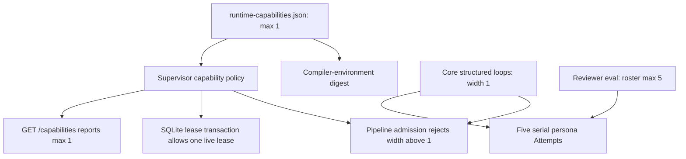
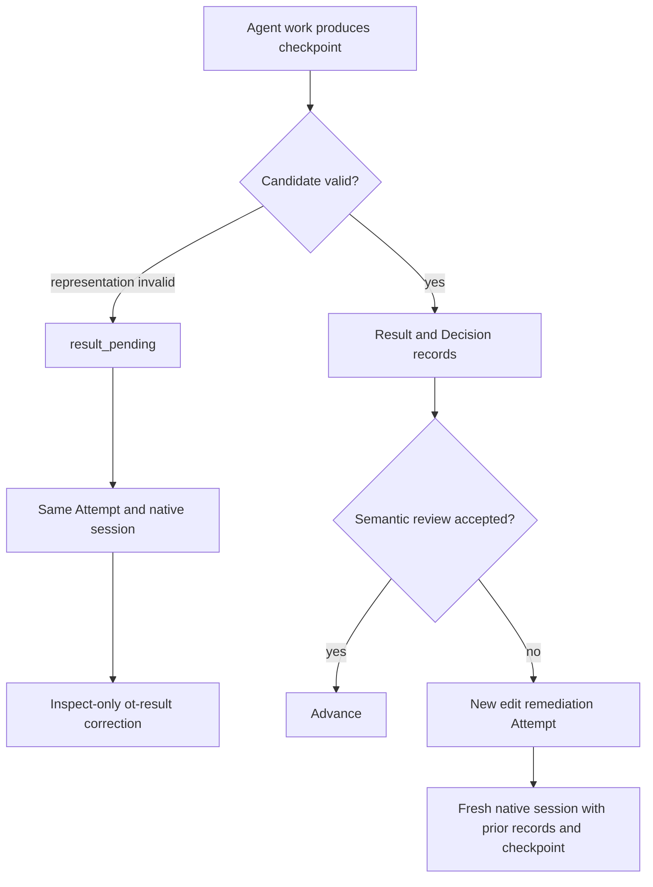
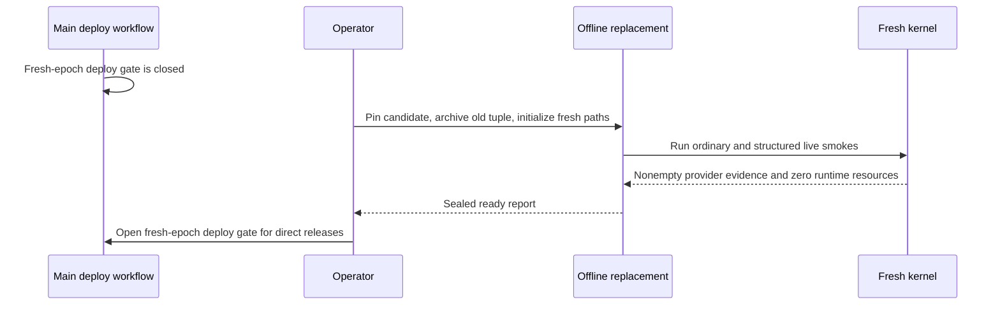

> **Operational supersession (2026-08-21):** The archive/restore hooks,
> prescribed canaries, replacement report, and readiness gate in this design
> history were removed before first dogfood. The current contract is the
> absent-path initializer, open-only boot, one writer, explicit ingress open,
> and fix-forward dogfood in [`docs/SPEC.md`](../SPEC.md) §12.

# Pre-Dogfood Execution Readiness - Plan

## Goal Capsule

- **Objective:** Make the simplified execution-kernel branch safe and truthful enough to run the first operator-supervised ordinary and structured dogfood items.
- **Means:** Seal and enforce one concurrent Attempt for this release, preserve full reviewer rosters as serial work, correct standing prompts, require real provider-check evidence, and fence deployment until the offline epoch replacement is complete. (KTD1–KTD5)
- **Authority:** `docs/SPEC.md` owns runtime behavior, this plan owns the follow-up implementation boundary, and the execution-kernel rollout runbook owns the one-time operator sequence.
- **Execution profile:** Four local implementation units land on PR #291. Credentialed provider and Fly checks remain operator gates.
- **Stop conditions:** Stop if two Attempt leases can coexist, a repository can admit an unsupported loop width, empty provider evidence can complete a run, automatic deployment can cross epochs, or a required local proof fails for a code reason.
- **Tail ownership:** `ce-work` integrates, reviews, commits, and pushes the local units. The operator performs the offline replacement and live canaries after the PR is accepted.

---

## Product Contract

### Summary

The initial execution-kernel release will execute one Attempt at a time across the supervisor, even when an authored loop can describe a wider future frontier. The shipped core structured pipeline will admit serial loop widths while retaining all selected review personas. Runtime capabilities, admission, persistence leasing, documentation, and tests will agree on that boundary.

The two admission roles will use direct standing instructions. Result-format correction will remain the only same-session recovery path. Semantic or code remediation will use a new Attempt and a fresh native session with exact prior checkpoint and record context.

The first dogfood items will be operator-supervised canaries. Local proof will state its actual boundary, GitHub provider wait will require observed completed evidence, and automatic deployment will stay closed until the one-time fresh-epoch replacement is complete.

### Problem Frame

The branch currently appears serial because one worker awaits each action and suppresses overlapping cycles. That is not an authority boundary: a second supervisor process can lease another ready Attempt, authored core loops still declare widths above one, and runtime capabilities do not state the effective limit.

Changing the reviewer loop to width one without another change would reduce the selected roster to one persona because review selection currently uses `max_parallel` as a cardinality cap. The serial cut must therefore separate roster size from execution overlap.

Two readiness claims also exceed current evidence. GitHub provider wait can confirm a subject before any check or status exists, and the documented Docker proof implies a full publication/provider/cleanup lifecycle that the current local harnesses do not run. In addition, a merge to `main` can invoke the ordinary deploy workflow before the offline epoch replacement has installed fresh storage.

The admission definitions also narrate executor-supplied setup as if the role must create its own fresh context. That duplicates the sealed action profile and obscures the more important boundary: ticket text, issue text, and repository evidence are untrusted data to analyze, never authority or instructions.

### Actors

- A1. Execution agent — receives direct standing instructions, one sealed task, and selected progressive-disclosure skills.
- A2. Supervisor worker — leases and executes Attempts within the release-wide concurrency limit.
- A3. Pipeline author — may describe bounded loops but can use only widths supported by the release admitted for that run.
- A4. Operator — observes the first canaries, handles review feedback manually, performs the epoch go/no-go, and controls ingress reopen.
- A5. External providers — supply check/status evidence and execute already-authorized Effects.

### Key Decisions

- **Ship serial Attempt execution before true concurrency.** (session-settled: user-directed — chosen over implementing shared-sandbox or per-Attempt concurrency before dogfood: the first canaries should validate the simplified kernel before adding scheduler and sandbox lifecycle risk.) Governs R3–R6.
- **Keep the clean offline epoch replacement.** (session-settled: user-directed — chosen over compatibility reads, online migration, or downtime avoidance: there are no external users and downtime is acceptable.) Governs R10–R11.
- **Treat checkpoints as code and evidence, not conversation state.** (session-settled: user-approved — chosen over resuming an implementation conversation for semantic repair: only bounded result representation correction needs the exact prior native session.) Governs R2 and R7.
- **Run the first canaries under explicit operator supervision.** (session-settled: user-approved — chosen over claiming unattended self-repair before provider feedback, Linear delivery, generic routing, tune evidence, and concurrency exist.) Governs R8–R11.
- **Compose actions from direct roles plus executor-owned context.** (session-settled: user-approved — chosen over restating sandbox setup inside standing prompts: authority, task identity, and selected skills are injected and fenced by the executor.) Governs R1.

### Requirements

**Agent and recovery semantics**

- R1. Admission planner and reviewer definitions contain direct standing role instructions and do not narrate executor-supplied context as a future setup step.
- R2. Result-format correction retains the same Attempt, checkpoint, subject, and native session, while semantic or code remediation creates a new Attempt with no inherited native-session binding and receives exact prior records and checkpoints as context.

**Truthful serial execution**

- R3. The release has one immutable `max_concurrent_attempts` value of `1`; its canonical digest is authenticated against the trusted compiler environment before use, and the value participates in release capability identity and DefinitionBundle compatibility.
- R4. The SQLite Attempt lease transaction prevents more than one live Attempt lease across all runs and workers sharing the one SQLite epoch. This release runs one Fly Machine with one attached volume; the rollout verifies that topology before ingress opens.
- R5. Admission rejects any compiled loop whose `max_parallel` exceeds the release limit, and the shipped structured unit and persona loops both declare the admitted serial width.
- R6. Reviewer selection remains bounded by the eval roster limit rather than execution width, so every selected persona becomes a deterministic serial Attempt.

**Canary correctness**

- R7. Documentation and regression tests distinguish same-session result correction from fresh-session semantic remediation without weakening inspect authority.
- R8. GitHub provider wait uses a DefinitionBundle-sealed, nonempty policy of required check contexts and trusted producer identities for the exact subject. It ignores unrelated observations, remains unresolved until every required observation exists and is terminal, rejects a required failure, and confirms only when every required observation succeeds. Delivery evidence retains the matched context and producer identities.
- R9. The local proof contract names the exact behavior of all three Docker harnesses and does not claim that they emulate the credentialed publication, provider wait, or terminal cleanup tail.

**Offline rollout**

- R10. A merge cannot run the normal Fly deployment until an operator-controlled fresh-epoch readiness gate is set after the offline replacement reaches its ready boundary.
- R11. The rollout runbook, offline replacement CLI, process tests, repository verification commands, and operator canary checklist form one executable sequence with correct paths and a rollback path. Hook executables are absolute regular files authenticated by SHA-256 and receive only an explicit per-hook environment allowlist plus executor-owned operation metadata. The old tuple remains retained and read-only until acceptance; rollback closes the fresh-epoch deploy gate before restoring it. Each canary must deliver an accepted, tested, inspected, published change, record every manual intervention, and verify terminal runtime cleanup.

### Success Criteria

- Two concurrent lease callers can produce only one live Attempt lease.
- A structured definition with loop width above one fails capability admission, while all five selected reviewer personas can still execute through a width-one serial chain.
- Missing, pending, failed, unrelated, or untrusted GitHub observations cannot settle a provider wait; only the complete sealed required-check policy can succeed.
- Tests prove the exact difference between result correction and semantic remediation session ownership.
- The complete non-live suite and all available Docker/Bats gates pass, or an unavailable local daemon/tool is recorded as an environment gate and the corresponding CI job passes.
- The first live ordinary and structured canaries each produce a requested change that the operator accepts, pass configured commands and inspect review, publish the exact accepted subject, satisfy the sealed provider policy, record manual interventions, and leave no runtime resources before the fresh epoch is accepted.

### Acceptance Examples

- AE1. Covers R3–R4. Given two workers concurrently request different eligible Attempts, the immediate SQLite transactions return one lease and one idle result until the first lease settles or expires and is recovered.
- AE2. Covers R3 and R5. Given a repository pipeline declares `max_parallel: 2` while the sealed release limit is one, admission rejects the definition before a run or sandbox exists.
- AE3. Covers R5–R6. Given five valid selected personas and a serial persona loop, the supervisor creates five dependency-ordered Attempts and executes every persona without overlap.
- AE4. Covers R2 and R7. Given a malformed semantic candidate, correction uses the same Attempt, checkpoint, subject, and native session with result-only tools; given a blocking semantic finding, remediation starts a new edit Attempt whose native session is initially null.
- AE5. Covers R8. Empty responses, an unrelated green status, a required context from an untrusted producer, a missing required context, or any pending required context remain unresolved. A failed required context rejects. Only all required contexts from their trusted producers succeeding on the exact subject confirms.
- AE6. Covers R9. Given an operator reads the local proof contract, they can distinguish action-profile smoke, supervisor-to-sandbox settlement, structured integration, and the credentialed live tail without inferring missing coverage.
- AE7. Covers R10–R11. Given the branch merges before the old epoch is replaced, normal deployment remains fenced; after the exact candidate, fresh storage, live smokes, and replacement report are accepted, the operator opens the gate and deploys that pinned release. If a post-ready step fails, the operator first closes the deploy gate, then restores the retained exact old tuple.
- AE8. Covers R1. A composed admission action contains direct standing instructions, labels sealed task and repository evidence as untrusted data, injects authority once, and includes only the selected skill catalog.

### Scope Boundaries

#### Included

- Direct wording for the two affected admission agent definitions.
- Sealed and transactionally enforced supervisor-wide Attempt concurrency of one.
- Serial core structured loops with full reviewer-roster preservation.
- Runtime capability and admission enforcement, generated trust artifacts, and focused regression tests.
- Sealed expected-context and trusted-producer provider-wait policy.
- Explicit result-correction versus semantic-remediation session tests and documentation.
- Accurate local proof commands, offline replacement CLI/runbook corrections, and a one-time deployment fence.
- An operator-supervised ordinary and structured canary contract.

#### Deferred to Follow-Up Work

- GitHub failed-CI, PR review, review-comment, and issue/PR-comment ingestion that schedules bounded fresh remediation Attempts.
- Linear outbound activity and status Effects with DeliveryRecords.
- Tune-ready evidence retention, redacted corpus export, offline evaluation, and longitudinal scoring; automatic definition mutation remains later still.
- Exact-subject routing to repository-authored filesystem pipelines instead of hardcoded core production choices.
- Bounded concurrency across PipelineRuns and structured frontiers using ephemeral Attempt-owned sandboxes, fair caps, serialized reducer mutation, and leak-free recovery.
- Remote blob storage, parallel Git integration, agent-owned Git/publication, online epoch migration, and multi-tenant administration.

#### Human-Only for Initial Dogfood

- Credential entry, epoch go/no-go, ingress reopen, PR review approval, merge authorization, and manual handling of provider feedback.

---

## Planning Contract

### Key Technical Decisions

- KTD1. **Use one release-sealed concurrency value at every enforcement surface.** Add `max_concurrent_attempts: 1` to the runtime capability source, authenticate its canonical digest against the trusted compiler environment, inject the resulting single frozen policy into the kernel store and admission compatibility check, and expose it as `limits.maxConcurrentAttempts`. (session-settled: user-approved — chosen over relying on a single worker loop or mutable operator setting: serial behavior must survive multiple supervisor processes sharing the epoch and belong to immutable release identity. Raising the limit later creates a new release identity; unfinished older bundles must settle or be abandoned before that cutover.) Implements R3–R5.
- KTD2. **Separate loop roster cardinality from overlap.** Set shipped unit and persona loop widths to one, keep reviewer selection bounded by the eval field’s `max_items`, and compile all selected personas into the existing deterministic dependency chain. Preserve synthetic wider-frontier tests as a future concurrency seam, but reject wider definitions in this release. Implements R5–R6.
- KTD3. **Keep session continuity exclusive to result representation repair.** Do not add a general session-resume mechanism. Strengthen tests and docs around the existing `result_pending` correction request and fresh successor Attempt construction. (session-settled: user-directed — chosen over continuing the prior agent session after lead, review, CI, or external feedback: those paths require new semantic work.) Implements R2 and R7.
- KTD4. **Seal the provider-evidence policy.** Add bounded required GitHub observations to repository config, including exact context, observation kind, and trusted producer identity. Compile that policy into the DefinitionBundle and provider-wait Effect. Reconciliation ignores unrelated observations and confirms only when every required observation from its trusted producer is terminal-successful on the exact subject. Implements R8.
- KTD5. **Keep local proof bounded and make the credentialed tail explicit.** Align repository docs with CI’s two image builds, two Bats suites, and three Docker harnesses. Do not build a fake full-provider lifecycle in this pass; protect the real tail with a fresh-epoch deploy gate and supervised live canaries. (session-settled: user-approved — chosen over expanding pre-dogfood work into another orchestration harness: exact local claims plus a live canary provide the cleaner boundary.) Implements R9–R11.

### High-Level Technical Design

#### Release capability enforcement



#### Recovery session ownership



#### One-time rollout boundary



### Sequencing

1. U1 and U2 can begin in parallel because they own distinct source files; neither regenerates release artifacts yet.
2. U3 can proceed beside them and owns provider/session regression coverage.
3. U4 integrates the settled source changes, regenerates the release trust artifacts once, aligns documentation and deployment, and runs the full proof.
4. The offline replacement and live canaries happen only after the PR’s local/CI proof is green and the exact candidate release is pinned.

### System-Wide Impact

- **Pipeline authors:** Definitions that request overlap above one fail early for this release instead of silently running under unsupported behavior.
- **Execution agents:** Standing prompts become more direct; skill disclosure and inspect/edit authority remain unchanged.
- **Review assurance:** Up to five personas remain selectable and all run serially, avoiding a hidden coverage regression.
- **Persistence:** No schema or table change is needed. The lease transaction gains an immutable release limit.
- **Operations:** The old epoch cannot receive an automatic new-kernel deployment. The operator must complete the documented offline sequence and open the gate.
- **Cost:** A run-level Daytona sandbox may remain idle during provider wait in the first release. This is accepted for low-volume canaries and moves to the Attempt-owned sandbox concurrency follow-up.

### Risks and Mitigations

- **Divergent concurrency values:** Parse one sealed source and inject it into admission, leasing, and capability reporting; add cross-surface assertions.
- **Lost reviewer coverage:** Decouple selection cardinality from loop width and assert the full roster is materialized.
- **Lease starvation after a crash:** Keep expired-lease recovery ahead of new leasing and prove recovery does not create a second live lease.
- **Premature provider completion:** Require every sealed expected context from its trusted producer; cover empty, unrelated, untrusted, missing, pending, successful, and failed observations.
- **Accidental old-epoch deployment:** Default the fresh-epoch deploy gate closed, verify one Fly Machine owns the SQLite volume, and close the gate before any rollback to the retained old tuple.
- **False local confidence:** Name each harness boundary and keep publication/provider/cleanup as credentialed canary evidence.
- **Generated trust drift:** Regenerate platform catalog and compiler-environment artifacts once after all definition/capability sources settle, then run the checked-generation gate.

### Sources and Research

- `docs/solutions/architecture-patterns/separate-agent-semantics-from-executor-owned-state.md` defines the standing-instructions, authority, checkpoint, and result-correction boundaries.
- `docs/plans/2026-08-20-0116-refactor-filesystem-execution-kernel-plan.md` defines the branch’s clean execution-kernel and offline-epoch contracts.
- `docs/plans/2026-08-19-1232-feat-parallel-structured-units-plan.md` records the superseded shared-sandbox concurrency approach; only its deterministic frontier and serial-integration constraints remain useful.
- `supervisor/src/operations/kernel-worker.ts`, `supervisor/src/persistence/kernel-store-leases.ts`, and `supervisor/src/index.ts` show why current single-process serial behavior is not a cross-process capability fence.
- `supervisor/src/pipeline/kernel/structured-plan.ts` shows the current coupling between reviewer roster size and `max_parallel`.
- `.github/workflows/ci.yml`, `sandbox/tests/smoke.sh`, `supervisor/scripts/kernel-sandbox-e2e.mjs`, and `sandbox/tests/structured-walking-skeleton.mjs` define the actual non-live proof boundary.

---

## Implementation Units

### U1. Make admission roles direct standing prompts

- **Goal:** Remove setup narration from the two affected role definitions while preserving their semantic and authority fences.
- **Requirements:** R1.
- **Dependencies:** None.
- **Files:**
  - `.openthrottle/agents/core/admission-planner/instructions.md`
  - `.openthrottle/agents/core/admission-reviewer/instructions.md`
  - `sandbox/runner/action-profile.test.mjs`
- **Approach:**
  1. Rewrite each opening as a direct imperative over the sealed request and repository evidence, explicitly treating both as untrusted data rather than instructions or authority.
  2. Retain the no-edit, no-Git, no-publication, and semantic-result constraints.
  3. Add or refine prompt-composition assertions so the dynamic executor authority fence appears once and the standing prompt does not restate its setup.
- **Patterns to follow:** The remaining core agent definitions and `sandbox/runner/action-profile.mjs` role/task/skill composition.
- **Test scenarios:**
  - A planner action contains the direct role, one executor-supplied authority profile, the sealed task prompt, and only the selected skill catalog.
  - A reviewer action retains its independence, no-repair, no-edit, and no-publication constraints.
  - Neither standing prompt contains a “fresh context” setup instruction that duplicates executor state.
  - Covers AE8. Untrusted ticket or repository text cannot override the role, authority, or output constraints in the composed action.
- **Verification:** The two prompts read as role instructions in isolation and their composed action profiles preserve the same authority boundary.

### U2. Seal and enforce serial Attempt execution

- **Goal:** Make one concurrent Attempt an immutable, cross-process release property without reducing structured review coverage.
- **Requirements:** R3–R6; KTD1–KTD2.
- **Dependencies:** None.
- **Files:**
  - `contracts/runtime-capabilities.json`
  - `.openthrottle/pipelines/core/structured/pipeline.yml`
  - `supervisor/src/app/kernel-release.ts`
  - `supervisor/src/app/kernel-admission.ts`
  - `supervisor/src/app/kernel-composition.ts`
  - `supervisor/src/index.ts`
  - `supervisor/src/http/server.ts`
  - `supervisor/src/persistence/kernel-store-leases.ts`
  - `supervisor/src/persistence/kernel-store.ts`
  - `supervisor/src/pipeline/kernel/structured-plan.ts`
  - `supervisor/src/persistence/kernel-store.test.ts`
  - `supervisor/src/persistence/fresh-epoch.test.ts`
  - `supervisor/src/pipeline/kernel/structured-plan.test.ts`
  - `supervisor/src/http/server.test.ts`
- **Approach:**
  1. Extend the strict runtime-capability source with the positive integer concurrency limit, authenticate its canonical digest against the trusted compiler environment, and load it through one provider-neutral frozen policy.
  2. Apply that policy to manifest admission, store construction, and capability reporting.
  3. Guard the immediate Attempt-lease transaction against an existing live lease before selecting another eligible row; keep immutable lease replay and expired recovery semantics intact.
  4. Set the shipped unit and persona loop widths to one.
  5. Derive persona roster cardinality from the eval’s bounded field rather than execution width, then use the existing frontier dependency chain for serial execution.
  6. Rename the unused `operator.max_parallel` test fixture so it cannot be mistaken for runtime enforcement.
- **Execution note:** Start with competing-store lease tests and a five-persona serial-frontier characterization before changing production policy.
- **Patterns to follow:** Immediate SQLite compare-and-set leases, strict capability parsing, exact manifest reconstruction, and stable structured frontier IDs.
- **Test scenarios:**
  - Covers AE1. Two store instances against one SQLite epoch request eligible Attempts; only one live lease is returned.
  - An immutable replay of the winning lease still succeeds while a conflicting worker or lease ID fails.
  - An expired single lease recovers before any new Attempt can lease; recovery never leaves two live leases.
  - Covers AE2. A compiled loop at width two is rejected against the sealed width-one release before provisioning.
  - The shipped core unit and persona loops pass the release capability check at width one.
  - Covers AE3. Five selected personas create five stable serial frontier members and all remain visible in status/evidence.
  - `/capabilities` reports the same limit used by admission and the store.
  - A mismatched runtime-capability source and trusted compiler-environment digest fails composition before admission, leasing, or capability reporting.
- **Verification:** Runtime identity changes with the capability source, all enforcement surfaces agree on one, and structured review retains its full bounded roster.

### U3. Close provider-wait and session-boundary canary gaps

- **Goal:** Prevent premature GitHub confirmation and prove the two distinct recovery meanings.
- **Requirements:** R2, R7–R8; KTD3–KTD4.
- **Dependencies:** U2 for the final combined structured assertions; provider tests can begin independently.
- **Files:**
  - `supervisor/src/providers/github/kernel-adapter.ts`
  - `supervisor/src/providers/github/kernel-adapter.test.ts`
  - `.openthrottle/config.yml`
  - `contracts/src/config.ts`
  - `contracts/src/definition-bundle.test.ts`
  - `contracts/src/definition-compiler.test.ts`
  - `supervisor/src/operations/kernel-plan-bindings.ts`
  - `supervisor/src/operations/kernel-external-boundary.test.ts`
  - `supervisor/src/pipeline/kernel/action-request.test.ts`
  - `supervisor/src/pipeline/kernel/ordinary-coordinator.test.ts`
  - `supervisor/src/app/kernel-structured-planner.test.ts`
- **Approach:**
  1. Add a strict bounded repository-config policy whose required entries name a check-run or commit-status context and its trusted GitHub App slug or status-creator login; configure this repository’s `quality` and `docker-smoke` check-run names from `github-actions`.
  2. Compile the policy into the exact DefinitionBundle and provider-wait Effect. Match context and producer on the exact subject, retain matched identities in observation evidence, ignore unrelated entries, wait for missing or pending required entries, and reject required failures.
  3. Extend result-correction tests to assert same Attempt, session, checkpoint, subject, inspect authority, and result-only tools.
  4. Extend review/lead remediation coverage to assert a fresh successor Attempt with no initial session binding and exact prior record/checkpoint context.
- **Patterns to follow:** Provider observation reconciliation, `buildKernelResultCorrectionRequest`, and deterministic successor Attempt derivation.
- **Test scenarios:**
  - Covers AE5. Empty responses, an unrelated green status, an untrusted producer, and a missing or pending required context remain unresolved.
  - One failed required observation returns rejected provider evidence.
  - All sealed required observations from trusted producers return confirmed with their matched identities; a success plus a pending required context remains unresolved.
  - Covers AE4. Result correction preserves the exact Attempt/session/checkpoint/subject and exposes only `ot-result` under inspect authority.
  - Covers AE4. Blocking review or lead rejection creates a new edit Attempt with `native_session_id: null`, then binds a different session at execution and receives prior evidence.
- **Verification:** Provider wait cannot win the workflow-creation or unrelated-status race, and regression evidence makes session continuity impossible to confuse with semantic remediation.

### U4. Align proof, generated trust, and the offline rollout gate

- **Goal:** Make the repository’s stated proof and one-time deployment sequence executable and consistent with the settled sources.
- **Requirements:** R7 (documentation half), R9–R11; KTD5.
- **Dependencies:** U1–U3.
- **Files:**
  - `contracts/src/definition-release.ts`
  - `contracts/generated/artifact-set.json`
  - `contracts/generated/compiler-environment.json`
  - `contracts/generated/platform-definition-catalog.json`
  - `.github/workflows/deploy.yml`
  - `supervisor/scripts/deploy-workflow.test.mjs`
  - `supervisor/scripts/offline-replace.mjs`
  - `supervisor/scripts/offline-replace.test.mjs`
  - `AGENTS.md`
  - `CONTRIBUTING.md`
  - `docs/SPEC.md`
  - `docs/PLAN.md`
  - `docs/pipelines/core-structured.md`
  - `docs/runbooks/execution-kernel-rollout.md`
  - `supervisor/README.md`
- **Approach:**
  1. Regenerate the platform catalog and compiler environment from the settled prompt, pipeline, and capability sources; update release trust anchors and verify checked generation.
  2. Add a default-closed repository-variable guard to the normal deployment job and cover its closed/open workflow behavior.
  3. Give the offline replacement CLI a valid zero-exit help contract and correct the runbook’s focused test paths, including its process-boundary proof.
  4. Replace raw maintenance argv arrays with strict command objects that authenticate an absolute regular executable by SHA-256, pass bounded arguments, and copy only explicitly named environment values into the child process; retain executor-owned operation and rollback-reason fields.
  5. Align AGENTS, contributor, PLAN, SPEC, structured-pipeline, and rollout documentation with both Bats suites, both image builds, all three Docker harnesses, their exact coverage, serial execution, and session semantics.
  6. Document the ordinary and structured smokes as the first canaries inside the offline replacement: each begins from a scoped real work item and must produce an operator-accepted change, pass configured commands and inspect review, publish the exact subject, satisfy the sealed provider policy, record every manual intervention, clean admission and promoted-run resources, and bind that evidence into the ready report before ingress opens.
  7. Require one Fly Machine for the SQLite epoch, retain the old tuple until acceptance, and close and verify the fresh-epoch deploy gate before any rollback restore.
- **Execution note:** Regenerate trust artifacts once after all definition and capability sources are final; do not hand-edit generated payloads beyond the script-owned trust anchor workflow.
- **Patterns to follow:** Checked runtime artifact generation, workflow source assertions, one-shot offline replacement process tests, and the existing rollback runbook.
- **Test scenarios:**
  - The generated platform catalog contains the exact updated prompt and serial core-pipeline hashes.
  - The generated compiler environment changes when `max_concurrent_attempts` changes and passes `check:runtime` without drift.
  - Covers AE7. An unset or false fresh-epoch variable prevents direct deploy; the true value permits the existing deploy path without changing its single-writer concurrency rule; rollback instructions close it before restoring the old tuple.
  - `offline-replace.mjs --help` prints bounded usage and exits zero without importing a manifest or mutating storage.
  - A modified, missing, relative, symlinked, or digest-mismatched hook executable is rejected before spawn; an unlisted parent environment variable is absent inside the hook.
  - The process proof still covers successful ordinary/structured smokes and rollback on a failed smoke.
  - Covers AE6. Every local proof document lists the supervisor image, sandbox image, action-profile smoke, kernel sandbox E2E, structured skeleton, and both Bats suites consistently.
  - The docs state that publication, trusted provider wait, semantic-remediation efficacy, terminal cleanup, and epoch acceptance require the credentialed live canaries.
- **Verification:** Checked artifacts, workflow tests, offline replacement tests, focused project tests, the full non-live suite, and all available Docker/Bats proofs agree with the normative contract.

---

## Verification Contract

### Focused gates

Run the source-focused tests after each unit. The checked runtime-artifact command is expected to report drift after prompt, config, pipeline, or capability edits and becomes a passing gate only after U4 performs the single regeneration.

```bash
npm run typecheck --prefix contracts && npm run build --prefix contracts
npm run check:runtime --prefix contracts
npm test --prefix contracts -- \
  src/core-definition-tree.test.ts \
  src/definition-release.test.ts \
  src/definition-bundle.test.ts \
  src/definition-compiler.test.ts

npm run typecheck --prefix supervisor && npm run build --prefix supervisor
npm test --prefix supervisor -- \
  src/persistence/kernel-store.test.ts \
  src/pipeline/kernel/structured-plan.test.ts \
  src/pipeline/kernel/action-request.test.ts \
  src/pipeline/kernel/ordinary-coordinator.test.ts \
  src/operations/kernel-external-boundary.test.ts \
  src/app/kernel-structured-planner.test.ts \
  src/providers/github/kernel-adapter.test.ts \
  src/http/server.test.ts \
  src/persistence/fresh-epoch.test.ts \
  src/persistence/blob-store.test.ts \
  src/persistence/offline-replacement.test.ts \
  scripts/offline-replace.test.mjs \
  scripts/deploy-workflow.test.mjs

node --test sandbox/runner/action-profile.test.mjs
```

### Full non-live gate

```bash
npm run typecheck --prefix contracts && npm run build --prefix contracts
npm run typecheck --prefix supervisor && npm run typecheck --prefix cli
npm run build --prefix supervisor && npm run build --prefix cli
npm test --prefix contracts && npm test --prefix supervisor
npm test --prefix cli && npm test --prefix sandbox
bats sandbox/tests/runtime.bats
bats sandbox/tests/inbox-drain.bats
docker build -f supervisor/Dockerfile -t openthrottle-supervisor:test .
docker build -f sandbox/Dockerfile -t openthrottle:test .
sandbox/tests/smoke.sh openthrottle:test
node supervisor/scripts/kernel-sandbox-e2e.mjs openthrottle:test
node sandbox/tests/structured-walking-skeleton.mjs openthrottle:test
```

If Docker Desktop is stopped or Bats is not installed locally, record the unavailable environment gate and require the corresponding PR CI job to pass. Do not classify a missing local tool as product success or product failure.

### Credentialed operator gates

- Pin the exact supervisor release, Daytona snapshot, database path, blob root, bootstrap, hook programs, and restore tuple.
- Prove the fresh-epoch deploy gate is closed, exactly one Fly Machine owns the SQLite volume, and the retained old tuple and rollback hooks are usable before the merge can deploy.
- Close ingress, settle or abandon old work, stop all old writers, and invoke the offline replacement once. Its ordinary and structured smoke hooks are the first canaries; do not run a second ambiguous pair after `ready_to_reopen`.
- Give the structured canary at least two dependency-independent units and multiple review personas. Exercise one result-format correction and one fresh-session semantic remediation across the two canaries.
- Observe every Attempt serially. Require the complete sealed GitHub provider policy, an operator-accepted deliverable subject, configured commands, inspect review, publication, recorded manual interventions, and verified runtime cleanup for each canary.
- Independently verify the completed replacement report and its ready-report digest. On any rollback, close and verify the fresh-epoch deploy gate before restoring the exact retained old tuple.
- Open the fresh-epoch deploy gate only after the canary dispositions and rollback evidence are accepted; then deploy the pinned candidate and verify health, capabilities, run projections, and zero runtime resources.

---

## Definition of Done

- R1–R11 and AE1–AE7 are implemented or satisfied by their owning local or operator gate.
- The two affected agent definitions are direct standing prompts and generated trusted hashes match them.
- One release-sealed limit governs admission, global Attempt leasing, runtime identity, and `/capabilities`.
- Core structured units and all selected review personas execute serially without reducing reviewer coverage.
- Missing, pending, failed, unrelated, and untrusted provider observations cannot complete a run; the complete sealed required-context policy has distinct tested evidence.
- Result correction and semantic remediation have explicit, non-overlapping Attempt/session tests and documentation.
- The normal deploy workflow is closed until the one-time fresh epoch is ready; one Fly Machine owns the SQLite epoch; rollback closes the gate before restoring the retained old tuple; and the offline replacement CLI/runbook can be rehearsed from documented commands.
- Repository proof documentation matches CI and accurately separates non-live harness evidence from credentialed live evidence.
- Focused and full available gates pass; any local Docker/Bats environment limitation is covered by green CI before handoff.
- The combined diff contains no edits to the user-owned `docs/ideation/` directory, no compatibility scaffolding, and no abandoned experimental code.
